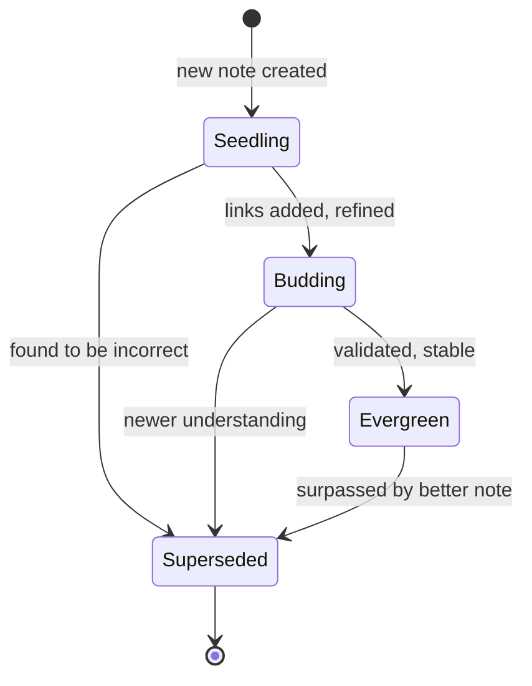

# Conventions

## File Naming

### Pattern by Directory

| Directory | Pattern | Example |
|-----------|---------|---------|
| `/concepts/` | `descriptive-slug.md` | `opencode-architecture.md` |
| `/tools/` | `tool-name.md` | `claude-code.md` |
| `/patterns/` | `pattern-name.md` | `multi-agent-patterns.md` |
| `/_meta/` | `meta-topic.md` | `vault-architecture.md` |
| `/_identity/` | `identity-name.md` | `nova-identity.md` |
| `/templates/` | `type-template.md` | `concept-template.md` |
| All directories | `index.md` | `index.md` |

### Rules
- Lowercase alphanumeric with single hyphens (`^[a-z0-9]+(-[a-z0-9]+)*$`)
- 1–64 characters
- No special characters (except `-`)
- Simple, descriptive slugs preferred over cryptic IDs

## Linking

### Internal Links (Obsidian Wiki Links)
```markdown
[[Zettelkasten Methodology]]          # Basic concept link
[[Zettelkasten Methodology|ZK]]       # Aliased link
[[Nova Identity#Session Protocol]]    # Heading deep link
[[Conventions#^block-id]]             # Block reference
```

### Which Link Format When

| Context | Format | Example |
|---------|--------|---------|
| Note body inline | `[[Note]]` | See [[OpenCode Architecture]] for details. |
| Frontmatter `related` | `"[[Note]]"` | `related: ["[[Note A]]"]` |
| Frontmatter `prerequisites` | `/path/to/note.md` | `prerequisites: [/concepts/note.md]` |
| External references | `[text](url)` | [OKF Spec](https://github.com/...) |
| Citations | `[1] URL` | See `# Citations` section |

### Link Semantics

Links encode relationships. The prose around a link explains **why**:
```markdown
✅ Good: "The attention mechanism, described in [[Attention Is All You Need]], enables..."

❌ Bad: "See also [[something]]." (no explanation of why)
```

## Frontmatter

### Required
```yaml
---
type: Concept    # REQUIRED by OKF v0.1
---
```

### Standard (add to every note)
```yaml
title: "Display Title"
description: One-line summary for index.md generation
tags: [tag1, tag2]
timestamp: 2026-06-22T05:30:00Z
```

### Nova Extended (add when applicable)
```yaml
id: "20260622T053000"       # Timestamp-based unique ID
status: evergreen            # seedling | budding | evergreen | superseded
difficulty: intermediate     # beginner | intermediate | advanced
domain: knowledge-management
prerequisites:               # Ordered list of dependency paths
  - /path/to/note.md
related:                     # Conceptually related notes
  - "[[Note A]]"
  - "[[Note B]]"
sources:                     # Provenance tracking
  - title: "Source"
    url: "https://..."
confidence: 0.85
summary: >                   # One-sentence TL;DR
  The core idea in one sentence.
```

## Mermaid Diagrams

All notes may include Mermaid diagrams using fenced code blocks:
```markdown
 ```mermaid
 graph TD
     A --> B
 ```
```

Supported types: `graph`, `flowchart`, `sequenceDiagram`, `classDiagram`, `stateDiagram-v2`, `erDiagram`, `gantt`, `pie`, `mindmap`, `timeline`, `gitGraph`.

## LaTeX Math

Inline: `$E = mc^2$`
Block:
```latex
$$
\text{Attention}(Q, K, V) = \text{softmax}\left(\frac{QK^T}{\sqrt{d_k}}\right)V
$$
```

## Tags Convention

```yaml
tags: [domain, subdomain, status]
```

Common tags:
- **Domains**: `ai-agents`, `knowledge-management`, `system-architecture`, `identity`
- **Types**: `concept`, `tool`, `pattern`, `meta`, `index`
- **Statuses**: `evergreen`, `seedling`, `superseded` (prefer `status:` field)
- **Topics**: `architecture`, `security`, `design`, `operations`

Tags categorize **what** a note is about. Links connect **how** it relates to specific ideas.

## Status Lifecycle



## Citations

All external references go in a `# Citations` section at the bottom:
```markdown
# Citations

[1] Author. "Title". Source. URL
[2] Another source...
```
