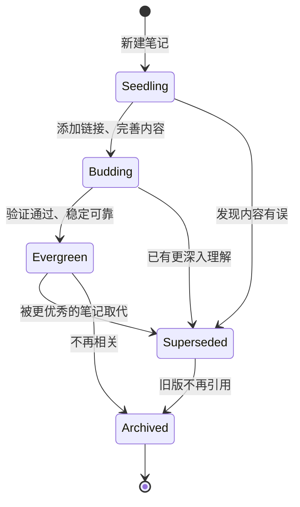

# 约定规范

## 文件命名

### 各目录命名模式

| 目录 | 命名模式 | 示例 |
|-----------|---------|---------|
| `/concepts/` | `descriptive-slug.md` | `attention-mechanism.md` |
| `/tools/` | `tool-name.md` | `claude-code.md` |
| `/patterns/` | `pattern-name.md` | `multi-agent-patterns.md` |
| `/_meta/` | `meta-topic.md` | `vault-architecture.md` |
| `/_identity/` | `identity-name.md` | `nova-identity.md` |
| `/templates/` | `type-template.md` | `concept-template.md` |
| 根目录 | `index.md` | 顶级目录 |
| 根级集群 | `concepts.md`/`tools.md`/`patterns.md`/`_meta.md`/`_identity.md`/`conference.md` | 集群 hub（`type: Index`） |

### 命名规则
- 全小写字母数字，单连字符分隔（`^[a-z0-9]+(-[a-z0-9]+)*$`）
- 1–64 个字符
- 不允许特殊字符（`-` 除外）
- 优先使用简洁、描述性的 slug，而非晦涩的 ID

## 链接规范

### 内部链接（Obsidian Wiki 链接）
```markdown
[[zettelkasten-methodology|Zettelkasten Methodology]]          # 基本概念链接
[[zettelkasten-methodology|Zettelkasten Methodology]]       # 别名链接
[[nova-identity|Nova Identity#Session Protocol]]    # 标题深层链接
[[Conventions#^block-id]]             # 块引用
```

### 链接格式使用场景

| 使用场景 | 格式 | 示例 |
|---------|--------|---------|
| 笔记正文内联 | `[[Note]]` | 详见 [[attention-mechanism|Attention Mechanism]]。 |
| 前置元数据 `related` | `"[[Note]]"` | `related: ["[[Note A]]"]` |
| 前置元数据 `prerequisites` | `"[[note-slug]]"`（优先） | `prerequisites: ["[[okf-format]]"]` |
| 外部引用 | `[text](url)` | [OKF Spec](https://github.com/...) |
| 引用文献 | `[1] URL` | 参见 `# Citations` 章节 |

### 图语义（Graph Semantics）

图操作（AGENTS.md §2）中的术语唯一定义：

| 术语 | 定义 |
|------|------|
| **节点 node** | 知识笔记（.md 文件）；`log.md` 条目是 trace，技能/配置不是节点 |
| **边 edge** | **仅 wiki 链接**（`[[...]]`，含 `related` 值）；`prerequisites` 路径值是依赖文档，非图边 |
| **方向** | 有向（链接者 → 被链接者）；反向链接在查询时扫描计算，不落盘 |
| **孤儿 orphan** | 零入边 wiki 链接（未被任何 hub 列出、未被任何笔记 `related`/正文引用） |
| **枢纽 hub** | 任何 `type: Index` 文件（根 `index.md` + 根级集群 hub） |
| **社区 community** | 拥有 hub 的目录及其笔记集合（如 `/concepts/`） |

### 链接语义

链接编码关系。链接周围的文字应解释**为什么**建立此连接：
```markdown
✅ 好: "注意力机制，详见 [Attention Is All You Need](https://arxiv.org/abs/1706.03762)，使得模型能够..."

❌ 差: "另请参见 [[something]]。"（未解释为什么）
```

## 前置元数据

### 必填字段
```yaml
---
type: Concept    # OKF v0.1 要求必填
---
```

### 标准字段（每篇笔记均应添加）
```yaml
title: "显示标题"
description: 用于 index.md 生成的一行摘要
tags:
  - 标签1
  - 标签2
timestamp: 2026-06-22T05:30:00Z
```

### Nova 扩展字段（按需添加）
```yaml
id: "20260622T053000"       # 基于时间戳的唯一 ID
status: evergreen            # seedling | budding | evergreen | superseded | archived
difficulty: intermediate     # beginner | intermediate | advanced
domain: knowledge-management
prerequisites:               # wiki 链接优先；旧路径 = 依赖文档非图边
  - "[[okf-format]]"
related:                     # 概念相关笔记
  - "[[Note A]]"
  - "[[Note B]]"
sources:                     # 来源追踪
  - title: "来源"
    url: "https://..."
confidence: 0.85
summary: >                   # 一句话 TL;DR
  核心思想用一句话概括。
```

## Mermaid 图表

所有笔记均可使用围栏代码块嵌入 Mermaid 图表：
```markdown
 ```mermaid
 graph TD
     A --> B
 ```
```

支持的类型：`graph`、`flowchart`、`sequenceDiagram`、`classDiagram`、`stateDiagram-v2`、`erDiagram`、`gantt`、`pie`、`mindmap`、`timeline`、`gitGraph`。

## LaTeX 数学公式

行内公式：`$E = mc^2$`
块级公式：
```latex
$$
\text{Attention}(Q, K, V) = \text{softmax}\left(\frac{QK^T}{\sqrt{d_k}}\right)V
$$
```

## 标签约定

```yaml
tags:
  - 领域
  - 子领域
  - 状态
```

常用标签：
- **领域**：`ai-agents`、`knowledge-management`、`system-architecture`、`identity`
- **类型**：`concept`、`tool`、`pattern`、`meta`、`index`
- **状态**：`evergreen`、`seedling`、`superseded`（优先使用 `status:` 字段）
- **主题**：`architecture`、`security`、`design`、`operations`

标签分类笔记**是什么**。链接描述它**如何**与其他具体概念关联。

## 状态生命周期



## 引用格式

所有外部引用放在文末的 `# Citations` 章节：
```markdown
# Citations

[1] 作者. "标题". 来源. URL
[2] 另一个来源...
```
