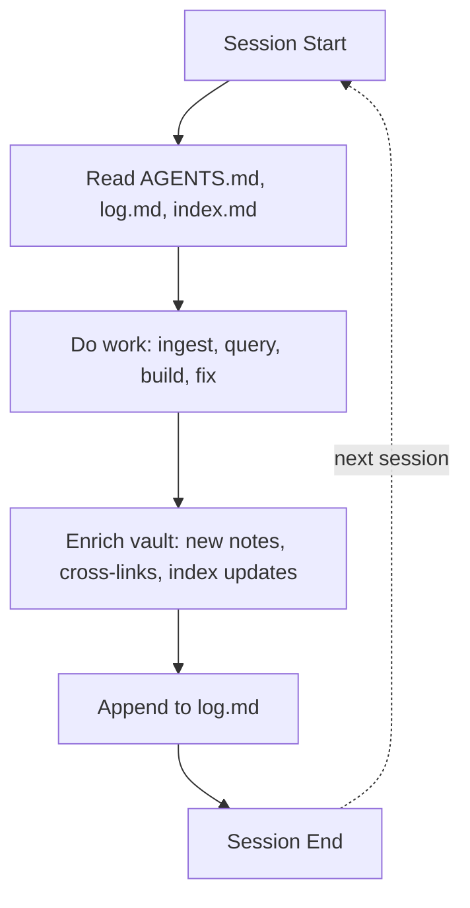
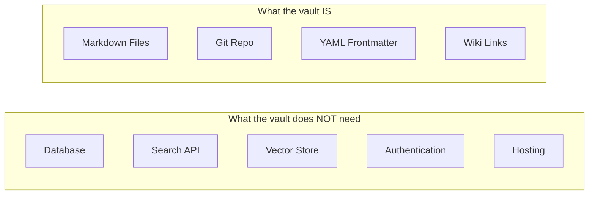

# Self-Bootstrapping

## The Core Loop



## Phase 1: Seed (Human + AI Bootstrap)

The initial vault is created through a bootstrap sequence:
1. Human defines the knowledge domain and rough taxonomy
2. AI proposes directory structure and writes `AGENTS.md`
3. First 10-20 concept notes written collaboratively
4. `index.md` at every level established
5. Templates created for consistent note creation
6. `log.md` initialized with creation entry

**This vault is currently at Phase 1 completion.**

## Phase 2: Growth (AI-Assisted Enrichment)

Each session adds to the vault:
- **Ingests**: New sources → extracted concepts → permanent notes with cross-links
- **Queries filed**: Good answers become new notes → knowledge compounds
- **Lint**: Detects orphans, contradictions, stale content → creates TODO items
- **Cross-linking**: New connections between existing notes strengthen the graph

**Growth is compounding**: more content → richer indexes → better answers → more content.

## Phase 3: Self-Maintenance (AI-Driven, Human Oversight)

The vault becomes capable of:
- **Proactive gap detection**: Lint identifies topic gaps → AI proposes research
- **Continuous lint**: Contradictions auto-flagged in `log.md`
- **Supersession management**: Old concepts marked `status: superseded`, newer ones linked
- **Git-native audit**: Every change is a commit; `git diff` shows what changed and why

## What Enables Self-Bootstrapping

### No Infrastructure Dependencies



The vault is **just files**. Any text editor can open it. Any git client can version it. Any markdown renderer can display it. No proprietary dependencies.

### The Three Pillars

| Pillar | File | Function |
|--------|------|----------|
| **Schema** | `AGENTS.md` | Tells the AI how to read, write, and maintain the vault |
| **Memory** | `log.md` | Preserves what happened across sessions (greppable) |
| **Navigation** | `index.md` (at every level) | Enables progressive disclosure without search |

### The Boot Sequence

Every AI session starts with this sequence, which costs ~300 lines of context and fully re-orients the agent:

```
1. Read /AGENTS.md     → Know the rules
2. Read /log.md (last) → Know what happened
3. Read /index.md      → Know the current state
```

This is the **minimum viable memory** — enough context to resume work without RAG, vector databases, or external APIs.

## Resilience Properties

| Property | How Achieved |
|----------|-------------|
| **Context-loss survival** | Session start reads log.md + index.md → re-orients |
| **Corruption resistance** | Git version control; immutable `raw/` layer (future) |
| **Format lock-in avoidance** | Plain markdown + YAML; any editor works |
| **Scalability without infrastructure** | Progressive disclosure via `index.md`; works for 500+ notes |
| **Auditability** | Append-only log; git blame on every file |
| **Human readability** | All files are human-written markdown; AI is the maintainer, not the sole reader |

## Growth Metrics

Target metrics for a healthy, growing vault:

| Metric | Seed Phase | Growth Phase | Mature Phase |
|--------|-----------|-------------|--------------|
| Total notes | 20–50 | 50–200 | 200–500+ |
| Average links/note | 2–3 | 3–5 | 5–10+ |
| Orphan notes | < 10% | < 5% | 0% |
| Lint frequency | Every 5 sessions | Every 10 ingests | Every session |
| `log.md` entries | 20–50 | 50–200 | 200+ |
| `index.md` completeness | Manual updates | Semi-automated | Auto-generated |

---

# Citations

[1] Karpathy, A. (2026). LLM Wiki Gist. https://gist.github.com/karpathy/442a6bf555914893e9891c11519de94f
[2] Google Cloud. (2026). Open Knowledge Format v0.1 SPEC.md. https://github.com/GoogleCloudPlatform/knowledge-catalog
[3] Bush, V. (1945). "As We May Think." *The Atlantic Monthly*.
