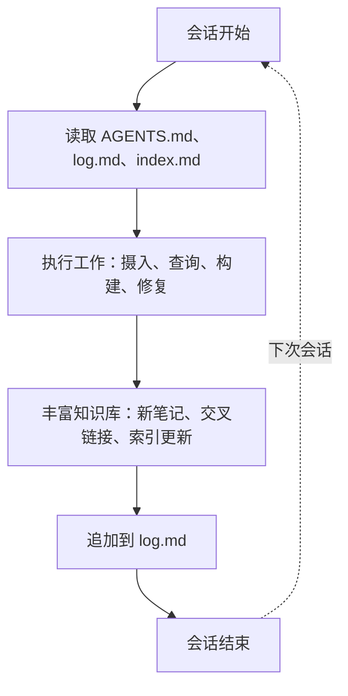
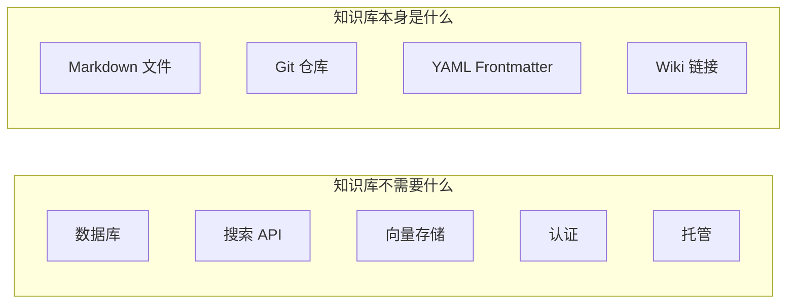

# 自举

## 核心循环



## 第一阶段：播种（人类 + AI 启动）

初始知识库通过启动序列创建：
1. 人类定义知识域和粗略分类
2. AI 提议目录结构并编写 `AGENTS.md`
3. 协作编写首 10–20 篇概念笔记
4. 建立每个层级的 `index.md`
5. 创建模板以保持笔记创建一致性
6. 用创建条目初始化 `log.md`

**当前知识库处于第一阶段完成状态。**

## 第二阶段：成长（AI 辅助丰富）

每次会话为知识库增添：
- **摄入**：新来源 → 提取概念 → 带交叉链接的原子概念笔记
- **归档查询**：好的答案成为新笔记 → 知识复利增长
- **检查**：检测孤立笔记、矛盾、过时内容 → 生成待办事项
- **交叉链接**：现有笔记间的新连接强化图谱

**增长是复利的**：更多内容 → 更丰富的索引 → 更好的答案 → 更多内容。

## 第三阶段：自我维护（AI 驱动，人类监督）

知识库具备以下能力：
- **主动缺口检测**：检查识别主题缺口 → AI 提议研究
- **持续检查**：矛盾在 `log.md` 中自动标记
- **替代管理**：旧概念标记 `status: superseded`，链接到更新版本
- **Git 原生审计**：每次变更是一次提交；`git diff` 显示变更内容和原因

## 什么赋能自举

### 无基础设施依赖



知识库**仅仅是文件**。任何文本编辑器都能打开它。任何 git 客户端都能版本控制它。任何 markdown 渲染器都能显示它。无专有依赖。

### 三大支柱

| 支柱 | 文件 | 功能 |
|--------|------|----------|
| **模式** | `AGENTS.md` | 告诉 AI 如何阅读、编写和维护知识库 |
| **记忆** | `log.md` | 保存跨会话的历史（可 grep） |
| **导航** | `index.md`（每个层级） | 实现无需搜索的渐进式披露 |

### 启动序列

每次 AI 会话以以下序列开始，约消耗 300 行上下文即可完全重新定向 Agent：

```
1. 读取 /AGENTS.md     → 了解规则
2. 读取 /log.md（末尾）→ 了解发生了什么
3. 读取 /index.md      → 了解当前状态
```

这是**最小可行记忆** — 足以恢复工作，无需 RAG、向量数据库或外部 API。

## 韧性属性

| 属性 | 实现方式 |
|----------|-------------|
| **上下文丢失存活** | 会话启动读取 log.md + index.md → 重新定向 |
| **损坏抵抗** | Git 版本控制；不可变 `raw/` 层（未来） |
| **格式锁定避免** | 纯 markdown + YAML；任何编辑器均可使用 |
| **无基础设施的规模化** | 通过 `index.md` 渐进式披露；支持 500+ 笔记 |
| **可审计性** | 仅追加日志；每个文件可 git blame |
| **人类可读** | 所有文件是人工编写的 markdown；AI 是维护者而非唯一读者 |

## 增长指标

健康、增长中的知识库的目标指标：

| 指标 | 播种阶段 | 成长阶段 | 成熟阶段 |
|--------|-----------|-------------|--------------|
| 笔记总数 | 20–50 | 50–200 | 200–500+ |
| 平均链接数/笔记 | 2–3 | 3–5 | 5–10+ |
| 孤立笔记 | < 10% | < 5% | 0% |
| 检查频率 | 每 5 次会话 | 每 10 次摄入 | 每次会话 |
| `log.md` 条目数 | 20–50 | 50–200 | 200+ |
| `index.md` 完整度 | 手动更新 | 半自动化 | 自动生成 |

---

# Citations

[1] Karpathy, A. (2026). LLM Wiki Gist. https://gist.github.com/karpathy/442a6bf555914893e9891c11519de94f
[2] Google Cloud. (2026). Open Knowledge Format v0.1 SPEC.md. https://github.com/GoogleCloudPlatform/knowledge-catalog
[3] Bush, V. (1945). "As We May Think." *The Atlantic Monthly*.
