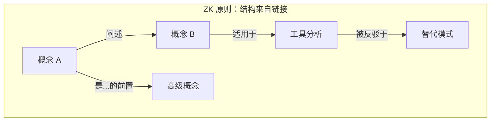

# 知识库架构

## 目录拓扑

```
<vault>/                       # 知识库根目录（任意位置）
├── AGENTS.md                  # 模式层（Karpathy 第 3 层）：AI Agent 的规则
├── index.md                   # 顶级渐进式披露目录（type: Index hub）
├── concepts.md                # 概念集群 hub（type: Index）
├── tools.md                   # 工具集群 hub（type: Index）
├── patterns.md                # 模式集群 hub（type: Index）
├── _meta.md                   # 元信息集群 hub（type: Index）
├── _identity.md               # 身份集群 hub（type: Index）
├── conference.md              # 会议集群 hub（type: Index）
├── log.md                     # 仅追加的时间线记忆（trace 层）
│
├── _identity/                 # AI 自我身份（Nova 是谁）
│   ├── nova-identity.md       # 核心目标、指令、个性
│   └── capability-manifest.md # 工具清单与成长路径
│
├── _meta/                     # 关于知识库的知识库（自我参照）
│   ├── promotions.md          # 升格台账（boot 加载）
│   ├── vault-architecture.md  # 本文件
│   ├── conventions.md         # 命名、链接、frontmatter 规则
│   └── self-bootstrapping.md  # 知识库如何自我维护
│
├── concepts/                  # 核心原子概念笔记（ZK 方法）
│   └── <concept>.md           # 原子笔记（每个文件一个概念）
│
├── tools/                     # 工具专项深度分析
│   └── <tool-name>.md
│
├── patterns/                  # 设计模式与架构
│   └── <pattern-name>.md
│
├── templates/                 # 笔记模板，用于一致化创建
│   ├── concept-template.md
│   ├── tool-template.md
│   └── pattern-template.md
│
├── skills/                     # 技能定义（受 AGENTS.md §8 保护）
│   └── nova-kb/SKILL.md        # Nova 知识库维护技能
│
├── .opencode/                  # OpenCode 项目配置
│   └── agents/                 # 自定义子 Agent（受 AGENTS.md §8 保护）
│       └── nova-architect.md
│
├── opencode.json               # 最小化配置（skills.paths + instructions）
│
├── .obsidian/                  # Obsidian 编辑器配置
│   └── app.json
│
└── _attachments/              # 图片、PDF 及其他附件
```

## 设计原理

### 为什么用目录，而非扁平结构？

虽然 Zettelkasten 纯粹主义者偏好扁平结构，但目录服务于两个实际目的：
1. **渐进式披露** — 每个目录层级的 `index.md` 文件提供了一个有序的入口，无需加载所有文件
2. **粗略的领域分区** — 目录是标签，不是层级。一篇笔记的"位置"是便利而非约束

### 真正的结构是图谱



目录提供**命名空间**。链接提供**结构**。`/concepts/` 中的笔记可以链接到 `/tools/` 和 `/patterns/` 中的笔记 — 跨领域连接是最有价值的。

### 自我参照设计

知识库包含**关于自身**的知识：
- `_meta/` 描述知识库如何运作
- `_identity/` 描述维护它的 AI
- `AGENTS.md` 提供两个领域共同遵循的规则

这种自我参照实现了真正的自举：AI 可以通过阅读知识库来理解如何维护知识库。

## 图谱拓扑

知识库的知识图谱具有以下属性：

| 属性 | 描述 |
|----------|-------------|
| **节点类型** | 文件（原子笔记；`type: Index` 文件为 hub） |
| **边类型** | Wiki 链接 `[[target]]`（`prerequisites` 路径 = 依赖文档，非图边） |
| **边语义** | 编码于链接周围的文字和 frontmatter 字段（`prerequisites`、`related`、`sources`） |
| **方向** | 有向（链接者 → 被链接者） |
| **反向链接** | 在查询时通过扫描所有文件的入链来计算 |
| **密度** | 目标：每篇笔记 3+ 条入链（反孤立） |
| **枢纽节点** | `type: Index` 文件（根 `index.md` + 根级集群 hub）提供导航 |

### 预期的图谱结构


## 关键架构决策

1. **OKF v0.1 合规**：每个文件在 frontmatter 中有 `type`。所有链接使用 markdown 语法。`index.md` 用于渐进式披露。`log.md` 用于变更日志。
2. **Obsidian wiki 链接**：内部引用使用 `[[note-name]]`。Obsidian 将其渲染为可点击链接并自动追踪反向链接。
3. **时间戳 ID**：`YYYYMMDDThhmmss` 格式，提供稳定、可排序的标识符。
4. **暂无 raw/ 层**：当前为种子知识库，无不不可变的源文档。raw 层可随知识库增长而添加。
5. **仅追加日志**：`/log.md` 从不重写 — 仅追加。这保留了完整的审计历史。
6. **Git 原生**：知识库设计为 git 仓库。每次变更是带有有意义信息的提交。
