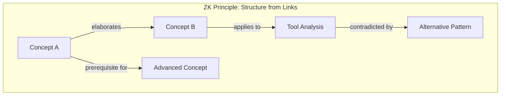
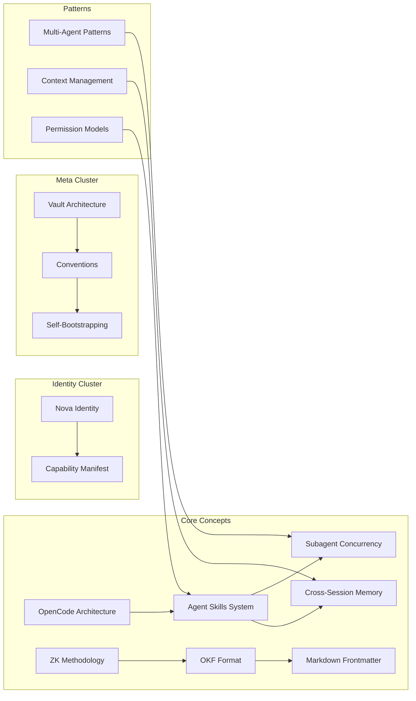

# Vault Architecture

## Directory Topology

```
D:\OpenCode\Note\              # Vault root
├── AGENTS.md                  # Schema layer (Karpathy Layer 3): rules for AI agents
├── index.md                   # Top-level progressive-disclosure catalog
├── log.md                     # Append-only chronological memory
│
├── _identity/                 # AI self-identity (who Nova is)
│   ├── index.md
│   ├── nova-identity.md       # Core purpose, directives, personality
│   └── capability-manifest.md # Tool inventory and growth path
│
├── _meta/                     # Vault-about-the-vault (self-referential)
│   ├── index.md
│   ├── vault-architecture.md  # This file
│   ├── conventions.md         # Naming, linking, frontmatter rules
│   └── self-bootstrapping.md  # How the vault maintains itself
│
├── concepts/                  # Core Zettelkasten permanent notes
│   ├── index.md               # Concept catalog
│   └── <concept>.md           # Atomic notes (one concept per file)
│
├── tools/                     # Tool-specific deep dives
│   ├── index.md
│   └── <tool-name>.md
│
├── patterns/                  # Design patterns & architectures
│   ├── index.md
│   └── <pattern-name>.md
│
├── templates/                 # Note templates for consistent creation
│   ├── concept-template.md
│   ├── tool-template.md
│   └── pattern-template.md
│
├── .opencode/                 # Opencode project configuration
│   ├── skills/nova-kb/        # Nova knowledge base maintenance skill
│   └── agents/                # Custom subagents
│
├── .obsidian/                 # Obsidian editor configuration
│   └── app.json
│
└── _attachments/              # Images, PDFs, and other attachments
```

## Design Rationale

### Why Directories, Not Flat?

While Zettelkasten purists prefer a flat structure, directories serve two practical purposes:
1. **Progressive disclosure** — `index.md` files at each directory level provide a curated entry point without loading all files
2. **Rough domain partitioning** — Directories are tags, not hierarchies. A note's "location" is a convenience, not a constraint

### The Real Structure is the Graph



Directories provide **namespace**. Links provide **structure**. A note in `/concepts/` can link to a note in `/tools/` and `/patterns/` — cross-domain connections are the most valuable.

### Self-Referential Design

The vault contains knowledge **about itself**:
- `_meta/` describes how the vault works
- `_identity/` describes the AI that maintains it
- `AGENTS.md` provides the rules both domains follow

This self-reference enables true self-bootstrapping: the AI can read the vault to understand how to maintain the vault.

## Graph Topology

The vault's knowledge graph has these properties:

| Property | Description |
|----------|-------------|
| **Node type** | File (atomic note) |
| **Edge type** | Wiki link `[[target]]` |
| **Edge semantics** | Encoded in surrounding prose and frontmatter fields (`prerequisites`, `related`, `sources`) |
| **Direction** | Directed (linker → linked) |
| **Backlinks** | Computed at query time by scanning all files for incoming links |
| **Density** | Target: 3+ incoming links per note (anti-orphan) |
| **Hubs** | `index.md` files serve as high-degree hub nodes for navigation |

### Expected Graph Structure



## Key Architectural Decisions

1. **OKF v0.1 conformance**: Every file has `type` in frontmatter. All links use markdown syntax. `index.md` for progressive disclosure. `log.md` for changelog.
2. **Obsidian wiki links**: `[[note-name]]` for internal references. Obsidian renders these as clickable links and automatically tracks backlinks.
3. **Timestamp IDs**: `YYYYMMDDThhmmss` format for stable, sortable identifiers.
4. **No raw/ layer (yet)**: Currently a seed vault without immutable source documents. The raw layer can be added as the vault grows.
5. **Append-only log**: `/log.md` is never rewritten — only appended. This preserves full audit history.
6. **Git-native**: The vault is designed to be a git repository. Every change is a commit with a meaningful message.
