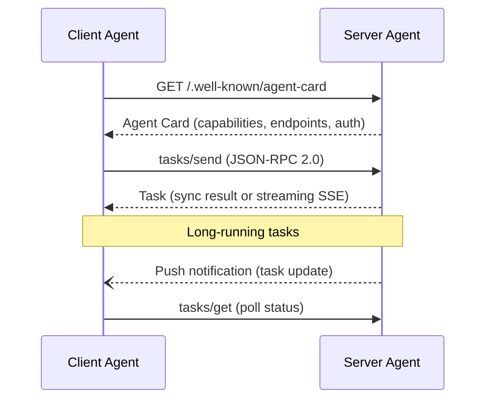

# A2A (Agent-to-Agent Protocol)

A2A is an open protocol enabling communication and interoperability between **opaque agentic applications** — AI agents built on different frameworks, by different providers, running on separate infrastructure.

## Core Philosophy: Opaque Collaboration

Unlike tool-calling protocols where the caller sees the implementation, A2A agents collaborate **without exposing**:
- Internal memory or reasoning state
- Proprietary logic or prompts
- Specific tool implementations

This enables secure, enterprise-grade multi-agent systems where each agent is a black box that can be independently developed, deployed, and secured.

## Architecture



| Component | Role |
|-----------|------|
| **Agent Card** | Public metadata (`.well-known/agent-card`) describing capabilities, skills, endpoints, auth schemes |
| **Client Agent** | Initiates tasks by sending requests to server agents |
| **Server Agent** | Exposes capabilities via Agent Card, processes tasks, returns results |
| **Task** | The unit of work — has lifecycle (submitted → working → completed/failed/cancelled) |

## Protocol: JSON-RPC 2.0 over HTTP(S)

A2A uses the same JSON-RPC 2.0 foundation as [[mcp-protocol|MCP]], but over HTTP(S) rather than stdio:

- **Requests**: Standard JSON-RPC with unique IDs
- **Responses**: Synchronous result or error
- **Streaming**: Server-Sent Events (SSE) for real-time progress
- **Push Notifications**: Asynchronous server→client updates (webhooks, polling fallback)

## Interaction Modalities

| Modality | Transport | Use Case |
|----------|-----------|----------|
| **Synchronous** | HTTP request/response | Simple queries, quick lookups |
| **Streaming** | SSE (Server-Sent Events) | Long-running tasks with progress, real-time agent reasoning |
| **Asynchronous** | Push notifications + polling | Fire-and-forget tasks, batch processing |

## Task Lifecycle

```
submitted → working → completed
                   → failed
                   → cancelled
```

Tasks support:
- **Artifacts**: Structured outputs (text, files, JSON) attached to task state
- **Status updates**: Progress notifications during execution
- **Cancellation**: Tasks can be cancelled mid-execution
- **History**: Full audit trail of task evolution

## Rich Data Exchange

A2A handles multiple data types within a single task:
- **Text**: Natural language messages between agents
- **Files**: Documents, images, code, binaries
- **Structured Data**: JSON payloads with schemas
- **Forms**: UI-driven data collection (negotiated at runtime)

## A2A vs MCP

| Aspect | MCP | A2A |
|--------|-----|-----|
| **Purpose** | Connect LLM to tools/data | Connect agent to agent |
| **Initiative** | Host application manages clients | Peer agents discover and communicate |
| **Primitives** | Resources, Prompts, Tools | Tasks, Agent Cards, Artifacts |
| **State** | Stateful session | Task-level state |
| **Opacity** | Server exposes tools, client can inspect | Agents are opaque black boxes |
| **Transport** | stdio (primary), HTTP+SSE | HTTP(S), SSE, push notifications |
| **Governance** | Anthropic-led open source | Linux Foundation, contributed by Google |
| **Typical use** | Agent invokes a weather API tool | Travel agent delegates to flight-booking agent |

**Complementary, not competing**: MCP handles agent↔tool integration; A2A handles agent↔agent collaboration. An agent could use MCP to call tools while simultaneously using A2A to coordinate with other agents.

## SDKs and Ecosystem

Multi-language SDKs available:
- Python: `pip install a2a-sdk`
- Go: `go get github.com/a2aproject/a2a-go`
- JavaScript/TypeScript: `npm install @a2a-js/sdk`
- Java, .NET, Rust SDKs also available

Framework integrations: Google ADK, LangGraph, BeeAI can expose agents as A2A servers.

## Enterprise Readiness

- **Authentication**: Authorization schemes embedded in Agent Cards
- **Observability**: Structured logging and task tracing
- **Security**: Agents don't expose internals; auth at protocol level
- **Open Governance**: Linux Foundation, Apache 2.0 license

## Relationship to Existing Patterns

A2A directly enables several [[multi-agent-patterns|coordination patterns]]:

| Pattern | A2A Role |
|---------|----------|
| Orchestrator-Worker | Orchestrator sends tasks to worker A2A servers |
| Peer-to-Peer | Peers discover each other via Agent Cards |
| Hierarchical | Parent agents delegate to child A2A servers |

It also complements the [[agent-skills-system|Agent Skills System]] — skills extend a single agent's capabilities, while A2A enables multiple independent agents to collaborate.

## Limitations

- Protocol is focused on opaque agents — less suited for tightly coupled agent architectures where shared memory is beneficial
- HTTP transport adds latency vs in-process subagent calls (as in [[subagent-concurrency|Subagent Concurrency]]'s `task` tool)
- Still evolving — dynamic UX negotiation and client-initiated methods are on the roadmap
