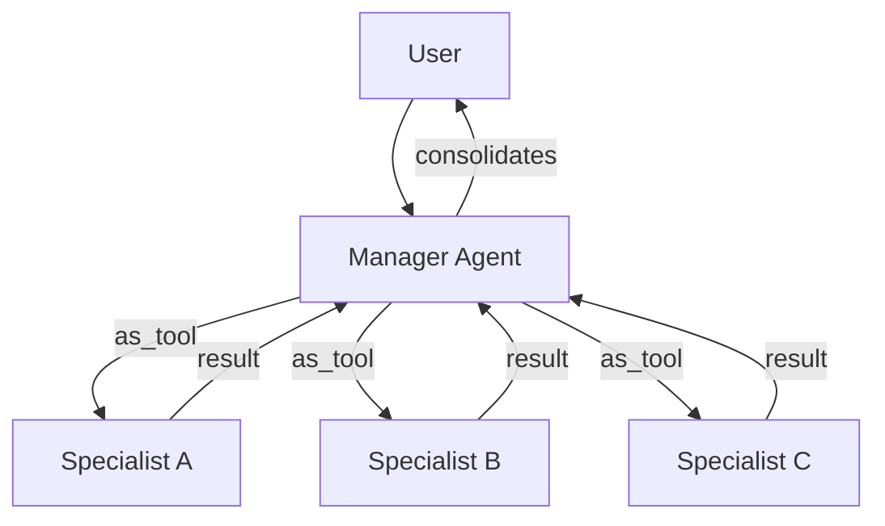
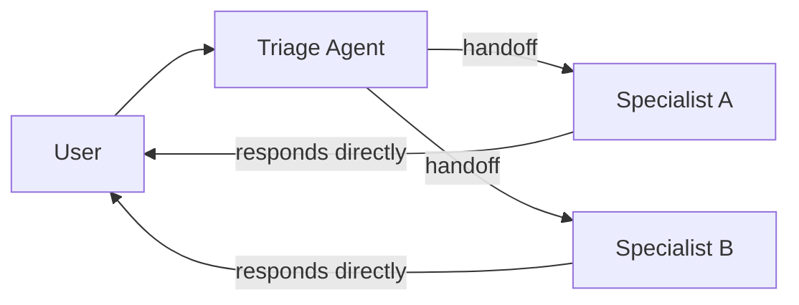

# Agent Orchestration

Orchestration is the control layer that decides **which agents run, in what order, and how they hand off work**. It operates on a spectrum from full LLM autonomy to explicit code control.

## The Orchestration Spectrum

```
LLM-Driven ←————————————————————————————→ Code-Driven
(Flexible)                                  (Deterministic)
```

| Approach | How It Works | Strengths | Weaknesses |
|----------|-------------|-----------|------------|
| **LLM-Driven** | Agent autonomously plans steps, invokes tools, delegates | Handles open-ended tasks, adapts to surprises | Non-deterministic, expensive, hard to debug |
| **Code-Driven** | Developer scripts the exact agent flow | Predictable, fast, auditable | Brittle, can't handle unexpected inputs |

Most production systems use a **hybrid**: LLM-driven for the broad strokes, code-driven for critical checkpoints.

## Two Fundamental Coordination Primitives

These are the atoms from which all multi-agent systems are built:

### 1. Manager (Agents as Tools)

A central orchestrator invokes specialists as **tools** — the manager retains control:



**Properties**:
- Centralized control, single merge point
- Manager can combine, filter, or transform specialist outputs
- Shared guardrails enforced in one place
- Specialist agents are stateless function calls
- Best for: bounded subtasks, combining results

### 2. Handoffs (Delegation)

A triage agent **transfers control** to a specialist — the specialist owns the response:



**Properties**:
- Decentralized, control transfers
- Specialist responds directly to user
- Each specialist has focused, uncluttered prompts
- Conversation history carries forward (configurable via filters)
- Best for: routing, independent expertise domains

### When to Use Which

| Situation | Pattern |
|-----------|---------|
| Need to combine outputs from multiple specialists | Manager |
| Specialist should respond directly to user | Handoff |
| Want shared guardrails across specialists | Manager |
| Want focused prompts per domain | Handoff |
| Need to transform specialist output before showing user | Manager |
| User should interact directly with the right expert | Handoff |

## LLM-Driven Orchestration Tactics

When letting the LLM decide:

1. **Invest in prompts** — Clear tool descriptions, usage guidelines, and constraints
2. **Monitor and iterate** — Trace decisions, identify failure patterns, refine prompts
3. **Allow introspection** — Let the agent critique itself in a loop; feed errors back
4. **Specialize, don't generalize** — Many focused agents outperform one generalist
5. **Use evals** — Automated testing to measure and improve agent quality

## Code-Driven Orchestration Patterns

When scripting the flow:

### Structured Output Routing
```python
# Agent classifies intent → code chooses next agent
classification = await classify_agent.run(input)
if classification.output == "refund":
    next_agent = refund_agent
elif classification.output == "booking":
    next_agent = booking_agent
```

### Agent Chaining (Pipeline)
```python
# Output of one agent becomes input to the next
outline = await planner.run(topic)
draft = await writer.run(outline.final_output)
critique = await reviewer.run(draft.final_output)
final = await polisher.run(f"{draft}\n\nFeedback: {critique}")
```

### Evaluation Loop
```python
# Agent produces → evaluator judges → repeat until passes
while True:
    result = await agent.run(task)
    eval_result = await evaluator.run(result.final_output)
    if eval_result.final_output == "PASS":
        break
    task = f"Previous attempt: {result}\nFeedback: {eval_result}"
```

### Parallel Execution
```python
# Run independent agents concurrently
results = await asyncio.gather(
    translate_to_fr.run(text),
    translate_to_es.run(text),
    translate_to_de.run(text),
)
```

## Orchestration in Major Tools

| Tool/Framework | Primary Pattern | Mechanism |
|----------------|-----------------|-----------|
| **OpenAI Agents SDK** | Both | `Agent.as_tool()` and `handoffs` parameter |
| **Claude Code** | Manager | `task` tool with `subagent_type` |
| **OpenCode** | Manager | `task` tool with agent types |
| **Aider** | Pipeline | Architect → Editor sequential |
| **LangGraph** | Code-driven | Explicit graph definition (nodes + edges) |
| **A2A Protocol** | Handoff | Agent Cards + task delegation |

## Hybrid Orchestration

The most robust systems blend both approaches:

```
User Input
    ↓
[LLM-Driven] Triage agent classifies intent
    ↓
[Code-Driven] Route to specialist based on classification
    ↓
[LLM-Driven] Specialist handles task autonomously
    ↓
[Code-Driven] Output guardrail validates response
    ↓
Final Output
```

This gives you flexibility where needed and determinism where required.

## Relationship to Protocols

- **[[MCP Protocol|MCP]]** enables tool-level orchestration — agents invoke tools on external servers
- **[[A2A Protocol|A2A]]** enables agent-level orchestration — agents delegate to other agents across organizational boundaries
- **Both complement each other**: MCP for agent↔tool, A2A for agent↔agent
