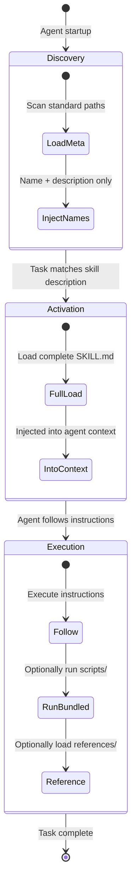
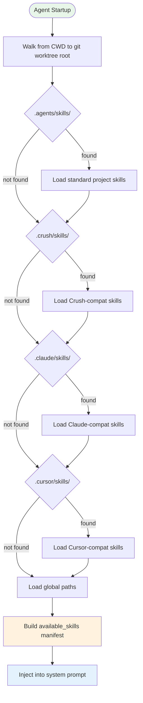

# Agent Skills Standard

## Overview

The **Agent Skills standard** ([agentskills.io](https://agentskills.io)) is an open format for extending AI agent capabilities through portable, self-contained skill packs. Originally developed by **Anthropic** as part of Claude Code, it has since converged into an industry-wide standard adopted by **40+ agent tools** as of mid-2026.

A skill is a **folder** containing:

```
skill-name/
├── SKILL.md          # Metadata + instructions (required)
├── scripts/          # Executable code bundled with the skill (optional)
├── references/       # Additional documentation loaded on demand (optional)
└── assets/           # Static resources (templates, images, configs) (optional)
```

The format's core insight is that agent extensibility needs **portability**: a skill built once should work across any compatible agent, regardless of vendor.

## Progressive Disclosure Model

The standard defines a **three-stage loading model** that minimizes context consumption:



### Stage 1: Discovery

At agent startup, only the **name** and **description** of each skill are loaded. This creates a lightweight manifest (the `<available_skills>` block) without consuming significant context window.

### Stage 2: Activation

When the agent determines that a task matches a skill's description, the **full `SKILL.md`** is loaded into the conversation context. This includes all instructions, workflow steps, and resource pointers.

### Stage 3: Execution

The agent follows the skill's instructions, optionally:
- Executing **bundled scripts** from `scripts/`
- Loading **reference materials** from `references/`
- Using **static assets** from `assets/`

This model means unused skills cost **zero context** — only activated skills consume tokens.

## SKILL.md Frontmatter Specification

The `SKILL.md` file uses **YAML frontmatter** followed by Markdown body. The standard defines both required and extended fields:

### Required Fields

| Field | Type | Description |
|-------|------|-------------|
| `name` | string | Unique skill identifier (1-64 chars, lowercase alphanumeric + hyphens) |
| `description` | string | 1-1024 char description used by the agent for task-matching |

### Extended Fields (Optional)

| Field | Type | Description |
|-------|------|-------------|
| `license` | string | SPDX license identifier for the skill |
| `compatibility` | string | Target agent compatibility marker |
| `user-invocable` | boolean | Whether the user can directly invoke this skill (default: true) |
| `disable-model-invocation` | boolean | Prevent the model from auto-activating this skill |
| `metadata` | map | Arbitrary string→string key-value pairs for tool-specific extensions |

### Example SKILL.md

```yaml
---
name: code-review
description: "Automated code review with style checking, security analysis, and best-practice recommendations. Use when the user asks for code review, audit, or quality check."
license: MIT
compatibility: agentskills
metadata:
  audience: developers
  workflow: github-pr
---
# Code Review Skill

## When to Use
- User explicitly requests code review
- User asks "is this code secure?"
- User mentions "audit" or "quality check"

## Workflow
1. Read the target file(s) with Read tool
2. Check for: security vulnerabilities, style violations, performance issues
3. Output a structured review report with severity levels

## References
See `references/security-checklist.md` for detailed CWE coverage.
```

## Standard Skills Paths

The standard defines canonical filesystem locations for skill discovery, enabling cross-tool sharing:

### Global (User-Level) Paths

| Priority | Path | Scope |
|----------|------|-------|
| 1 | `$XDG_CONFIG_HOME/agents/skills/` | Cross-tool global |
| 2 | `~/.config/agents/skills/` | Fallback global (Linux/macOS) |

### Project-Level Paths

| Priority | Path | Adopted By |
|----------|------|------------|
| 1 | `.agents/skills/` | Standard (40+ tools) |
| 2 | `.crush/skills/` | Crush (OpenCode successor) |
| 3 | `.claude/skills/` | Claude Code (legacy) |
| 4 | `.cursor/skills/` | Cursor |
| 5 | `.opencode/skills/` | OpenCode (legacy) |

### Discovery Algorithm



**Key property**: Skills in `.agents/skills/` are discovered by **all** compatible tools, enabling true cross-tool portability. Tools also scan their legacy paths for backward compatibility.

## Adopter Ecosystem (40+ Tools)

As of July 2026, the standard is adopted by a broad ecosystem:

### Major Adopters

| Tool | Vendor | Category |
|------|--------|----------|
| **Claude Code** | Anthropic | Terminal agent |
| **Cursor** | Cursor Inc. | IDE agent |
| **GitHub Copilot** | Microsoft | IDE agent |
| **VS Code** | Microsoft | IDE agent |
| **OpenAI Codex** | OpenAI | Terminal agent |
| **Crush** | AnomalyCo | Terminal agent (OpenCode successor) |
| **Gemini CLI** | Google | Terminal agent |
| **OpenHands** | All Hands AI | Autonomous agent |
| **Goose** | Block (Square) | Terminal agent |
| **Junie** | JetBrains | IDE agent |
| **Spring AI** | VMware/Broadcom | Java framework |
| **Snowflake Cortex Code** | Snowflake | Cloud agent |

### Ecosystem Impact

```mermaid
graph TD
    SUBGRAPH Community
        DEV[Developer<br/>creates skill once]
        DEV --> SKILL[Skill in .agents/skills/]
    end

    subgraph "Compatible Tools"
        CC[Claude Code]
        CR[Cursor]
        GH[GitHub Copilot]
        CX[OpenAI Codex]
        CH[Crush]
        GC[Gemini CLI]
        OH[OpenHands]
        GS[Goose]
    end

    SKILL --> CC
    SKILL --> CR
    SKILL --> GH
    SKILL --> CX
    SKILL --> CH
    SKILL --> GC
    SKILL --> OH
    SKILL --> GS
```

## Relationship to Nova's Skills System

Nova's vault already uses the `SKILL.md` format in `skills/` (see [[agent-skills-system|Agent Skills System]]). Aligning with the Agent Skills standard enables:

| Benefit | Detail |
|---------|--------|
| **Portability** | Nova skills can be shared with other agent tools (Claude Code, Cursor, etc.) |
| **Community skills** | Skills from the ecosystem (e.g., [Anthropic's public skills repo](https://github.com/anthropics/skills)) can be used in Nova |
| **Standard paths** | Adopting `.agents/skills/` as the primary location enables cross-tool discovery |
| **Future-proofing** | As the standard evolves, Nova benefits from the broader ecosystem's investments |

### Current Nova vs Standard

| Aspect | Nova Current | Standard |
|--------|-------------|----------|
| **Format** | SKILL.md with YAML frontmatter | SKILL.md with YAML frontmatter |
| **Primary path** | `skills/` | `.agents/skills/` |
| **Frontmatter** | `name`, `description`, `license`, `compatibility`, `metadata` | `name`, `description` (required) + extended fields |
| **Subdirectories** | N/A | `scripts/`, `references/`, `assets/` |
| **Progressive disclosure** | Implicit (lazy loading via tool call) | Explicit 3-stage model |

## Design Principles

### 1. Portability
Skills are filesystem artifacts, not database entries. Copy a folder → skill works. No registration, no API keys, no vendor lock-in.

### 2. Progressive Disclosure
Load nothing until needed. Even then, load only what's needed. This is the standard's most important architectural decision — it enables **unbounded skill count** without context exhaustion.

### 3. Composability
Skills can reference each other, chain workflows, and compose. A `deploy` skill can invoke a `test` skill, which invokes a `lint` skill.

### 4. Human + AI Dual Consumer
SKILL.md is readable by both humans (documentation) and AIs (executable instructions). The same file serves as both reference and runtime.

## Comparison with Related Standards

| Standard | Scope | Relationship |
|----------|-------|--------------|
| **Agent Skills** (agentskills.io) | Skill format and discovery | This note |
| **MCP** (modelcontextprotocol.io) | Tool/resource integration protocol | Complementary — MCP provides the tools a skill invokes |
| **A2A** (Google) | Agent-to-agent communication | Orthogonal — A2A handles inter-agent messaging; skills handle intra-agent capability |
| **SKILL.md** (OpenCode/Claude) | Per-tool skill format | **Now unified** — the Agent Skills standard absorbed the original SKILL.md format |

## See Also

- [[agent-skills-system|Agent Skills System]] — Mechanics of how Nova discovers, loads, and manages skills
- [[skill-subagent-boundary|Skill vs Subagent Boundary]] — When to use a skill (instruction injection) vs a subagent (process isolation)
- [[mcp-protocol|MCP Protocol]] — The complementary protocol for tool/resource integration that skills leverage
- [[agent-extensibility|Agent Extensibility]] — The broader extensibility triad: Skills + Hooks + Plugins
- [[opencode-architecture|OpenCode Architecture]] — How OpenCode's skill loader implements the standard

## Citations

1. [Agent Skills — Open Standard](https://agentskills.io)
2. [Agent Skills Specification](https://agentskills.io/specification)
3. [Anthropic Skills Repository](https://github.com/anthropics/skills)
