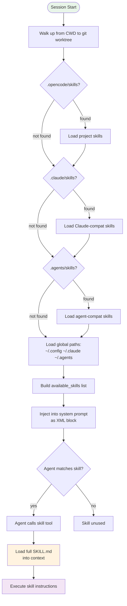

---
type: Concept
title: "Agent Skills System"
description: "Skills are lazy-loaded instruction modules defined via SKILL.md YAML frontmatter, discovered from six scan paths, and loaded on-demand via the skill tool into model context."
tags: [opencode, skills, agents, SKILL.md, context-management]
timestamp: 2026-06-22T00:00:00Z
id: "20260622T150100"
status: evergreen
difficulty: intermediate
domain: ai-tools
prerequisites:
  - /concepts/opencode-architecture.md
related:
  - "[[opencode-architecture|OpenCode Architecture]]"
  - "[[subagent-concurrency|Subagent Concurrency]]"
  - "[[cross-session-memory|Cross-Session Memory]]"
  - "[[mcp-protocol|MCP Protocol]]"
sources:
  - title: "OpenCode Documentation — Skills"
    url: "https://opencode.ai"
confidence: 0.92
summary: >
  Skills are on-demand instruction packs defined in SKILL.md files with YAML frontmatter (name, description required), scanned from six priority-ordered locations, lazy-loaded into model context when the agent invokes the skill tool.
---

# Agent Skills System

## SKILL.md Format

Skills are defined via a **`SKILL.md`** file inside a skill-named directory. The file must use **YAML frontmatter** followed by Markdown body content.

### Frontmatter Specification

```yaml
---
name: my-skill-name          # REQUIRED: 1-64 chars, lowercase alphanumeric, single hyphens
description: What I do       # REQUIRED: 1-1024 chars
license: MIT                 # OPTIONAL
compatibility: opencode      # OPTIONAL
metadata:                    # OPTIONAL: string-to-string map
  audience: maintainers
  workflow: github
---
```

### Naming Rules

Regex constraint: `^[a-z0-9]+(-[a-z0-9]+)*$`

- 1–64 characters
- Lowercase alphanumeric with single hyphen separators
- Cannot start or end with `-`
- Cannot contain consecutive `--`
- Must match the directory name containing `SKILL.md`
- Filename must be all-caps: `SKILL.md`

### Complete Frontmatter Reference

| Field | Required | Type | Constraints |
|-------|----------|------|-------------|
| `name` | Yes | string | 1-64 chars, matches regex, matches directory name |
| `description` | Yes | string | 1-1024 chars |
| `license` | No | string | Any SPDX identifier |
| `compatibility` | No | string | E.g., `opencode` |
| `metadata` | No | map (string→string) | Arbitrary key-value pairs |

Unknown frontmatter fields are silently ignored.

## Skill Storage Locations

OpenCode scans **six locations** for skills:

| Priority | Location | Scope |
|----------|----------|-------|
| 1 | `.opencode/skills/<name>/SKILL.md` | Project |
| 2 | `~/.config/opencode/skills/<name>/SKILL.md` | Global |
| 3 | `.claude/skills/<name>/SKILL.md` | Project (Claude-compatible) |
| 4 | `~/.claude/skills/<name>/SKILL.md` | Global (Claude-compatible) |
| 5 | `.agents/skills/<name>/SKILL.md` | Project (agent-compatible) |
| 6 | `~/.agents/skills/<name>/SKILL.md` | Global (agent-compatible) |

## Skill Discovery and Loading Flow



## Skill Loader Behavior

- For project-local paths, OpenCode **walks up from CWD** until it reaches the git worktree
- Loads any matching `skills/*/SKILL.md` in `.opencode/`, `.claude/skills/`, and `.agents/skills/` along the way
- Global definitions loaded from `~/.config/opencode/skills/`, `~/.claude/skills/`, `~/.agents/skills/`
- Skills are loaded **on-demand** (lazy loading) — metadata only until invocation

## How Skills Interact with Model Context

1. Skills are listed in the system prompt via the **`<available_skills>`** XML block in the `skill` tool description
2. Each entry includes `<name>` and `<description>`
3. When an agent determines a skill is needed, it calls the `skill` tool
4. The `skill` tool loads the **full** `SKILL.md` content into the conversation context
5. Skills with `deny` permission are completely hidden from the agent

```xml
<available_skills>
  <skill>
    <name>my-skill</name>
    <description>What I do — 1-1024 char description</description>
    <location>file:///path/to/SKILL.md</location>
  </skill>
</available_skills>
```

## What Makes a Good Skill

- **Specific description** within 1024 chars — the agent must be able to determine when to use it
- **Clear purpose sections**: "What I do," "When to use me," step-by-step instructions
- **Unique name** across all locations (duplicates cause load failures)
- **All-caps filename**: `SKILL.md` (not `skill.md` or `Skill.md`)
- Appropriate **permission configuration** to control which agents can access it

## Permission Configuration for Skills

```json
{
  "permission": {
    "skill": {
      "*": "allow",
      "pr-review": "allow",
      "internal-*": "deny",
      "experimental-*": "ask"
    }
  }
}
```

| Action | Behavior |
|--------|----------|
| `"allow"` | Skill loads without approval |
| `"ask"` | User prompted for approval |
| `"deny"` | Skill hidden from agents entirely |

### Wildcard Matching

- `*` matches zero or more characters
- `?` matches exactly one character
- **Last matching rule wins** — place catch-all `*` first, specific rules after
