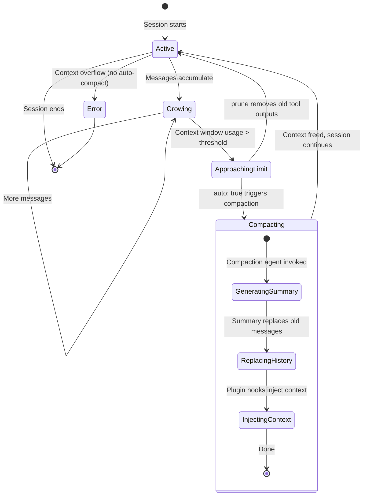

---
type: Concept
title: "Cross-Session Memory"
aliases:
  - "Cross Session Memory"
description: "Context management via message parts and session model, automatic compaction with a hidden agent, session persistence on disk, and cross-session knowledge through AGENTS.md and instruction files."
tags: [opencode, memory, sessions, compaction, context-management]
timestamp: 2026-06-22T00:00:00Z
id: "20260622T150300"
status: evergreen
difficulty: intermediate
domain: ai-tools
prerequisites:
  - /concepts/opencode-architecture.md
  - /concepts/agent-skills-system.md
related:
  - "[[opencode-architecture|OpenCode Architecture]]"
  - "[[agent-skills-system|Agent Skills System]]"
  - "[[subagent-concurrency|Subagent Concurrency]]"
  - "[[okf-format|OKF Format]]"
sources:
  - title: "OpenCode Documentation — Sessions & Memory"
    url: "https://opencode.ai"
  - title: "AGENTS.md — Nova Schema Layer"
confidence: 0.87
summary: >
  OpenCode manages context as Message→Part[] objects, auto-compacts when the window nears fullness via a hidden compaction agent, persists sessions to disk for resumption, and supports cross-session knowledge through AGENTS.md and instruction files — but has no built-in vector DB or long-term memory store.
---

# Cross-Session Memory

## Context Management

### Message-Part Model

OpenCode's context is the conversation history sent to the LLM. Key structures:

- **Message parts**: The conversation is composed of `Part[]` objects (text, tool use, tool result, thinking, etc.)
- **Session model**: Each conversation is a `Session` with `Message[]` entries, each having `Part[]`
- **Context window**: Limited by the model's maximum context length (handled by the AI SDK/provider)

### Context Window Limitations

The context window is the finite token capacity the model can process at once. When approached, compaction is triggered to prevent overflow.

## Compaction System

When the context window approaches fullness, OpenCode automatically compacts the conversation using a dedicated hidden agent.

### Compaction Lifecycle



### Configuration

```json
{
  "compaction": {
    "auto": true,
    "prune": false,
    "reserved": 10000
  }
}
```

| Setting | Type | Behavior |
|---------|------|----------|
| `auto` | boolean | Auto-compact when context is full |
| `prune` | boolean | Remove old tool outputs to save tokens |
| `reserved` | number | Token buffer to avoid overflow during compaction |

### Compaction Agent

A **hidden built-in agent** (`compaction`) generates a dense summary of the conversation so far, replacing the full history with a condensed version that preserves key context.

Key behaviors:
- When `auto: true`, compaction triggers automatically
- The `reserved` buffer ensures room for the compaction summary itself
- `prune: true` removes old tool outputs before compaction
- `OPENCODE_DISABLE_AUTOCOMPACT` environment variable can disable it
- Plugins can hook into compaction via `"experimental.session.compacting"` to inject context or replace the prompt

## Session Persistence

### Disk Storage

- Sessions are stored on disk in a database (queried via `opencode db`)
- Session data persists across OpenCode restarts

### Session Commands

| Command | Function |
|---------|----------|
| `opencode --continue` / `-c` | Resume the last session |
| `opencode -s <sessionID>` | Resume a specific session |
| `opencode --fork` | Fork a session at a specific message |
| `opencode session list` | List all sessions |
| `opencode export` | Export session data |
| `opencode import` | Import session data |
| `POST /session/:id/fork` | Fork via API |

### Session Forking

Sessions can be **forked** at any message:
- Creates a new session sharing history up to the fork point
- Useful for exploring alternative approaches without losing the original path

## Cross-Session Knowledge

### Persistent Knowledge Mechanisms

| Mechanism | Scope | Persistence |
|-----------|-------|-------------|
| **AGENTS.md** (project) | Project-level instructions | Committed to Git, shared with team |
| **AGENTS.md** (global) | Personal cross-project instructions | `~/.config/opencode/AGENTS.md` |
| **Instruction files** | Configured via `instructions` array | Loaded every session |
| **`/init` command** | Auto-generates AGENTS.md | Used by future sessions |
| **Compaction summaries** | Within-session context preservation | Per-session only |
| **Plugin-based persistence** | Via `session.compacted` hooks | Custom implementations |

### AGENTS.md Loading

AGENTS.md files and instruction files are loaded into **every new session** as system context. This is the primary mechanism for cross-session knowledge transfer.

Configuration in `opencode.json`:

```json
{
  "instructions": [
    "./AGENTS.md",
    "./docs/conventions.md",
    "~/.config/opencode/AGENTS.md"
  ]
}
```

### Memory Limitations

- **No built-in vector database** for semantic retrieval
- **No persistent cross-session agent memory** — each new session starts fresh except for AGENTS.md and instruction files
- **Compaction is per-session**, not cross-session
- **Snapshot system** tracks file changes for undo/redo but does not persist beyond the session

### Extending Memory

For advanced memory needs, implement custom solutions via:

1. **Plugins** that inject context into compaction hooks
2. **MCP servers** with persistent storage
3. **Custom tools** that read/write to external knowledge stores
4. **AGENTS.md** with explicit instructions to reference external files

## OKF Log.md Pattern

A complementary approach used by this knowledge vault:

- **Append-only**: Never delete entries, only append
- **Chronological**: Newest entries at the top (reverse chronological)
- **Greppable**: `grep "^## \[" log.md | tail -20` for recent activity
- **Format**: `## [YYYY-MM-DD] operation | Description`

## Session Boot Sequences

### Session Start (from AGENTS.md)

Every AI session **MUST** execute this boot sequence:
1. Read `/AGENTS.md` — rules and conventions
2. Read `/log.md` — last 20 lines for recent activity context
3. Read `/index.md` — current vault state
4. Read `/concepts/index.md` — current concept inventory

### Session End (from AGENTS.md)

Every AI session **SHOULD** execute this shutdown sequence:
1. Append to `/log.md`: `## [YYYY-MM-DD] session | <Summary>`
2. Update any changed `index.md` files
3. File any valuable query answers as new notes
4. Ensure all new/modified notes have complete frontmatter and links
