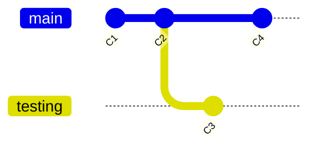
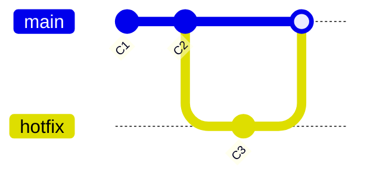
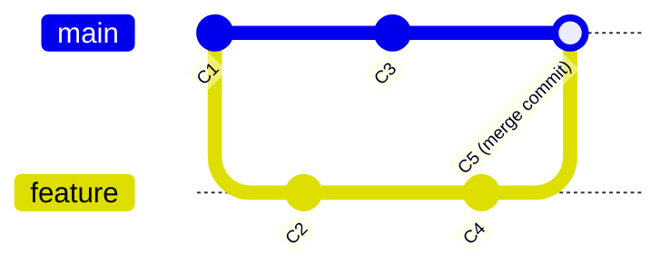
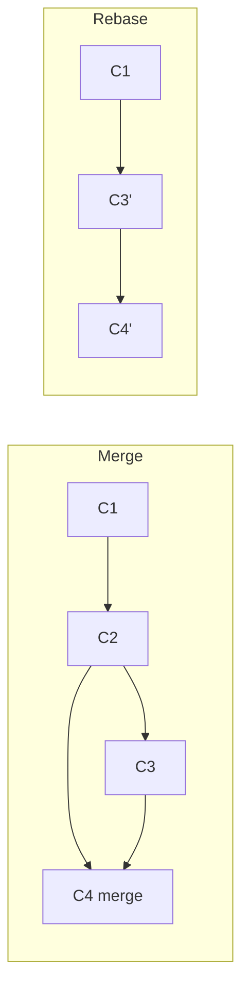

# Git Branching

## What Is a Branch?

在 Git 中，分支只是一个**指向某个 commit 的轻量级可移动指针**。

```
Branch = 41 bytes (40-char SHA-1 + newline)
```

创建一个分支 = 写入 41 字节到文件 = 瞬间完成。

### 默认分支

`git init` 创建默认的 `master`（或 `main`）分支。每当你提交，这个指针就自动向前移动到最新 commit。


## HEAD — 当前分支

`HEAD` 是一个特殊指针，指向当前所在的本地分支。


### 关键概念

| 操作 | HEAD 行为 |
|------|----------|
| `git branch <name>` | 创建新指针，HEAD 不动 |
| `git checkout <name>` | HEAD 移动指向新分支 |
| `git commit` | 当前 HEAD 指向的分支向前移动 |
| `git reset <commit>` | HEAD 指向的分支移动到指定 commit |

---

## Branching in Action

### 创建分支

```bash
git branch testing
# HEAD 仍然指向 master
# testing 和 master 指向同一个 commit

git checkout testing
# 或 git switch testing  (Git 2.23+)
# HEAD 移动到 testing
```



### 查看分支

```bash
git log --oneline --decorate --graph --all
#  * c2b9e (HEAD -> main) Make other changes
#  | * 87ab2 (testing) Make a change
#  |/
#  * f30ab Initial commit
```

---

## Merging

### Fast-Forward Merge（快进合并）

当被合并分支是当前分支的直接上游时，Git 只需移动指针：

```bash
git checkout master
git merge hotfix
# 无需创建新的 merge commit
```



### Three-Way Merge（三方合并）

当两个分支各自有独立提交时：

```bash
git checkout master
git merge feature
# 创建新的 merge commit，有 2 个父提交
```



### Merge Conflict（合并冲突）

当同一文件同一位置被两个分支修改：

```bash
git merge feature
# CONFLICT: Merge conflict in file.txt

# 手动解决冲突后：
git add file.txt
git commit -m "Resolve merge conflict"
```

---

## Rebasing

### Rebase vs Merge



| Merge | Rebase |
|-------|--------|
| 保留完整历史 | 线性历史 |
| 有 merge commit | 无额外 commit |
| 公共分支推荐 | 私有分支推荐 |
| 历史准确 | 历史干净 |

### 操作

```bash
# Rebase 当前分支到 master 上
git checkout feature
git rebase master

# 将当前分支最近 3 个 commit 合并为一个
git rebase -i HEAD~3
```

### Golden Rule of Rebasing

> **不要对已经推送到公共仓库的 commit 执行 rebase。**

---

## Branch Management

| 命令 | 作用 |
|------|------|
| `git branch` | 列出本地分支 |
| `git branch -a` | 列出所有分支（含远程） |
| `git branch <name>` | 创建分支 |
| `git branch -d <name>` | 删除分支（已合并） |
| `git branch -D <name>` | 强制删除分支 |
| `git branch -m <new>` | 重命名当前分支 |
| `git checkout -b <name>` | 创建并切换到新分支 |
| `git switch -c <name>` | Git 2.23+: 创建并切换 |

---

## Common Workflows

### Feature Branch Workflow

```
main ────○────○────○──── Merge ──
              \              /
feature         ○────○────○
```

所有功能开发在独立分支进行，通过 PR/MR 合并到 main。

### Git Flow

```
main ────○──────────────────────○──────
              \              /
develop        ○────○────○────○
                \        /
feature           ○────○
```

- `main`: 生产就绪代码
- `develop`: 集成分支
- `feature/*`: 功能分支
- `release/*`: 发布准备
- `hotfix/*`: 紧急修复

### Trunk-Based

```
main ──○──○──○──○──○──○──
        \  /   \  /
         ○      ○ (short-lived branches)
```

频繁合并到 main，分支生命周期很短。

---

# Remote Branches

远程分支是远程仓库状态的**只读副本**：

```
origin/main  ← 上次 fetch 时的远程 main 状态
main         ← 你的本地 main
```

```bash
git fetch origin                    # 更新所有远程引用
git push origin main                # 推送本地 main 到远程
git push origin --delete old-branch # 删除远程分支
```

### Tracking Branches

```bash
git checkout -b feature origin/feature   # 创建跟踪分支
git checkout --track origin/feature      # 简写 (Git 2.23+)
git push -u origin feature               # 首次推送并设置上游
```

---

# Citations

[1] Chacon, S. & Straub, B. (2014). *Pro Git* (2nd ed.). Apress. https://git-scm.com/book/en/v2
