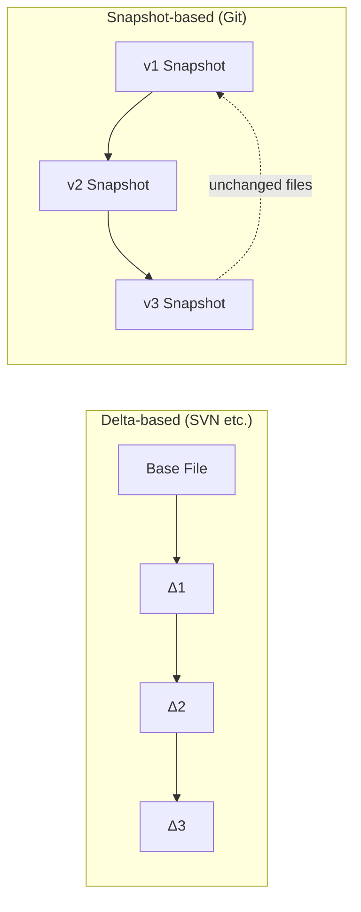
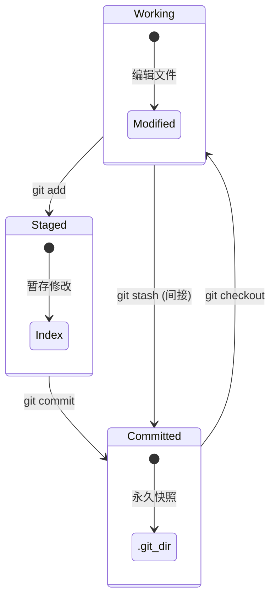

# Git Data Model

## 核心哲学

### Snapshots, Not Differences

大多数 VCS（如 Subversion、CVS）以**增量（delta-based）**方式存储：记录每个文件随时间变化的差异。

Git 完全不同——它把数据视为**微型文件系统的快照流**。每次 commit，Git 拍摄所有文件的快照，并存储引用。如果文件未变化，则只存储一个链接指向上一个相同的文件。



### Content-Addressable (内容寻址)

Git 本质是一个**内容寻址的文件系统**——一个键值数据库：

$$
\text{Key} = \text{SHA-1}(\text{header} + \text{content})
$$

任何内容插入 Git 都会返回一个 40 字符的 SHA-1 哈希值作为唯一键：

```
24b9da6552252987aa493b52f8696cd6d3b00373
```

### Integrity (完整性)

所有内容在存储前都经过校验和计算。**不可能**在 Git 不知情的情况下更改任何文件或目录的内容。

---

## Four Object Types (四种对象)

```mermaid
graph TD
    TAG[Tag Object<br/>Annotated tag] --> COMMIT
    COMMIT[Commit Object<br/>Author, message, timestamp, parent(s)] --> TREE
    TREE[Tree Object<br/>Directory listing: filename → blob/tree SHA] --> BLOB1[Blob<br/>File content]
    TREE --> BLOB2[Blob<br/>File content]
    TREE --> SUBTREE[Tree<br/>Subdirectory]
    SUBTREE --> BLOB3[Blob]
```

### Blob（二进制大对象）

存储**文件内容**，不包含文件名，不包含元数据。

```bash
$ echo 'test content' | git hash-object -w --stdin
d670460b4b4aece5915caf5c68d12f560a9fe3e4

$ git cat-file -t d670460b  # 查看类型
blob

$ git cat-file -p d670460b  # 查看内容
test content
```

### Tree（树对象）

对应**目录结构**。每个条目包含：mode（文件权限）、type（blob/tree）、SHA-1 哈希、文件名。

```bash
$ git cat-file -p master^{tree}
100644 blob a906cb...  README
100644 blob 8f9413...  Rakefile
040000 tree 99f1a6...  lib
```

### Commit（提交对象）

存储一个**快照的元数据**：指向顶层 tree 的指针、作者、提交者、时间戳、父提交、提交信息。

```bash
$ git cat-file -p HEAD
tree cfda3bf379e4f8dba8717dee55aab78aef7f4daf
parent 3c4e9cd789d88d8d89c1073707c3585e41b0e614
author hencter <...> 1719033600 +0800
committer hencter <...> 1719033600 +0800

First commit
```

**父指针**：初始提交 0 个父，普通提交 1 个父，merge 提交多个父。

### Tag（标签对象）

指向 commit 的永久引用，可以有注释、签名。

---

## Three States & Three Areas



| 区域 | 位置 | 含义 | 命令 |
|------|------|------|------|
| **Working Directory** | 硬盘上的项目目录 | 解包后的文件，可编辑的沙箱 | 手动编辑 |
| **Staging Area** (Index) | `.git/index` | 下一次 commit 的快照提案 | `git add` / `git reset` |
| **Git Directory** (Repository) | `.git/objects/` | 永久快照存储 | `git commit` |

### 工作流

```
编辑文件 → git add → git commit → 循环
  (Modified)  (Staged)  (Committed)
```

---

## Object Storage Format

每个 Git 对象存储格式如下：

```
header = "<type> <content_bytes>\0"
store  = header + content
sha1   = SHA-1(store)
file   = zlib(store)
path   = .git/objects/<sha1[0:2]>/<sha1[2:40]>
```

例如 "what is up, doc?" (17 bytes):

```
header  = "blob 17\0"
store   = "blob 17\0what is up, doc?"
sha1    = bd9dbf5aae1a3862dd1526723246b20206e5fc37
path    = .git/objects/bd/9dbf5aae1a3862dd1526723246b20206e5fc37
```

---

## .git Directory Structure

```
.git/
├── HEAD              # 指向当前分支的指针
├── config            # 仓库配置
├── description       # 仓库描述
├── index             # 暂存区
├── hooks/            # Git hooks 脚本
├── info/
│   └── exclude       # 本地 ignore 规则
├── logs/             # 分支和 HEAD 的变更日志
│   ├── HEAD
│   └── refs/
├── objects/          # 对象数据库
│   ├── info/
│   ├── pack/         # Packfiles (压缩存储)
│   └── <xx>/         # 松散对象 (前2位→目录，后38位→文件)
└── refs/             # 分支、标签引用
    ├── heads/        # 本地分支
    ├── remotes/      # 远程分支引用
    └── tags/         # 标签引用
```

---

# Citations

[1] Chacon, S. & Straub, B. (2014). *Pro Git* (2nd ed.). Apress. https://git-scm.com/book/en/v2
