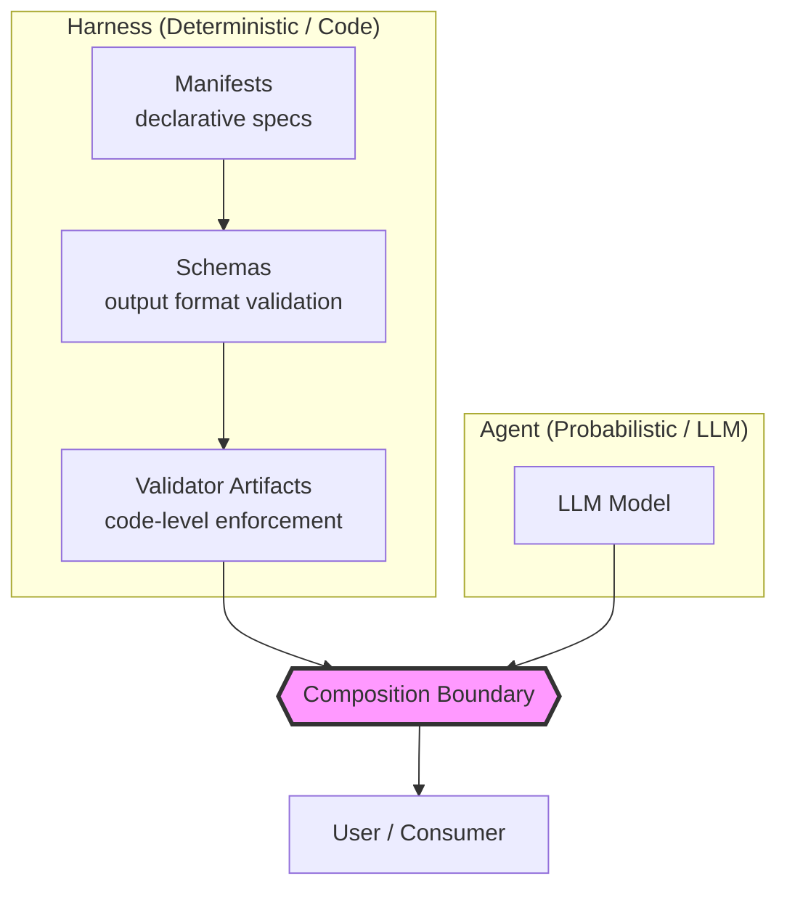
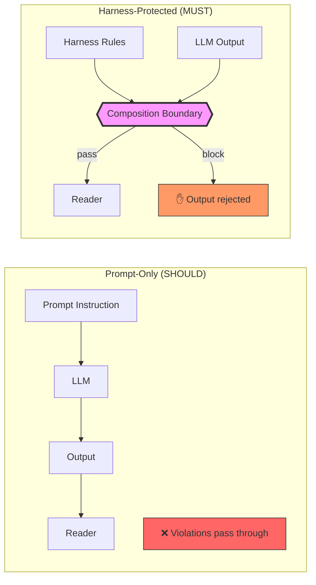
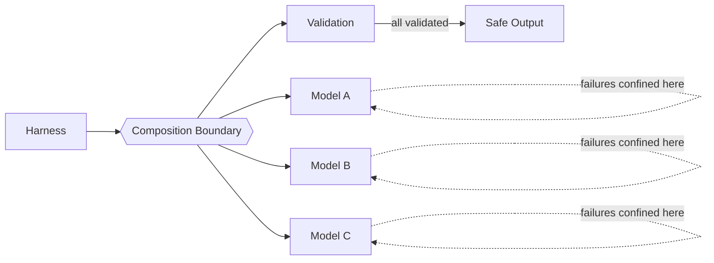
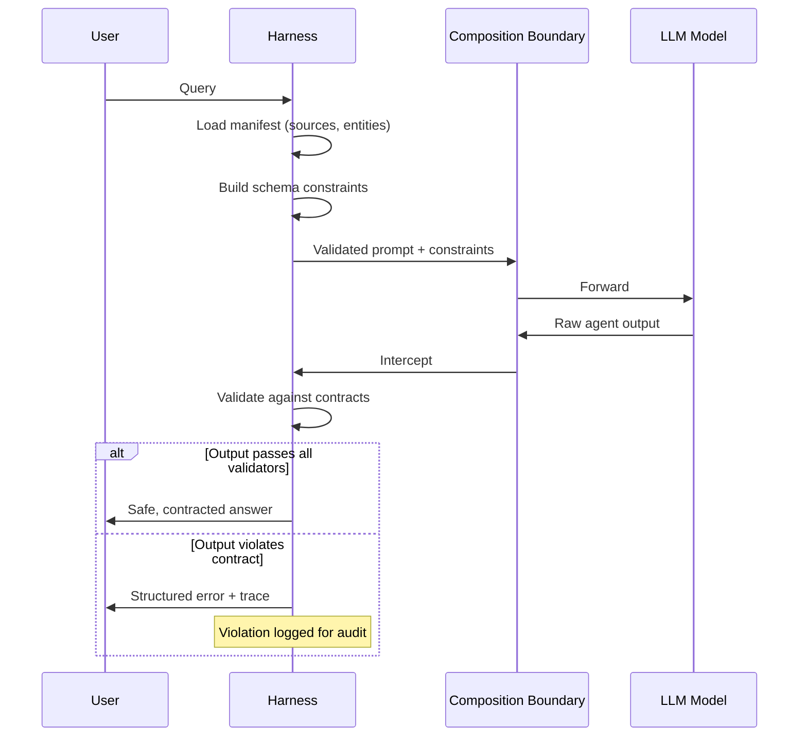

# Harness Engineering

## Overview

LLM agent applications begin life as prototypes — behavior is carried by natural-language prompts. Productionizing these prototypes for enterprise use requires moving from "prompts as contracts" to "code as contracts." **Harness engineering** is the design pattern that achieves this: deterministic guarantees are extracted from prompts and encoded into a layered harness of manifests, schemas, validator artifacts, and a composition boundary. The LLM still contributes runtime intelligence, but the harness ensures that every output reaching the user is auditable, reproducible, and safe.

The core insight: **prompt instructions alone cannot enforce constraints.** The paper demonstrates that prompt-only guardrails let instruction violations reach the user; a harness blocks them entirely, while preserving full utility (120/120 on the benchmark) where bolt-on guardrails over-refuse (88/120).

## Architecture

### Harness Layers

| Layer | Responsibility | Example |
|-------|---------------|---------|
| **Manifests** | Declarative specification of sources, entities, and answer contracts | YAML/JSON declaring which data sources are authoritative, which entities the agent may discuss, and what shape answers must take |
| **Schemas** | Output format validation | JSON Schema, Pydantic models, type constraints on agent output |
| **Validator Artifacts** | Code that enforces contracts before output reaches the user | Pre-output hooks that check source-backedness, entity routing correctness, and contract compliance |
| **Composition Boundary** | The seam between harness (deterministic) and agent (probabilistic) | A well-defined interface where agent output is intercepted, validated, and either passed through or rejected |

## Key Principles

### 1. Code-Owned Guarantees Are Load-Bearing

Prompt instructions produce **SHOULD-level** compliance — the model may or may not follow them. Code produces **MUST-level** enforcement — violations are mechanically impossible.

The harness is **load-bearing**: remove it, and the guarantees collapse. No amount of prompt engineering reproduces the deterministic enforcement.

### 2. Harness Preserves Utility, Guardrails Over-Refuse

A common enterprise pattern is to bolt on safety guardrails (content filters, output scanners) after the agent. The paper benchmarks this:

| Approach | Utility Preserved | Safety Achieved |
|----------|:---:|:---:|
| Prompt-only | 120/120 | Violations escape |
| Bolt-on guardrails | 88/120 | Partial safety |
| **Harness engineering** | **120/120** | **Full safety** |

Bolt-on guardrails operate post-hoc — they can only reject, not restructure. They lack source-awareness and entity-routing knowledge, so they both over-refuse (false positives that kill utility) and under-block (violations they cannot detect). The harness, by contrast, knows the contract and validates at the composition boundary.

### 3. Model Substitution Resilience

The harness is model-agnostic. The paper tested the same harness against 3 different hosted models on all 270 composition-boundary runs:

Failures were **confined to the model-composed side** — the harness caught them regardless of which model produced the violation. This means the agent model is replaceable without recertification of the safety envelope.

### 4. Fault-Injection Control

Validator artifacts can deliberately inject broken contracts to verify that the harness detects them. This enables:
- **CI/CD testing** of harness rules
- **Regression detection** when model upgrades change behavior
- **Compliance auditing** with reproducible failure traces

## Composition Boundary in Detail

The composition boundary is the core architectural concept. It is a **replaceable seam** — the LLM model behind it can be swapped, fine-tuned, or upgraded without changing the harness contracts.

## Relevance to Nova Vault

Nova's `AGENTS.md` currently defines rules as natural language (SHOULD-level). The harness engineering pattern suggests several hardening opportunities:

| Current (SHOULD) | Potential (MUST) |
|---|---|
| Boot sequence rules in prose | Code-level validation that required files were read |
| Frontmatter completeness conventions | Schema validation on `Write` operations |
| Lint protocol as agent task | Formalized validation artifacts with reproducible checks |
| Auto-commit as skill instruction | Deterministic git hook with pre-commit validation |
| Link integrity ("at least 1-3 links") | Schema-enforced at note creation time |

The implicit hypothesis: a **harness-manifested AGENTS.md** would produce strictly more reliable vault maintenance than the current natural-language approach. The `auto-commit` plugin-to-skill migration (logged in [[log.md]]) is itself a concrete example of the reliability gap: a deterministic plugin (WILL-level) was replaced by a skill instruction (SHOULD-level), trading reliability for portability.

## Comparison: Harness vs Related Patterns

| Pattern | What it enforces | Enforcement layer |
|---------|-----------------|-------------------|
| **Permission Models** (`allow`/`ask`/`deny`) | *Can* the agent execute this tool? | Execution gate |
| **Context Management** (compaction, token budgets) | *Does* the agent have the right context? | Input shaping |
| **Skills** (SKILL.md injection) | *Should* the agent follow this workflow? | Instruction (SHOULD) |
| **Harness Engineering** | *Must* the output conform to this contract? | Output validation (MUST) |

Harness engineering is complementary to all three: it operates at the **output boundary**, while permissions operate at the **execution boundary**, context management at the **input boundary**, and skills at the **instruction boundary**.

## See Also

- [[permission-models|Permission Models]] — Execution-level constraints (complementary to output-level harness)
- [[agent-extensibility|Agent Extensibility]] — The plugin/skill/hook triad; harness is a hook-pattern specialization
- [[context-management|Context Management]] — Input shaping; harness validates what comes out
- [[agent-skills-system|Agent Skills System]] — Skills are SHOULD-level instructions; harness is MUST-level enforcement
- [[skill-subagent-boundary|Skill vs Subagent Boundary]] — Architecture decision framework; harness adds a validation dimension

## Citations

1. [From Prompts to Contracts: Harness Engineering for Auditable Enterprise LLM Agents](https://arxiv.org/abs/2607.08028) — arXiv:2607.08028, July 9, 2026
2. [Reference Implementation](https://github.com/hammerbaki/enterprise-llm-agent-harness) — GitHub repository
