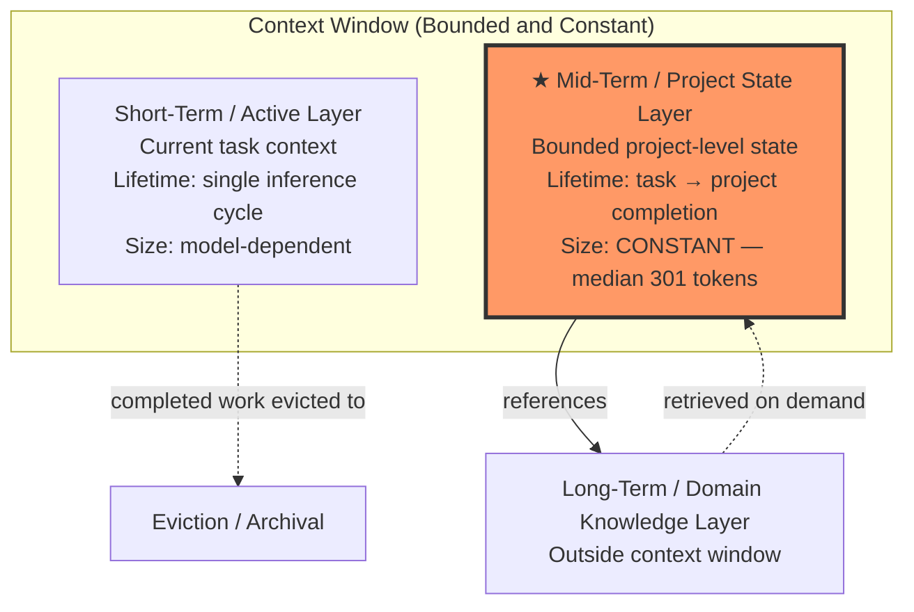
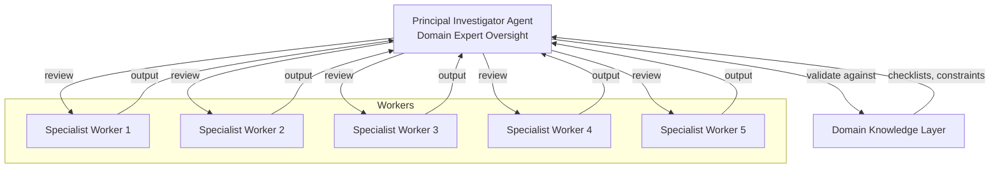

# Hierarchical Memory Architecture

## Overview

LLMs are fundamentally **stateless** — each inference call operates on the injected context window with no persistent internal state. This limits deployment in long-horizon autonomous workflows: as a project grows in duration, the agent's context accumulates, degrading performance or hitting the model's hard context limit. Ensemble QSP (arxiv:2607.07666) presents a solution: a **three-layer hierarchical memory architecture** that keeps injected context **bounded and constant** regardless of project duration. Combined with a Principal Investigator (PI)-agent oversight pattern, the system achieves robust autonomous operation across 104 experimental runs without human intervention.

## The Three Memory Layers

Memory is partitioned into three tiers with distinct lifetimes, sizes, and eviction policies:



### Short-Term / Active Layer

The **immediate working memory** — what the agent is processing right now.

- **Contents**: Current task description, tool outputs, recent conversation turns, active code context
- **Lifetime**: A single inference cycle to a few turns
- **Size**: Bounded by the model's context window; managed via standard compaction/summarization
- **Role**: Provides the agent with the situational awareness needed for the current step

This is analogous to human working memory: high-fidelity but transient.

### Mid-Term / Project State Layer (Key Innovation)

The **bounded project memory** — the paper's primary contribution.

- **Contents**: Categorized project state (task progress, completed results, pending decisions, error logs, intermediate outputs)
- **Lifetime**: Spans from task start to project completion
- **Size**: **Constant** — median 301 tokens, maximum 4,050 tokens (across 104 experimental runs)
- **Key mechanism**: Each state category has a cap; completed work is **evicted** once its results are finalized and stored externally

```
┌─────────────────────────────────────────────┐
│         Mid-Term Project State              │
│                                             │
│  ┌─────────┐  ┌─────────┐  ┌─────────────┐ │
│  │ Category │  │ Category │  │  Category   │ │
│  │  A (cap) │  │  B (cap) │  │   C (cap)   │ │
│  │  ████░░  │  │  ██░░░░  │  │  ████████   │ │
│  └─────────┘  └─────────┘  └─────────────┘ │
│                                             │
│  Evicted: completed results → disk/log      │
│  Total: median 301 tokens (constant)        │
└─────────────────────────────────────────────┘
```

**Why this matters**: Without this layer, project state grows linearly with duration. An agent working for 8 hours accumulates context that exceeds any model's window, degrading through compaction loss. The capped mid-term layer **decouples project duration from context size** — the agent can run indefinitely without context inflation.

### Long-Term / Domain Knowledge Layer

The **structured reference knowledge** — accessed on demand, never injected wholesale.

- **Contents**: Domain-specific physics models, validation checklists, known constraints, historical patterns, tool documentation
- **Lifetime**: Persistent across projects
- **Size**: Unbounded (stored externally)
- **Access pattern**: Retrieval — the mid-term layer queries specific knowledge when the current task requires it
- **Role**: Provides correctness guardrails without consuming context tokens continuously

## PI-Agent Oversight Pattern

The memory architecture is paired with a **Principal Investigator (PI) agent** pattern for quality control:



- **PI agent**: A domain-expert oversight agent that reviews worker outputs against domain knowledge (physics checklists, validation rules). Does not perform work — only validates.
- **5 specialist workers**: Execute domain-specific computational tasks under PI supervision
- **Key benefit**: PI oversight **improves debugging efficiency** (catches errors early via checklist validation) while **preserving final accuracy** (no false rejections). The PI acts as a quality gate, not a reworker.

This is a specialization of the [[multi-agent-patterns|Orchestrator-Worker pattern]], with the PI serving as a **validate-only orchestrator** rather than a task-dispatcher.

## Key Results

| Metric | Result |
|--------|--------|
| **Mid-term state size** | Median 301 tokens, max 4,050 tokens |
| **Context stability** | Bounded and constant across 104 runs |
| **Autonomy** | Robust operation without human intervention |
| **LLM generality** | Consistent quality across both lower-cost and frontier LLMs |
| **Domain portability** | Structurally domain-agnostic — new domain requires only a new PI agent + domain knowledge layer |

## Relevance to Nova Vault

Nova's memory architecture can be mapped to this three-layer model:

```mermaid
graph TB
    subgraph "Nova Session Context"
        HOT[Hot Layer<br/>AGENTS.md + boot files<br/>(schemas, conventions, user identity)]
        WARM[★ Warm Layer<br/>Recent log.md entries<br/>Active concept notes<br/>Capped + eviction of stale entries]
    end

    COLD[Cold Layer<br/>Archived/superseded notes<br/>Historical log entries<br/>Rarely-accessed concepts]

    HOT --> |boot sequence loads| SESSION[Session Start]
    WARM --> |query retrieves| ANSWER[Query Answer]
    WARM -.-> |staleness eviction| COLD
    COLD -.-> |lint / query retrieves| WARM

    style WARM fill:#f96,stroke:#333,stroke-width:3px
```

| Ensemble QSP Layer | Nova Equivalent | Mechanism |
|--------------------|-----------------|-----------|
| Short-Term / Active | Current session context (AGENTS.md + conversation) | Boot sequence reads fixed set of files |
| Mid-Term / Project State | Recent log.md entries + active concept notes | Grep on `log.md` reads last ~20 lines; `related` fields link active notes |
| Long-Term / Domain Knowledge | `index.md` catalogs, archived notes, `status: superseded` notes | Progressive disclosure via `index.md` → directory indexes → atomic notes |
| PI-Agent Oversight | Lint protocol (Section 2.3) | Detects contradictions, orphans, staleness; proposes fixes |

**Current gap**: Nova lacks explicit cap-and-evict mechanics on the warm layer. The log.md is append-only and grows unboundedly. A future refinement could implement:
1. **Category caps** on warm layer entries (e.g., max 30 log entries in active retrieval window)
2. **Automatic eviction** of resolved/stale entries from the warm layer into the cold layer
3. **Staleness scoring** based on `timestamp` and `status` fields

## See Also

- [[cross-session-memory|Cross-Session Memory]] — How Nova currently manages memory across sessions (log.md + AGENTS.md boot sequence)
- [[context-management|Context Management]] — Comparative analysis of context window strategies across AI coding tools
- [[agent-orchestration|Agent Orchestration]] — LLM-driven vs code-driven multi-agent coordination
- [[multi-agent-patterns|Multi-Agent Patterns]] — Orchestrator-worker, peer-to-peer, and hierarchical coordination architectures
- [[selective-persistent-memory|Selective Persistent Memory]] — A related approach to bounded persistent agent memory

## Citations

1. [A hierarchical memory architecture overcomes context limits in long-horizon multi-agent computational modeling](https://arxiv.org/abs/2607.07666) — Y. Zhou et al., arXiv:2607.07666, July 8, 2026
