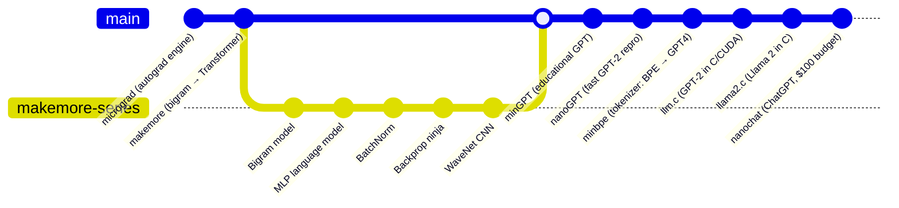
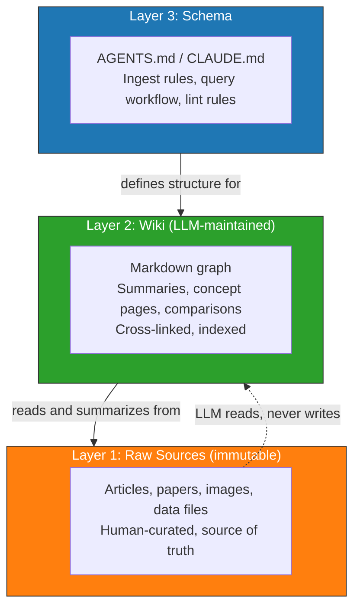

# Karpathy LLM Curriculum

> "From scratch, in code, spelled out."

## The "From Scratch" Teaching Philosophy

Andrej Karpathy's approach to teaching LLMs is defined by five principles:

1. **Minimal** — Stripped to the essential logic. No bloated abstractions.
2. **Self-contained** — Single files when possible. Readable in one sitting.
3. **Progressive** — Each project builds directly on the previous, adding one conceptual layer.
4. **Executable** — Theory paired with runnable code. Train and see results.
5. **No magic** — Every line explained. No black boxes.

From *"A Recipe for Training Neural Networks"* (2019):

> "Neural net training is a leaky abstraction. Backprop + SGD does not magically make your network work. Batch norm does not magically make it converge faster."

His process philosophy: build from simple to complex, make concrete hypotheses, validate with experiments, never introduce unverified complexity at once.

## Zero to Hero Course Structure

Karpathy's free YouTube course embodies progressive, layered curriculum design:

| # | Lecture | Key Concept | Duration | Associated Repo |
|---|---------|-------------|----------|-----------------|
| 1 | Building micrograd | Backpropagation, autograd, scalar DAG | 2h25m | `karpathy/micrograd` |
| 2 | Building makemore (Bigram) | Language modeling, torch.Tensor | 1h57m | `karpathy/makemore` |
| 3 | makemore Part 2: MLP | Multi-layer perceptrons, train/dev/test | 1h15m | `karpathy/makemore` |
| 4 | makemore Part 3: BatchNorm | Activations, gradients, batch normalization | 1h55m | `karpathy/makemore` |
| 5 | makemore Part 4: Backprop Ninja | Manual backpropagation through MLP | 1h55m | `karpathy/makemore` |
| 6 | makemore Part 5: WaveNet | CNN, dilated convolutions, hierarchical | 56m | `karpathy/makemore` |
| 7 | Let's build GPT | Full Transformer, attention, GPT-2/3 | 1h56m | `karpathy/nanoGPT` |
| 8 | Let's build the GPT Tokenizer | Byte Pair Encoding (BPE) | 2h13m | `karpathy/minbpe` |

**Key structural insight**: Each lecture assumes competence from prior lectures. makemore starts as a single-file bigram model and is "complexified" across 5 videos into a Transformer — mirroring the historical evolution of the field.

## GitHub Repo Progression

The repos form a deliberate **pedagogical progression** from fundamentals to production:

Each repo is **self-contained but references prior knowledge**:
- `micrograd`: ~100 lines, the atomic unit of all subsequent repos
- `minbpe`: Tokenizer as a separate pipeline stage with its own training
- `llm.c`: "Descent to the metal" — stripping away PyTorch to reveal hardware-level operations
- The progression mirrors the "Leaky Abstraction" philosophy

## The LLM Wiki Pattern (April 2026)

Karpathy's LLM Wiki gist (5,000+ stars) is his **meta-layer** — a pattern for using LLMs to build and maintain knowledge bases.

### Three-Layer Architecture

### Three Operations

| Operation | Trigger | LLM Actions |
|-----------|---------|-------------|
| **Ingest** | New source added to `raw/` | Read source, discuss takeaways, write summary, update index.md, update entity/concept pages (10–15 files), append log.md |
| **Query** | Human asks a question | Read index.md, drill into relevant pages, synthesize answer with citations, **file good answers back as new wiki pages** |
| **Lint** | Periodic health check | Find contradictions, stale claims, orphan pages, missing cross-references, data gaps, suggest new sources |

### Two Special Files

| File | Orientation | Purpose |
|------|-------------|---------|
| `index.md` | Content | Catalog of all pages with links, one-line summaries, metadata |
| `log.md` | Chronological | Append-only timeline: `## [YYYY-MM-DD] ingest \| Title` |

## Core Philosophical Claims

> "LLMs don't get bored, don't forget to update a cross-reference, and can touch 15 files in one pass."

> "The wiki is a persistent, compounding artifact. Cross-references are already there. Contradictions have already been flagged. Synthesis already reflects everything you've read."

> "Obsidian is the IDE; the LLM is the programmer; the wiki is the codebase."

> "Good answers should be filed back into the wiki as new pages. A comparison you asked for, an analysis, a connection you discovered — these are valuable and shouldn't disappear into chat history."

## Connection to Vannevar Bush's Memex (1945)

Karpathy explicitly links the LLM Wiki pattern to Bush's vision of a personal, curated knowledge store with **associative trails** between documents. Bush's vision was "private, actively curated, with the connections between documents as valuable as the documents themselves."

The part Bush couldn't solve — **who does the maintenance** — is what LLMs now handle. The Memex vision from 1945 finds its realization in an LLM maintaining cross-references across a markdown knowledge graph.

## Self-Bootstrapping Knowledge Base Model

### Phase 1: Seed (Human-Driven)

- Human defines topic taxonomy (directory structure + AGENTS.md)
- First 5–10 concept pages written collaboratively with LLM
- Core `index.md` and `log.md` established
- AGENTS.md specifies: curriculum structure, frontmatter conventions, ingest/query/lint rules

### Phase 2: Growth (LLM-Assisted)

- New sources dropped into `raw/` → LLM ingests and integrates
- Queries filed back as pages → knowledge compounds
- Lint runs surface gaps, contradictions → LLM proposes new sources
- `index.md` grows, link density increases, graph becomes navigable

### Phase 3: Self-Maintenance (LLM-Driven, Human Oversight)

- LLM proactively suggests gaps: "The curriculum is light on RLHF. Should I scrape and synthesize the Ouyang et al. paper?"
- Lint becomes continuous: contradictions auto-flagged in `log.md`
- Deprecated concepts marked, superseded by newer understanding
- Git history provides full audit trail

## The Compound Effect

The compound effect is the core mechanism that makes the LLM Wiki pattern powerful:

Every ingest enriches the graph → richer graph enables better query answers → good answers get filed as new notes → more notes provide richer context for future ingests → **the wiki becomes a thinking partner, not just a storage system**.

Mathematically, if $K_t$ is the knowledge state at time $t$:

$$K_{t+1} = K_t \cup \text{ingest}(\text{source}_{t+1}, K_t) \cup \text{filed\_answers}(\text{queries}_t, K_t)$$

The growth is **superlinear** because each new source connects to $n$ existing nodes and can trigger $m$ cross-reference updates, making the marginal value of each new ingest increase over time rather than decrease.

## Ecosystem Extensions

The LLM Wiki gist spawned a rich ecosystem:

| Project | Focus | Key Innovation |
|---------|-------|----------------|
| **AutoSci** | Research agent | Contradiction edges, self-evolving wiki, wrote 3 papers |
| **memwiki** | Coding-agent memory | `.memory/` folder with session hooks |
| **secure-llm-wiki** | Trust & security | Four-eyes review; untrusted sources gated |
| **LLM-Wiki-v3** | Provenance | Every claim traces to sources, spans, timestamps |
| **synthadoc** | UI & automation | Web chat UI, scheduled ingest, local-only |
| **Dense-Mem** | MCP server | Typed claims, conflicts, graph via MCP |
| **synto** | Local-first | Multi-provider, Ollama-friendly |

## Convergence with OKF

See [[okf-format|OKF Format]] for how Google's specification formalizes this pattern into an interoperable standard.

# Citations

[1] [Karpathy LLM Wiki Gist](https://gist.github.com/karpathy/442a6bf555914893e9891c11519de94f)
[2] [Neural Networks: Zero to Hero (YouTube)](https://www.youtube.com/playlist?list=PLAqhIrjkxbuWI23v9cThsA9GvCAUhRvKZ)
[3] [A Recipe for Training Neural Networks (2019)](https://karpathy.github.io/2019/04/25/recipe/)
[4] [Vannevar Bush, "As We May Think" (1945)](https://www.theatlantic.com/magazine/archive/1945/07/as-we-may-think/303881/)
