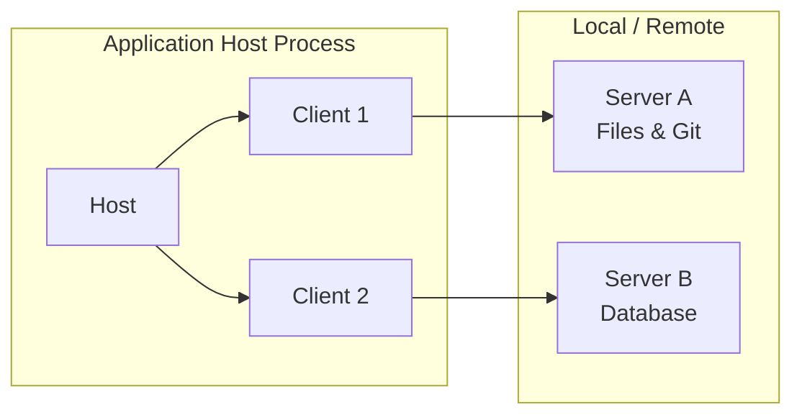
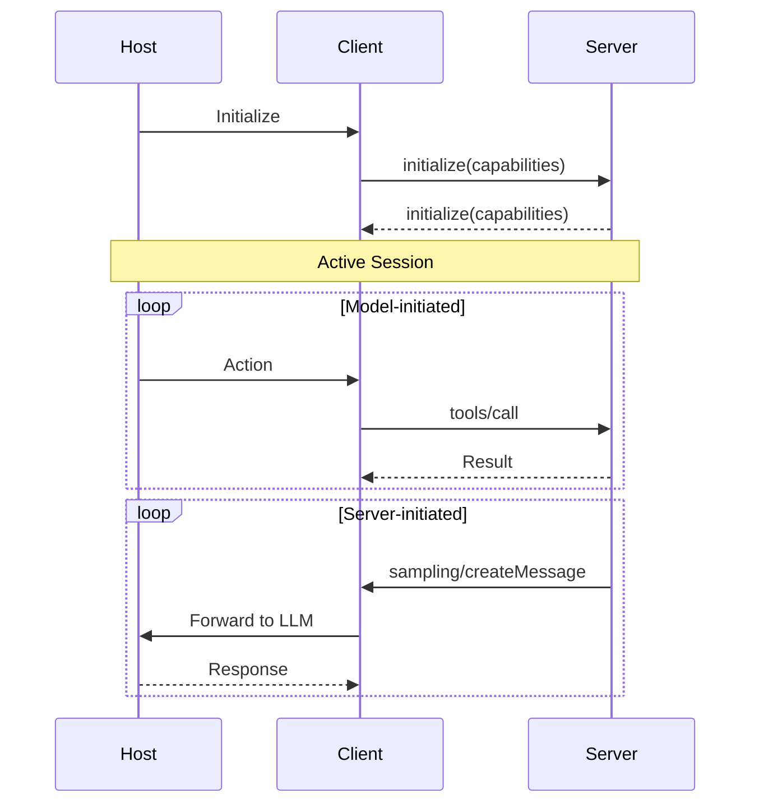

# MCP (Model Context Protocol)

MCP is an open protocol that standardizes how LLM applications connect to external data sources and tools. Think of it as **"USB-C for AI applications"** — just as USB-C standardizes device connectivity, MCP standardizes AI-to-external-system integration.

It is inspired by the [[Language Server Protocol|LSP]], which standardized IDE-to-language integration.

## Architecture

MCP follows a **Host → Client → Server** architecture:



| Component | Role |
|-----------|------|
| **Host** | The LLM application (Claude Desktop, VS Code, Cursor). Creates/manages clients, enforces security, coordinates AI/LLM integration |
| **Client** | 1:1 connector to a server. Handles protocol negotiation, routes messages, maintains security boundaries |
| **Server** | Provides specialized capabilities: Resources, Prompts, Tools. Can be local process or remote service |

## Design Principles

1. **Servers should be extremely easy to build** — Hosts handle complex orchestration
2. **Servers should be highly composable** — Multiple servers combine seamlessly
3. **Servers cannot read the whole conversation** — Only receive necessary context, full history stays with host
4. **Features can be added progressively** — Core protocol is minimal, capabilities negotiated

## Base Protocol: JSON-RPC 2.0

All messages follow JSON-RPC 2.0:

- **Requests**: `{ jsonrpc, id, method, params? }` — ID must be unique per session, never null
- **Responses**: `{ jsonrpc, id, result? | error? }` — Either result or error, never both
- **Notifications**: `{ jsonrpc, method, params? }` — No ID, no response expected
- **Batching**: Array of requests/notifications — MAY send, MUST receive

### Lifecycle

1. **Initialization**: Client sends `initialize` with capabilities → Server responds with capabilities
2. **Active session**: Negotiated features available
3. **Termination**: Clean shutdown via `shutdown` request or transport close

## Three Primitives

| Primitive | Control | Purpose | Example |
|-----------|---------|---------|---------|
| **Resources** | Application-controlled | Contextual data managed by client | File contents, git history, database records |
| **Prompts** | User-controlled | Interactive templates invoked by user | Slash commands, menu options, canned workflows |
| **Tools** | Model-controlled | Functions the LLM can invoke | API calls, file writes, calculations, searches |

### Resources
Expose data to the model. Support `resources/list`, `resources/read`, `resources/subscribe`, and `resources/list_changed` notifications. Can be text or binary.

### Prompts
Pre-defined templates for user-initiated interactions. Declared via `prompts/list` and invoked via `prompts/get`. Supports arguments for parameterization.

### Tools
Executable functions exposed to the LLM. Declared via `tools/list` and invoked via `tools/call`. The model autonomously decides when to use them.

## Client Features

### Sampling
Servers can request LLM completions through the client via `sampling/createMessage`. This enables server-initiated agentic behaviors — e.g., a server that needs to summarize data before returning it.

**Security**: Users must explicitly approve all sampling requests and control what prompts are sent and what results the server sees.

### Roots
Clients expose filesystem boundaries ("roots") to servers, defining where servers can operate. Clients declare `roots` capability and can emit `notifications/roots/list_changed`.

## Capability Negotiation

Both sides declare capabilities during initialization:

- **Server capabilities**: `resources` (with `subscribe`, `listChanged`), `tools` (with `listChanged`), `prompts` (with `listChanged`), `logging`
- **Client capabilities**: `sampling`, `roots` (with `listChanged`)



## Security Model

Four key principles:
1. **User Consent & Control** — Explicit consent for all data access and operations
2. **Data Privacy** — User data never transmitted without consent, access controls required
3. **Tool Safety** — Tools represent arbitrary code execution; descriptions from untrusted servers are untrusted
4. **LLM Sampling Controls** — Users approve sampling, control prompts, and limit server visibility

## Transport

- **stdio**: For local process communication (CURRENTLY STANDARD)
- **HTTP + SSE**: For remote servers, with OAuth-based authorization framework
- Streamable HTTP transport under development for improved reliability

## Ecosystem Support

MCP is supported across major AI tools:
- Claude Desktop, Claude Code
- ChatGPT (OpenAI)
- VS Code / GitHub Copilot
- Cursor
- Zed, Sourcegraph Cody, and many others

## MCP vs LSP

| Aspect | LSP | MCP |
|--------|-----|-----|
| Domain | Programming language support | AI context and tool integration |
| Initiator | IDE → Language Server | Host Application → MCP Server |
| Primitives | Diagnostics, completions, hover | Resources, Prompts, Tools |
| Model involvement | None | LLM can invoke tools, server can request sampling |

## Practical Implementation

An MCP server is typically a local process that:
1. Reads/writes via stdin/stdout (or serves HTTP+SSE)
2. Declares capabilities on initialization
3. Responds to `tools/list`, `tools/call`, `resources/read`, etc.
4. May request LLM sampling through the client

Example Python MCP server pattern:

```python
from mcp.server import Server, NotificationOptions
from mcp.server.models import InitializationCapabilities

server = Server("my-server")

@server.list_tools()
async def list_tools() -> list[Tool]:
    return [Tool(name="search", description="Search documents", inputSchema={...})]

@server.call_tool()
async def call_tool(name: str, arguments: dict) -> list[TextContent]:
    # Execute the tool
    return [TextContent(type="text", text="results...")]
```

## Relationship to the Nova Vault

MCP is the protocol layer beneath tools like [[Claude Code]], [[OpenCode]], [[Cursor]], and [[GitHub Copilot]] that connect agents to external capabilities. It complements [[A2A Protocol|A2A]] — MCP connects agents to tools/data, A2A connects agents to agents.
