# Mermaid Diagrams

> Text-driven diagramming embedded directly in markdown.

## Embedding Syntax

Mermaid diagrams use fenced code blocks with the `mermaid` language identifier:

````markdown
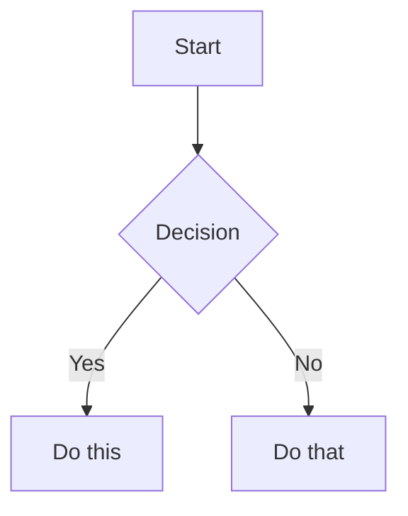
````

Obsidian renders Mermaid natively (since v0.5.0). Other platforms (GitHub, GitLab) may require plugins.

## Flowchart

### Direction

```
graph TD     Top → Down (also: TB)
graph BT     Bottom → Top
graph LR     Left → Right
graph RL     Right → Left
```

### Node Shapes

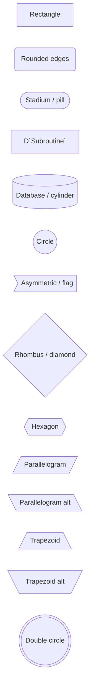

### Edge Types

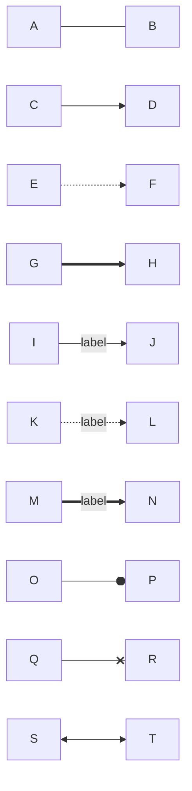

### Subgraphs

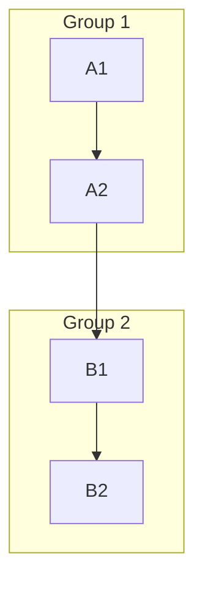

## Sequence Diagram

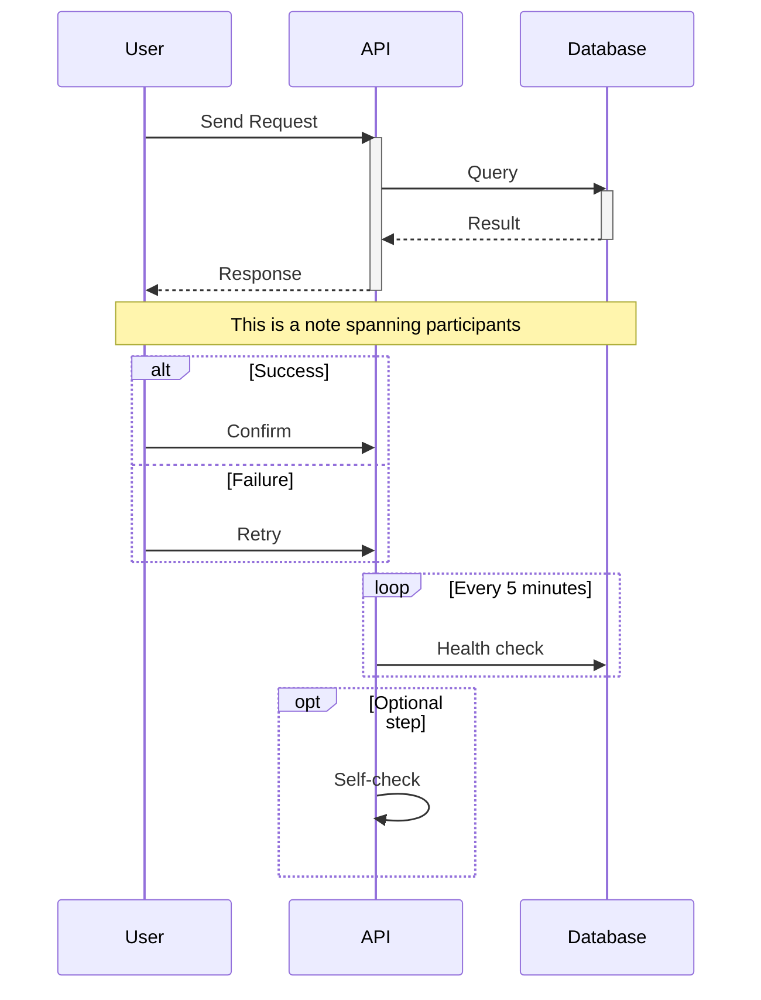

### Arrow Types

| Syntax | Meaning |
|--------|---------|
| `->>` | Solid line, filled arrow |
| `-->>` | Dashed line, filled arrow |
| `->)` | Async (open arrow) |
| `-x` | Cross end |
| `-)` | Async (small open arrow) |

### Activations

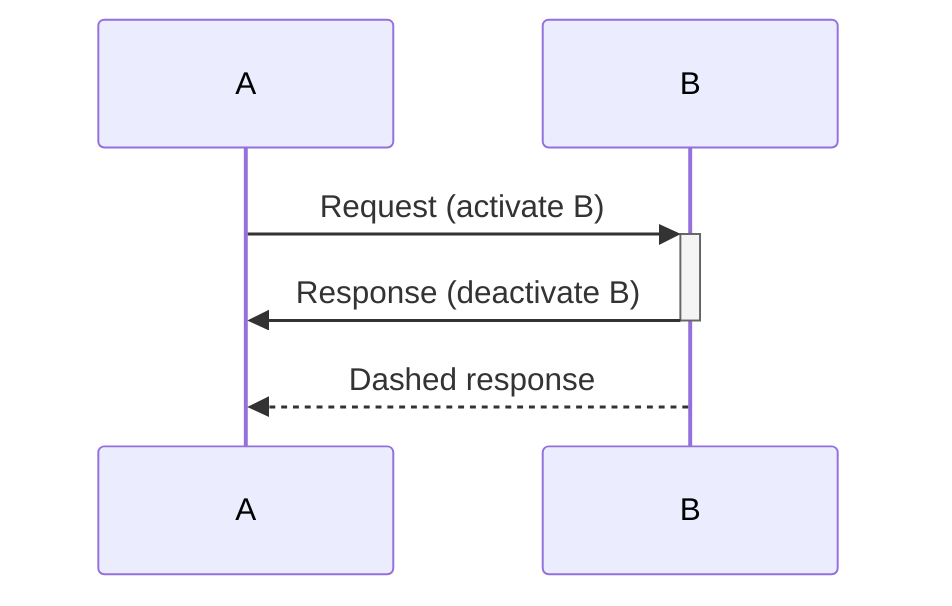

## Class Diagram

```mermaid
classDiagram
    class Animal {
        +String name
        +int age
        +makeSound() void
    }

    class Dog {
        +fetch() void
    }

    class Cat {
        +purr() void
    }

    Animal <|-- Dog : Inheritance
    Animal <|-- Cat : Inheritance

    class Owner {
        +String name
        +feed(Animal a) void
    }

    Owner "1" --> "*" Animal : owns

    <<interface>> IWalkable
    IWalkable : +walk() void
    Dog ..|> IWalkable : implements
```

### Relationship Types

| Syntax | Meaning |
|--------|---------|
| `<\|--` | Inheritance |
| `*--` | Composition |
| `o--` | Aggregation |
| `-->` | Association |
| `..>` | Dependency |
| `..\|>` | Realization (implements) |

### Multiplicity

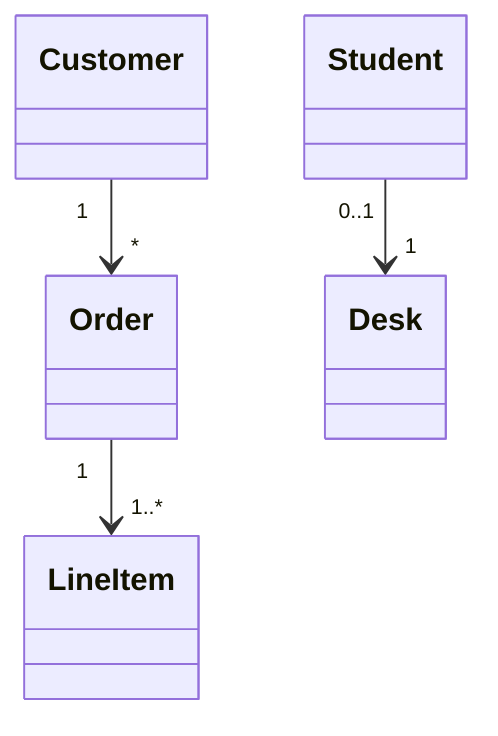

## State Diagram

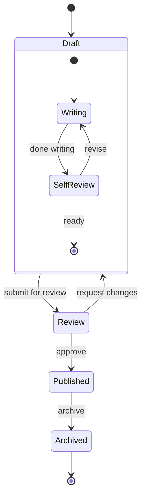

## Entity Relationship Diagram

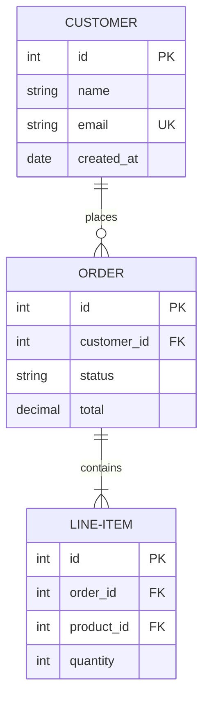

## Gantt Chart

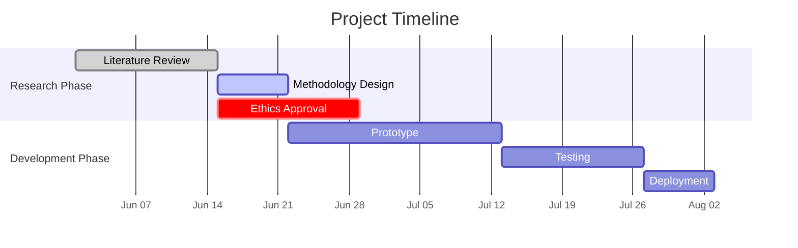

## Pie Chart

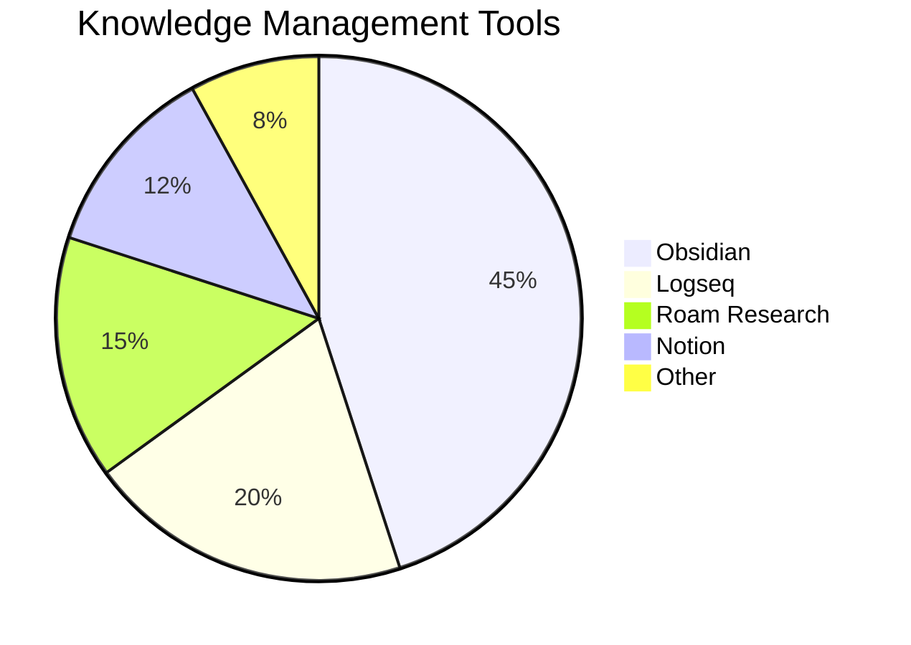

## Mindmap

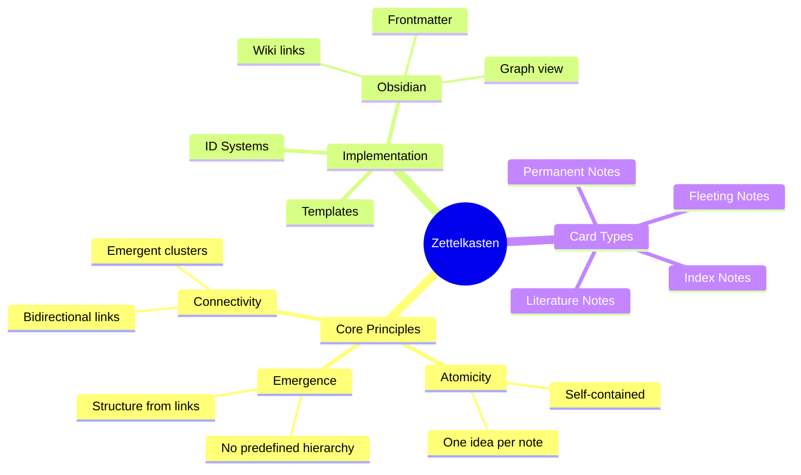

### Mindmap Shapes

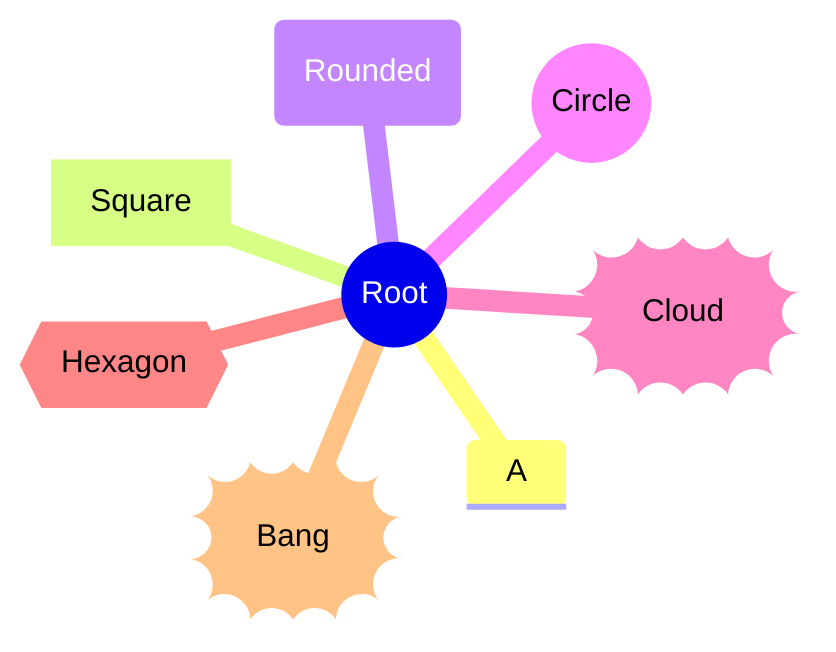

## Timeline

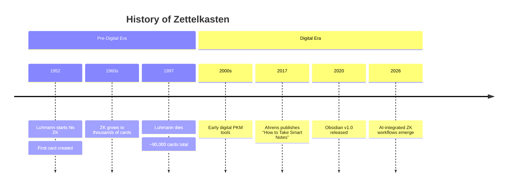

## Git Graph

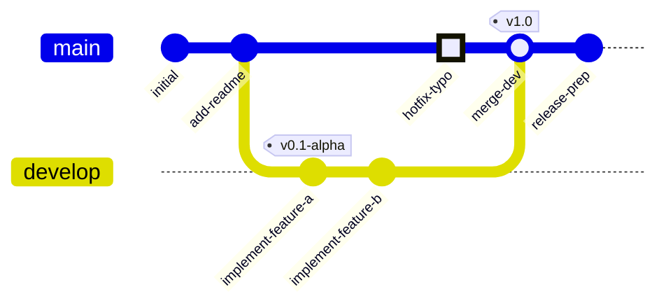

Commit types: `NORMAL` (default), `REVERSE` (crossed circle), `HIGHLIGHT` (filled rect).

## Styling and Theming

### Global Theme Directive

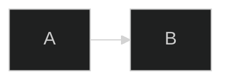

Available themes: `default`, `base`, `forest`, `dark`, `neutral`.

### Node-Specific Styling

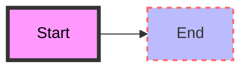

### Class-Based Styling

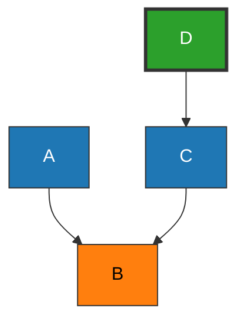

## Knowledge Representation Examples

### Concept Hierarchy

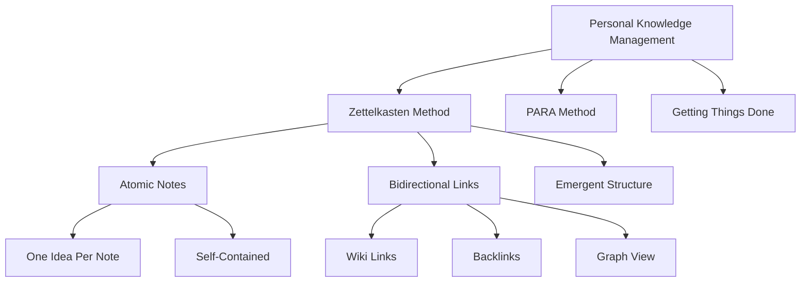

### Knowledge Flow

```mermaid
sequenceDiagram
    participant R as Reading/Research
    participant F as Fleeting Notes
    participant L as Literature Notes
    participant P as Permanent Notes
    participant I as Index Notes

    R->>F: Capture ideas
    F->>L: Process with source
    L->>P: Extract atomic insights
    P->>P: Link to existing notes
    P->>I: Cluster into MOCs
    I->>P: Provide navigation
```

### Workflow State Machine

```mermaid
stateDiagram-v2
    [*] --> Captured : quick capture or read
    Captured --> Processed : review & annotate
    Processed --> Atomic : extract single ideas
    Atomic --> Linked : add connections
    Linked --> Evergreen : mature & validated
    Evergreen --> Archived : superseded
    Atomic --> Archived : no longer relevant
    Processed --> Discarded : not worth keeping
    Discarded --> [*]
    Archived --> [*]
```

# Citations

[1] [Mermaid.js Documentation](https://mermaid.js.org)
[2] [Obsidian Help — Advanced Formatting Syntax (Diagrams)](https://help.obsidian.md/Editing+and+formatting/Advanced+formatting+syntax#Diagram)
