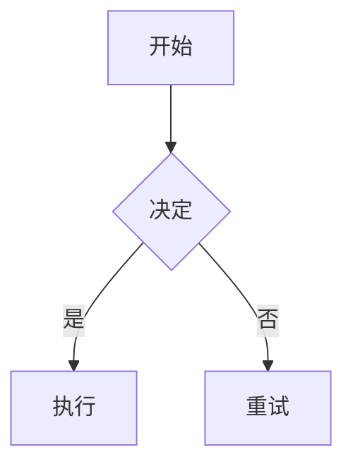

# Obsidian Syntax Reference

## 1. Wiki Links (内部链接)

```markdown
[[Note Name]]                    # 基本链接
[[Note Name|Display Text]]       # 别名链接
[[Note Name#Heading]]            # 指向特定标题
[[Note Name#^block-id]]          # 指向特定块
[[Note Name#Heading|Alias]]      # 标题 + 别名
[[folder/Note]]                  # 路径链接（同名消歧）
```

### 块引用 (Block References)

创建块 ID：
```markdown
这是一段我想引用的文字。 ^my-block-id

- 列表项 ^list-ref

> 引用块 ^quote-ref
```

引用：
```markdown
[[source-note#^my-block-id]]          # 链接
![[source-note#^my-block-id]]         # 嵌入（内联渲染）
```

---

## 2. Callouts（标注框）

### 语法

```markdown
> [!type] 可选标题
> 内容。支持多行。
>
> - 支持列表
> - 更多内容
```

### 可折叠标注

```markdown
> [!faq]+ 点击展开        # + = 默认展开
> [!danger]- 点击展开      # - = 默认折叠
```

### 内置类型 (14 种)

| 类型 | 别名 | 图标 | 用途 |
|------|------|------|------|
| `note` | — | 📝 | 通用备注 |
| `abstract` | `summary`, `tldr` | 📋 | 摘要 |
| `info` | — | ℹ️ | 信息 |
| `todo` | — | ✅ | 待办 |
| `tip` | `hint`, `important` | 🔥 | 提示 |
| `success` | `check`, `done` | ✅ | 成功 |
| `question` | `help`, `faq` | ❓ | 问题 |
| `warning` | `caution`, `attention` | ⚠️ | 警告 |
| `failure` | `fail`, `missing` | ❌ | 失败 |
| `danger` | `error` | ⚡ | 危险 |
| `bug` | — | 🐛 | Bug |
| `example` | — | 📖 | 示例 |
| `quote` | `cite` | 💬 | 引用 |

### 嵌套标注

```markdown
> [!info] 外层
> 内容。
> > [!warning] 内嵌警告
> > 重要细节。
```

### 自定义标注 (CSS 片段)

```css
.callout[data-callout="our-custom"] {
  --callout-color: 255, 128, 0;
  --callout-icon: lucide-flame;
}
```

```markdown
> [!our-custom] 自定义标注
> 自定义内容。
```

---

## 3. Task Lists（任务列表）

### 标准 Obsidian 语法

```markdown
- [ ] 未完成
- [x] 已完成
- [/] 进行中
- [-] 已取消
- [>] 推迟
- [<] 计划中
- [?] 问题
- [!] 重要
- [*] 星标
- ["] 引用
- [l] 位置
- [b] 书签
- [i] 信息
- [S] 储蓄
- [I] 想法
- [p] 优点
- [c] 缺点
- [f] 火焰
- [k] 钥匙
- [w] 胜利
- [u] 向上
- [d] 向下
```

### 搜索任务

```markdown
task-todo:""       # 所有未完成任务
task-done:""       # 所有已完成任务
```

---

## 4. Maple 主题扩展任务列表

> 需要安装 [Maple 主题](https://github.com/subframe7536/obsidian-theme-maple) 才能渲染。

### Maple 额外支持的复选框

```markdown
- [+] 添加          - [B] Bug
- [a] 警报          - [n] 笔记
- [R] 审核          - [L] 喜欢
```

### Maple 完整复选框汇总

| 语法 | 含义 | 来源 |
|------|------|------|
| `- [ ]` | To-do | Obsidian 标准 |
| `- [/]` | Incomplete | Obsidian 标准 |
| `- [x]` | Done | Obsidian 标准 |
| `- [-]` | Canceled | Obsidian 标准 |
| `- [>]` | Forwarded | Obsidian 标准 |
| `- [<]` | Scheduling | Obsidian 标准 |
| `- [?]` | Question | Obsidian 标准 |
| `- [!]` | Important | Obsidian 标准 |
| `- [*]` | Star | Obsidian 标准 |
| `- ["]` | Quote | Obsidian 标准 |
| `- [l]` | Location | Obsidian 标准 |
| `- [b]` | Bookmark | Obsidian 标准 |
| `- [i]` | Information | Obsidian 标准 |
| `- [S]` | Dollar | Obsidian 标准 |
| `- [I]` | Idea | Obsidian 标准 |
| `- [p]` | Pros | Obsidian 标准 |
| `- [c]` | Cons | Obsidian 标准 |
| `- [w]` | Win | Obsidian 标准 |
| `- [u]` | Up | Obsidian 标准 |
| `- [d]` | Down | Obsidian 标准 |
| `- [+]` | Add | **Maple 专属** |
| `- [B]` | Bug | **Maple 专属** |
| `- [a]` | Alarm | **Maple 专属** |
| `- [n]` | Note | **Maple 专属** |
| `- [R]` | Review | **Maple 专属** |
| `- [L]` | Love | **Maple 专属** |

---

## 5. Embeds（嵌入 / 嵌入语法）

```markdown
![[note-name]]                    # 嵌入整个笔记
![[note-name#heading]]            # 嵌入特定标题
![[note-name#^block-id]]          # 嵌入特定块
![[image.png]]                    # 嵌入图片
![[image.png\|300]]               # 嵌入图片（300px 宽）
![[audio.mp3]]                    # 嵌入音频
![[video.mp4]]                    # 嵌入视频
![[document.pdf]]                 # 嵌入 PDF
![[document.pdf#page=5]]          # 嵌入 PDF 第5页
```

### 嵌入 vs 链接

| 特性 | `![[...]]` 嵌入 | `[[...]]` 链接 |
|------|----------------|----------------|
| 外观 | 内容内联显示 | 可点击链接 |
| 可编辑 | 否 | 是（可导航编辑） |
| 反链 | 创建 | 创建 |

---

## 6. Tags（标签）vs Links（链接）

| 标签 `#tag` | 链接 `[[note]]` |
|-------------|-----------------|
| 扁平分类型系统 | 网络关系型系统 |
| 一对多：一个标签分组多个笔记 | 一对一：每条链接是特定连接 |
| `#methodology` 标记笔记类型 | `[[zettelkasten-methodology\|Zettelkasten]]` 连接到特定想法 |
| 适合大类分类 | 适合精确的关系映射 |
| 可搜索/过滤 | 构建图结构 |

### 最佳实践

- **标签** 用于类型、状态、领域分类
- **链接** 用于特定想法间的关系
- 前置元数据 `tags:` 比行内 `#tag` 更利于机器读取

---

## 7. Footnotes（脚注）

```markdown
这句话有一个脚注。[^1]
命名脚注。[^long-note]
行内脚注。^[这是行内脚注。]

[^1]: 这是脚注内容。
[^long-note]: 命名脚注，可以包含 **Markdown**，
  多段落，甚至代码块。

  第二段。
```

---

## 8. Tables（表格）

### 基本表格

```markdown
| Header 1 | Header 2 | Header 3 |
|----------|----------|----------|
| Cell 1   | Cell 2   | Cell 3   |
| Cell 4   | Cell 5   | Cell 6   |
```

### 对齐

```markdown
| Left      | Center    |     Right |
|:----------|:---------:|----------:|
| 左对齐    |  居中    |   右对齐 |
```

### 表格内 Markdown

```markdown
| 概念         | 定义              | 重要度 |
|-------------|------------------|:------:|
| **原子性**  | 每条笔记一个想法  | ⭐⭐⭐⭐⭐  |
| *连接性*    | 双向链接          | ⭐⭐⭐⭐⭐  |
| `涌现`      | 结构自底向上      | ⭐⭐⭐⭐   |
| ~~文件夹~~  | 过时的组织范式    | ⭐       |
```

---

## 9. Search Syntax（搜索语法）

| 操作符 | 示例 | 说明 |
|--------|------|------|
| `word` | `zettelkasten` | 精确匹配（不区分大小写） |
| `"exact phrase"` | `"knowledge management"` | 精确短语 |
| `-word` | `-zettelkasten` | 排除 |
| `path:` | `path:projects` | 按路径搜索 |
| `file:` | `file:index` | 按文件名搜索 |
| `content:` | `content:graph` | 搜索正文 |
| `tag:` | `tag:#zk` | 按标签搜索 |
| `line:(...)` | `line:(date completed)` | 按行搜索 |
| `block:(...)` | `block:(^ref-id)` | 按块搜索 |
| `section:(...)` | `section:(todo)` | 按标题搜索 |
| `task:` | `task:todo` | 按任务状态搜索 |
| `task-todo:` | `task-todo:""` | 未完成任务 |
| `task-done:` | `task-done:""` | 已完成任务 |
| `match-case:` | `match-case:Zettelkasten` | 区分大小写 |
| `ignore-case:` | `ignore-case:ZETTELKASTEN` | 强制忽略大小写 |
| `regex:` | `regex:/\d{4}-\d{2}-\d{2}/` | 正则搜索 |
| `[]` | `[tag: zk]` | 按前置元数据属性搜索 |

### 布尔运算

```markdown
zettelkasten AND obsidian            # 两者都有
zettelkasten OR luhmann              # 任一即可
(zettelkasten OR pkm) AND method    # 分组搜索
zettelkasten -obsidian              # 包含第一个，排除第二个
```

---

## 10. 标准 Markdown 格式

### 标题 (Headings)

```markdown
# H1
## H2
### H3
#### H4
##### H5
###### H6
```

### 文字格式

```markdown
**粗体**  *斜体*  ***粗斜体***  ~~删除线~~  `行内代码`  ==高亮==
```

### 列表

```markdown
- 无序列表 1
  - 嵌套
- 无序列表 2

1. 有序列表 1
2. 有序列表 2

- [x] 任务列表
```

### 引用 (Blockquote)

```markdown
> 引用文字
> 多行引用
> > 嵌套引用
```

### 代码

````markdown
`行内代码`

```python
print("代码块")
```
````

### 分隔线

```markdown
---
***
___
```

### 图片

```markdown

   # 指定宽度
```

### 外部链接

```markdown
[link text](https://url.com)
[link text](https://url.com "悬停标题")
```

---

## 11. 综合示例

以下是一个结合多种语法的笔记示例：

```markdown
---
type: Concept
title: "Example Note"
tags:
  - example
  - syntax
timestamp: 2026-06-22T07:00:00Z
---

# Example Note

## 概述

参见 [[Related Note]] 和 [[Another Note#section]]。

> [!info] 关键信息
> 这是关键概念的解释。详见 [[Reference#^block-id]]。

## 任务

- [x] 了解 Obsidian 语法
- [ ] 学习 Mermaid 图表
- [/] 在笔记中实践
- [+] 添加 Maple 主题 ✅

## 数学

$$
\text{Attention}(Q, K, V) = \text{softmax}\left(\frac{QK^T}{\sqrt{d_k}}\right)V
$$

## 图表



## 脚注

这是重要声明。[^1]

# Citations

[^1]: 引用来源。
```

---

# 相关工具

- [[obsidian-maple-theme|Obsidian Maple Theme]] — Maple 主题详细分析
- [[mermaid-diagrams|Mermaid Diagrams]] — 图表语法
- [[latex-in-markdown|LaTeX in Markdown]] — 数学语法
- [[markdown-frontmatter|Markdown Frontmatter]] — 前置元数据
