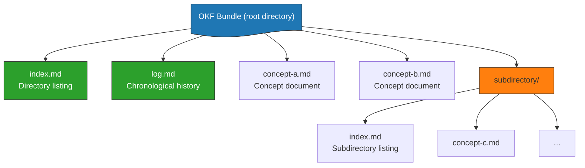

# OKF Format

> **Open Knowledge Format v0.1** — a specification, not a platform.

## What Is OKF?

OKF v0.1 (published June 12, 2026 by Google Cloud) is an open specification that standardizes the representation of knowledge bases as directories of markdown files with YAML frontmatter. It is:

- **Vendor-neutral**: No required SDK, no proprietary account, no central authority
- **File-based**: Just directories of `.md` files — portable via git, tarball, or zip
- **Interoperable**: Any producer (human, agent, export pipeline) and any consumer (HTML visualizer, query agent, static site generator) can share the same format
- **Minimally opinionated**: Only one required field — `type`
- **Permissive**: Consumers must tolerate unknown fields, types, and broken links

The specification itself is ~450 lines in `okf/SPEC.md` under the Apache 2.0 license in the `GoogleCloudPlatform/knowledge-catalog` repository.

## Bundle Structure

An OKF bundle is a directory tree of markdown files:



A bundle MAY be distributed as:
- A git repository (recommended — history, attribution, diffs)
- A tarball or zip archive
- A subdirectory within a larger repository

## Concept Document Structure

Every concept is a UTF-8 markdown file with **two parts**:

### 1. YAML Frontmatter (Required)

Delimited by `---`, containing frontmatter (YAML metadata):

```yaml
---
type: BigQuery Table           # REQUIRED (only mandatory field)
title: Customer Orders          # Optional display name
description: One row per...     # Optional one-line summary
resource: https://...           # Optional canonical URI for underlying asset
tags: [sales, orders, revenue]  # Optional cross-cutting categorization
timestamp: 2026-05-28T14:30:00Z # Optional ISO 8601 last-modified time
---
```

### 2. Markdown Body (Free-form)

Conventional section headings:

| Heading | Purpose |
|---------|---------|
| `# Schema` | Structured description of columns/fields |
| `# Examples` | Concrete usage (fenced code blocks) |
| `# Citations` | External sources backing claims |

## The Single Required Field: `type`

Only `type` is mandatory — a short string identifying the kind of concept. It is **not centrally registered**. Producers pick descriptive values; consumers tolerate unknown types.

## Standard Recommended Fields

In priority order:

1. **`title`** — Display name (derived from filename if omitted)
2. **`description`** — One-line summary for index generation and search
3. **`resource`** — Canonical URI for an underlying asset (table, dataset, API endpoint)
4. **`tags`** — Cross-cutting categorization as a YAML list
5. **`timestamp`** — ISO 8601 last-modified time

**Extensions**: Producers MAY include any additional keys. Consumers should preserve unknown keys when round-tripping (permissive consumption).

## Reserved Filenames

| Filename | Purpose | Notes |
|----------|---------|-------|
| `index.md` | Directory listing (progressive disclosure) | No frontmatter required; uses sections with `* [Title](url) - description` |
| `log.md` | Update history | Date-grouped entries: `## YYYY-MM-DD`, newest first |

All other `.md` files are concept documents.

## Link Forms

### Absolute (Bundle-Relative) Links

Begin with `/`, interpreted relative to bundle root:

```markdown
See the [customers table](/tables/customers.md) for the join key.
```

Recommended because links remain **stable when documents are moved**.

### Relative Links

Standard markdown:

```markdown
See the [neighboring concept](./other.md).
```

### Link Semantics

A link from concept $A$ to concept $B$ asserts a *relationship*. The specific kind (parent/child, references, joins-with, depends-on) is conveyed by the surrounding prose, not the link syntax itself. Consumers building graph views treat all links as **directed edges of an untyped relationship**.

> **Broken links are tolerated** — they may represent not-yet-written knowledge, not malformed content.

## log.md Format

`log.md` serves as the **append-only chronological memory**:

```markdown
# Directory Update Log

## 2026-05-22
* **Update**: Added new BigQuery table reference for [Customer Metrics](/tables/customer-metrics.md).
* **Creation**: Established the [Dataplex Playbook](/playbooks/dataplex.md).

## 2026-05-15
* **Initialization**: Created foundational directory structure.
```

Conventions:
- Date headings: ISO 8601 `YYYY-MM-DD`
- Bold prefix words: `**Update**`, `**Creation**`, `**Deprecation**` (convention, not requirement)
- Newest entries at the top
- Greppable: the harness `grep` tool on `log.md` with pattern `^## \[` → read last lines

## Citations Convention

External sources backing claims are listed under `# Citations` at document bottom:

```markdown
# Citations

[1] [BigQuery public dataset announcement](https://cloud.google.com/blog/...)
[2] [Internal data quality runbook](https://wiki.acme.internal/data/quality)
```

Citation links MAY be absolute URLs, bundle-relative paths, or paths into a `references/` subdirectory.

## Conformance Rules

A bundle is conformant with OKF v0.1 if:

1. Every non-reserved `.md` file contains parseable YAML frontmatter.
2. Every frontmatter block contains a **non-empty `type` field**.
3. Every reserved filename follows structural conventions.

**Permissive consumption**: Consumers MUST NOT reject bundles for:
- Missing optional fields
- Unknown `type` values
- Unknown additional frontmatter keys
- Broken cross-links
- Missing `index.md` files

## Three Design Principles

1. **Minimally opinionated** — Only `type` is required. What types exist, what other fields are used, what body sections appear — all producer's choice. OKF defines the interoperability surface, not the content model.

2. **Producer/consumer independence** — Human-authored wiki consumed by AI agent. BigQuery export browsed in HTML visualizer. LLM-generated bundle queried by another LLM. Same format, swappable tooling at each end.

3. **Format, not platform** — No proprietary account, SDK, or cloud required. The value of a knowledge format scales with adoption breadth, not vendor lock-in.

## Relationship to Karpathy's LLM Wiki

OKF explicitly cites [[karpathy-llm-curriculum|Karpathy's LLM Wiki gist]] as its inspiration. The three-layer mapping:

| Karpathy Layer | OKF Equivalent | Notes |
|---------------|----------------|-------|
| Raw sources (immutable) | External datasets, docs, APIs | OKF bundles are the *compiled* layer |
| Wiki (LLM-maintained) | OKF bundle (`*.md` + frontmatter) | OKF adds required `type`, optional `resource`/`tags`/`timestamp` |
| Schema (`CLAUDE.md`) | Producer/consumer conventions + `okf/SPEC.md` | Org-wide spec replaces per-vault bespoke rules |

Both reserve `index.md` (catalog) and `log.md` (change history). The key distinction: Karpathy's pattern is a **method**; OKF is a **specification** that enables interoperability across different wikis.

## Reference Implementations

| Tool | Type | Purpose |
|------|------|---------|
| **BigQuery enrichment agent** | Producer | Walks BQ dataset, drafts OKF docs for every table/view, enriches with LLM |
| **Static HTML visualizer** | Consumer | Interactive force-directed graph (Cytoscape.js) from any OKF bundle — single HTML file, no backend |
| **3 sample bundles** | Demo | GA4 e-commerce, Stack Overflow, Bitcoin public datasets |

Visualizer features: force-directed graph with colored nodes by type, detail panel with rendered markdown, "Cited by" backlinks, search box, type filters, switchable layouts.

## Why OKF Enables Offline-First Knowledge Bases

OKF is inherently offline-friendly:

- **Just files** — shippable as tarball, hostable in any git repo
- **No runtime** — `cat` a file and you're reading OKF
- **Git-native** — version control, branching, PRs, blame, diffs just work
- **No search infrastructure** — `index.md` provides progressive disclosure at small-to-medium scale
- **Any markdown editor** — Obsidian, VS Code, Notion, MkDocs, Hugo, Jekyll
- **No API dependencies** — bundle is self-contained; broken external links are tolerated

# Citations

[1] [OKF v0.1 Specification](https://github.com/GoogleCloudPlatform/knowledge-catalog/blob/main/okf/SPEC.md)
[2] [Introducing the Open Knowledge Format (Google Cloud Blog, June 12, 2026)](https://cloud.google.com/blog/products/data-analytics/open-knowledge-format)
[3] [Karpathy LLM Wiki Gist](https://gist.github.com/karpathy/442a6bf555914893e9891c11519de94f)
