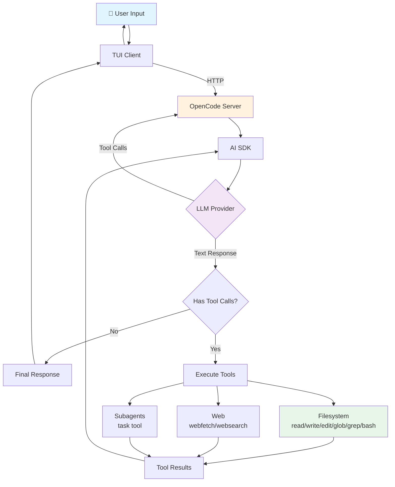

# OpenCode Architecture

## Client-Server Model

OpenCode follows a **client-server architecture**. When you run `opencode` in a terminal:

1. A **headless HTTP server** starts (exposes an OpenAPI 3.1 spec at `/doc`)
2. A **TUI** (Terminal User Interface) launches as a **client** that talks to the server
3. The TUI can randomly assign a port, or be fixed via `--port` and `--hostname` flags
4. This decoupled design enables multiple client types (TUI, desktop app, web interface, IDE plugins)

## Core Agent Loop



## Filesystem Interaction

Tools providing filesystem access:

| Tool | Function | Implementation |
|------|----------|----------------|
| `read` | Read file contents | Filesystem + image/PDF rendering |
| `write` | Create or overwrite files | Atomic write operations |
| `edit` | Exact string replacement in files | Line-based diff matching |
| `glob` | File pattern matching | Ripgrep, respects `.gitignore` |
| `grep` | Content search with regex | Ripgre, respects `.gitignore` |
| `bash` | Execute shell commands | Platform-native shell |
| `apply_patch` | Apply unified diff patches | Patch application |

### Snapshot System

A **snapshot system** tracks file changes using an internal git repository, enabling:

- `/undo` — revert to previous state
- `/redo` — reapply reverted changes
- Configured via `"snapshot": true/false` in config

## LLM Provider Interaction

Uses the **AI SDK** (Vercel's `@ai-sdk`) and **Models.dev** to support **75+ providers**.

### Model ID Format

```
provider/model-id
```

Examples: `anthropic/claude-sonnet-4-5`, `openai/gpt-4o`, `github-copilot/claude-sonnet`

### Built-in Connectivity

| Service | Type |
|---------|------|
| GitHub Copilot | Built-in |
| OpenAI (ChatGPT Plus/Pro) | Built-in |
| GitLab Duo | Built-in |
| OpenCode Zen | Curated models |
| OpenCode Go | $10/mo subscription |

### Provider Configuration

```json
{
  "provider": {
    "anthropic": {
      "apiKey": "{env:ANTHROPIC_API_KEY}",
      "timeout": 60000,
      "baseURL": "https://api.anthropic.com"
    }
  }
}
```

Authentication stored in `~/.local/share/opencode/auth.json`.

## User Interaction Modes

| Mode | Command | Use Case |
|------|---------|----------|
| **TUI** | `opencode` | Default interactive terminal interface |
| **CLI** | `opencode run "prompt"` | Non-interactive scripting |
| **Server** | `opencode serve` | HTTP/API programmatic access |
| **Web** | `opencode web` | Web browser interface |
| **Desktop** | Beta app | macOS, Windows, Linux |
| **IDE plugins** | ACP / dedicated | IDE integration |

### TUI Features

- **Tab** key switches between primary agents (Build ↔ Plan)
- `@` key fuzzy-searches files in the project for context
- Drag-and-drop images into the terminal (auto-normalized)
- `/` commands: `/init`, `/undo`, `/redo`, `/share`, `/connect`, `/models`

## Key File Paths

| Purpose | Path |
|---------|------|
| Global config | `~/.config/opencode/opencode.json` |
| Global TUI config | `~/.config/opencode/tui.json` |
| Project config | `<project>/opencode.json` |
| Project TUI config | `<project>/tui.json` |
| Auth credentials | `~/.local/share/opencode/auth.json` |
| Global agents | `~/.config/opencode/agents/` |
| Project agents | `.opencode/agents/` |
| Global skills | `~/.config/opencode/skills/` |
| Project skills | `.opencode/skills/` |
| Global plugins | `~/.config/opencode/plugins/` |
| Project plugins | `.opencode/plugins/` |
| Custom tools | `.opencode/tools/` or `~/.config/opencode/tools/` |
| Global rules | `~/.config/opencode/AGENTS.md` |
| Project rules | `<project>/AGENTS.md` |
| MCP auth | `~/.local/share/opencode/mcp-auth.json` |
| Plugin cache (npm) | `~/.cache/opencode/node_modules/` |

## Configuration Precedence

Config sources loaded in order (later overrides earlier):

1. Remote config (`.well-known/opencode`)
2. Global config (`~/.config/opencode/opencode.json`)
3. Custom config (`OPENCODE_CONFIG` env var)
4. Project config (`opencode.json`)
5. `.opencode` directories
6. Inline config (`OPENCODE_CONFIG_CONTENT` env var)
7. Managed config files
8. macOS managed preferences (`.mobileconfig` via MDM)

Configuration files are **merged**, not replaced — only conflicting keys are overridden.
