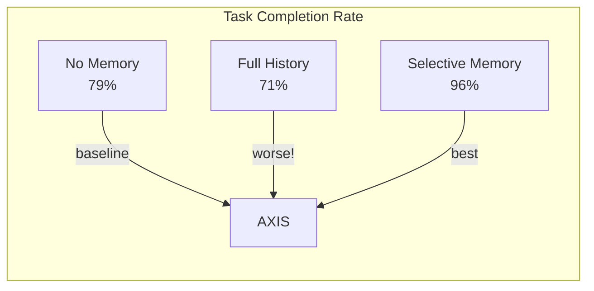
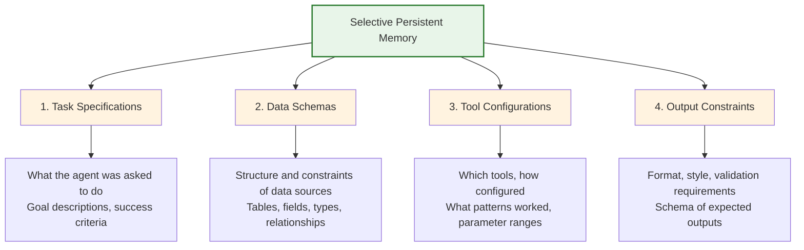
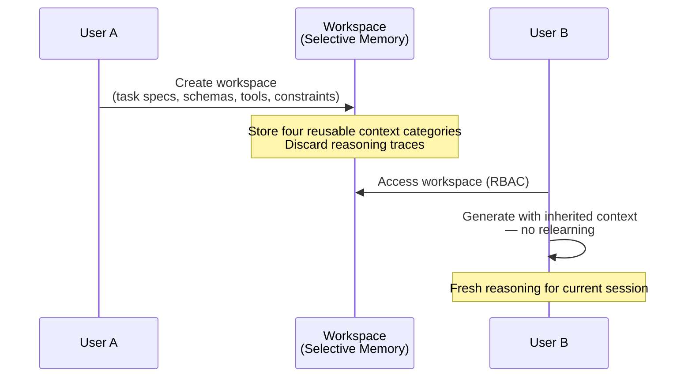
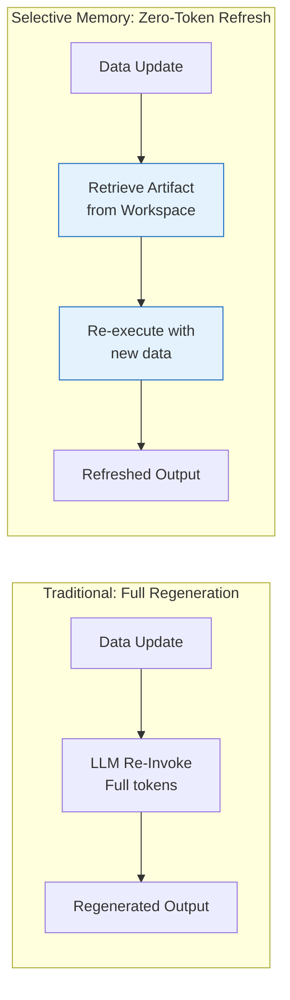
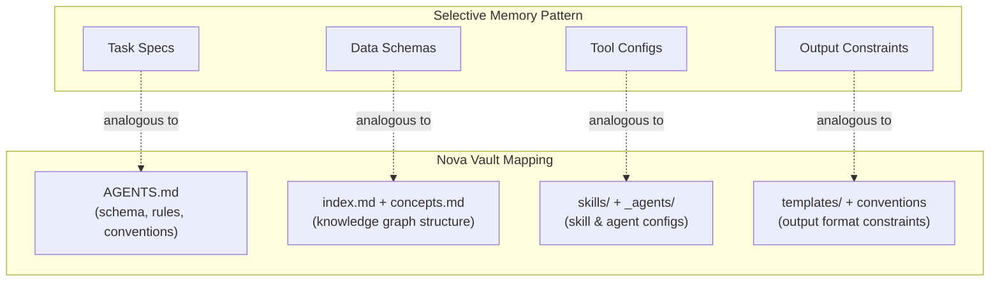

# Selective Persistent Memory

## Overview

Agentic LLM systems face a fundamental context problem: each session starts from zero, requiring the agent to relearn task specifications, data schemas, tool configurations, and output constraints every time. The naive solution — persisting entire conversation histories — is **counterproductive**: irrelevant context from past sessions degrades generation quality, achieving only 71% task completion versus 79% with no memory at all.

Selective persistent memory solves this by retaining only **four reusable context categories** while aggressively discarding session-specific reasoning traces. The result is **96% task completion** — a 17% improvement over no-memory baselines and a 25% improvement over full-history persistence.

## The Counterintuitive Finding

Full-history persistence is not just unhelpful — it is **actively harmful**. The paper demonstrates across 3 enterprise scenarios and 4 public datasets:

The degradation from full-history persistence occurs because stale reasoning traces **bias** the agent toward past decision paths. When the task, schema, or tools change between sessions, the agent follows obsolete traces instead of adapting to the current context. Selective memory avoids this by discarding all intermediate reasoning while preserving only structural, reusable knowledge.

## The Four Categories of Reusable Context

The paper identifies exactly four categories worth persisting across sessions:

### Task Specifications

The high-level description of what the agent is asked to accomplish — goal statements, success criteria, domain of the task. These persist because similar tasks recur across users and sessions. Example: "Generate a weekly sales report with trend analysis" carries reusable structure even when the underlying data changes.

### Data Schemas

The structural description of data sources — table names, field names, data types, primary/foreign key relationships, nullability constraints. These are **expensive to re-discover** (requiring multiple tool invocations) and **change slowly** relative to task frequency.

### Tool Configurations

Which tools are available, how they are configured (API endpoints, authentication methods, parameter ranges), and which invocation patterns have proven effective. This is the "how to work with the environment" knowledge that agents otherwise relearn each session.

### Output Constraints

The expected format, style, validation rules, and structural requirements of the agent's output. These are user-specific or team-specific preferences that stabilize over time — formatting conventions, reporting templates, required sections.

## What Is NOT Stored

Equally important is what the system **deliberately discards**:

| Stored | Discarded |
|--------|-----------|
| Task specifications | Session-specific reasoning traces |
| Data schemas | Intermediate thought chains |
| Tool configurations | Step-by-step execution logs |
| Output constraints | Transient query results |

The discarded content is **session-scoped** — it has no reuse value and actively harms future sessions by providing obsolete pathways. This is the selectivity that differentiates the approach from naive log persistence (see [[cross-session-memory|Cross-Session Memory]] for how Nova's `log.md` currently follows the naive pattern).

## Key Innovations

### Workspace-Based Sharing

Selective memory is encapsulated in **workspaces** — bounded containers that package the four context categories for a specific domain or task family. Workspaces can be:

- **Transferred across users** with role-based access control (RBAC)
- **Shared across sessions** without leaking user-specific data
- **Versioned** — schema changes propagate without invalidating old artifacts

This maps conceptually to Nova's `conference/` directory — a shared memory surface where structured context persists across agent invocations (see [[agent-conference-protocol|Agent Conference Protocol]]).

### Zero-Token Data Refresh

A critical innovation: **decouple generated programs from the runtime data they operate on**. When a data source updates (e.g., new rows in a table), the artifact (generated code, report template, query plan) is reused **without re-invoking the LLM**. The paper reports:

- **14× task-time reduction** (runtime refresh vs full regeneration)
- **Zero LLM tokens consumed** for data-only updates
- **12/12 trials succeeded** — zero failures in zero-token refresh

### Summary-Driven Generation

Instead of injecting raw data into the LLM context, the system generates **dense summaries** of the selective memory contents. This achieves:

- **97× token cost reduction** per invocation (summary vs raw data injection)
- Higher-quality generation by focusing the LLM on structural patterns rather than raw data

## Relevance to Nova Vault

Nova's current cross-session memory strategy (boot sequence → `log.md` append-only → `AGENTS.md` schema layer) can learn several lessons from selective persistent memory:

### Current Gap: log.md as Naive Full History

Nova's `log.md` is essentially **naive full-history persistence** — every session appends a chronological entry, reasoning traces and all. Per the paper's findings, this risks:

1. **Stale context bias**: Old log entries may bias future agents toward obsolete decisions
2. **No selectivity**: log.md stores session-scoped reasoning alongside reusable structural knowledge
3. **Growth without compression**: No mechanism to summarize or prune low-value entries

### Proposed Enhancement: Selective Forgetting Layer

A future vault enhancement could introduce a **compression/selection layer** that periodically:

1. Scans `log.md` for patterns matching the four reusable categories
2. Extracts structural knowledge into dedicated concept notes
3. Compresses or prunes session-scoped reasoning traces
4. Maintains a "working memory" workspace analogous to the paper's model

This would align Nova's memory architecture with the empirical finding that **selective memory (96%) > no memory (79%) > full history (71%)**.

## See Also

- [[cross-session-memory|Cross-Session Memory]] — Nova's current session persistence model, including the log.md append-only pattern that maps to naive full-history persistence
- [[context-management|Context Management]] — Comparative analysis of context window strategies across AI coding tools, including compaction and token budget management
- [[knowledge-graph-patterns|Knowledge Graph Patterns]] — How atomic notes, progressive disclosure, and status lifecycles achieve selective, structured persistence
- [[agent-conference-protocol|Agent Conference Protocol]] — Async agent communication via shared files; conference directory conceptually analogous to the workspace-based sharing model
- [[self-bootstrapping|Self-Bootstrapping]] — How Nova maintains itself; the compound growth loop can incorporate selective forgetting principles

## Citations

1. [Shared Selective Persistent Memory for Agentic LLM Systems](https://arxiv.org/abs/2607.09493) — arXiv:2607.09493, July 10, 2026
