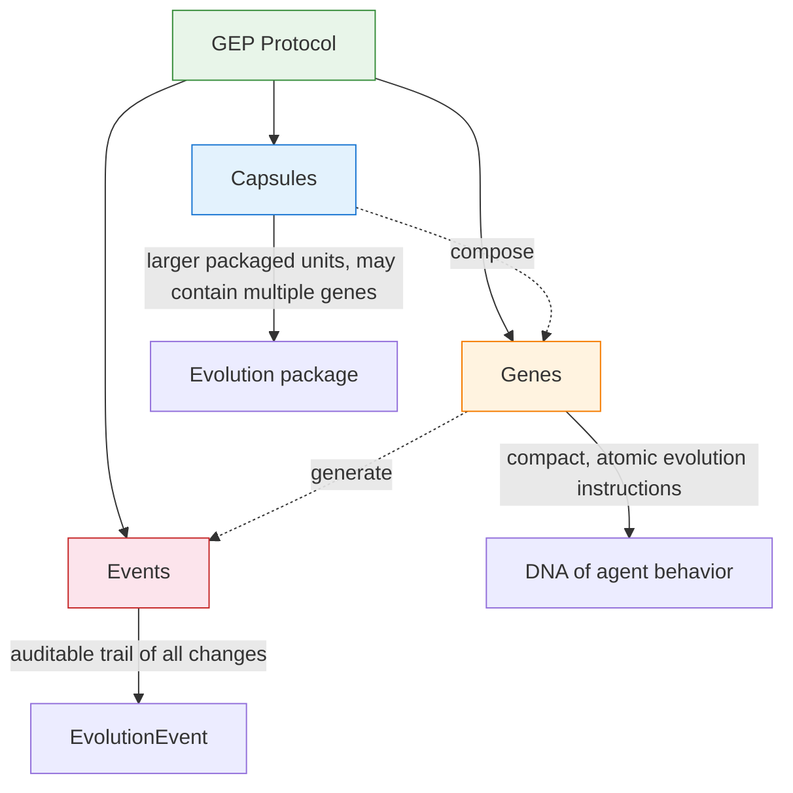
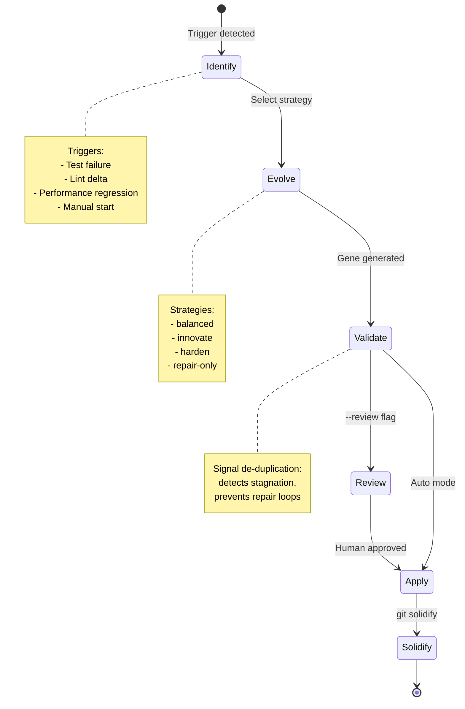
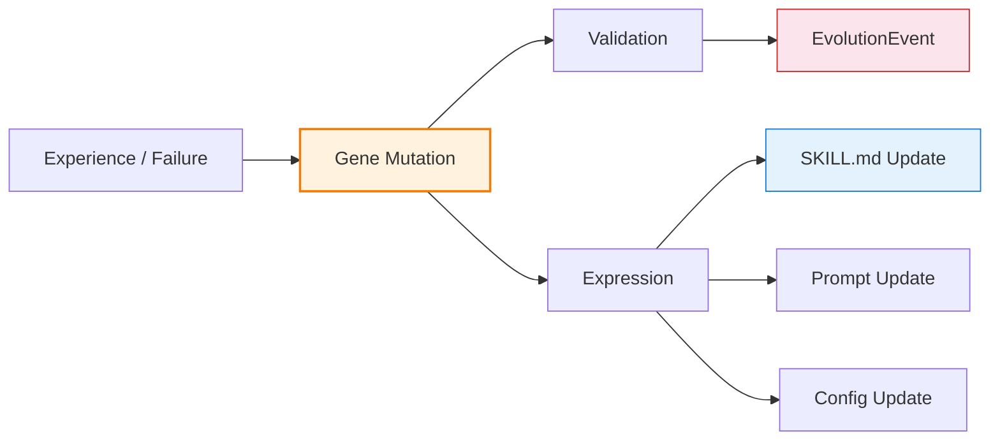
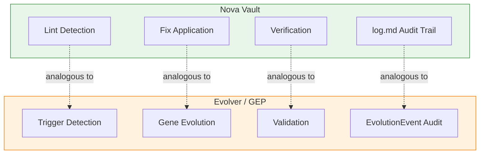

# Self-Evolving Agents

## Overview

**Self-evolving agents** are a paradigm shift from static agent configuration to *auditable evolution cycles*. Instead of manually tweaking prompts or writing skill documents after failures, the agent's learned experience is encoded as **Genes** — compact, protocol-bound evolution instructions — under the **Genome Evolution Protocol (GEP)**. The canonical implementation is **Evolver** (github.com/EvoMap/evolver, v1.91.1, 8.9k stars, July 2026), validated across 4,590 controlled trials on 45 scenarios.

The core insight: **skill documents are the wrong carrier for learned experience**. They are verbose, unstable under perturbation, and provide sparse control signal. Genes are the correct abstraction — compact, composable, auditable.

## The Problem: Why Skill Documents Don't Scale as Evolution Carriers

Manual prompt/skill iteration suffers from three structural deficiencies:

| Deficiency | Skill Document Behavior | Gene Behavior |
|---|---|---|
| **Sparse control signal** | Free-text instructions provide inconsistent steering | Compact structured representation yields dense, reliable signal |
| **Perturbation fragility** | Small rewrites can destabilize agent behavior | Genes stay robust under structural perturbation |
| **No audit trail** | Manual edits have no provenance tracking | Every change produces an EvolutionEvent |

The arXiv paper (2604.15097) empirically demonstrated this across 4,590 trials:

- Gene-evolved systems lifted paired base models from **9.1% → 18.57%** and **17.7% → 27.14%** — roughly 2x performance
- Genes were **far better carriers** for iterative experience accumulation than skill documents
- The gene representation remained robust when subjected to structural perturbation tests

## GEP: Genome Evolution Protocol

GEP defines three asset types that together form a complete evolution system:

### Asset Hierarchy

### 1. Genes

Genes are the **fundamental unit of evolution**. Each gene is:
- **Compact**: A structured, protocol-bound instruction — not free-text prose
- **Protocol-bound**: Conforms to GEP schema, machine-parseable and verifiable
- **Composable**: Multiple genes can be combined into Capsules or applied independently
- **Versioned**: Every gene change is tracked via EvolutionEvents

A gene encodes *what to improve* and *how to improve it*, not the full context of the improvement. This compactness is precisely what makes genes superior carriers.

### 2. Capsules

Capsules are larger, packaged evolution units that:
- Can contain multiple genes bundled together
- Represent higher-level evolutionary strategies
- Serve as the distribution unit for sharing evolution across agents/teams
- Map roughly to a "skill upgrade pack" — but in gene form, not prose form

### 3. Events (EvolutionEvent)

Every evolution step produces an **EvolutionEvent** — an immutable record of:
- **What** changed (gene ID, before/after state)
- **Why** it changed (trigger: test failure, lint delta, performance regression)
- **When** it changed (timestamp)
- **Who** initiated it (human or automated)
- **Impact**: Measurable outcome delta (pass rate, score improvement)

This makes the entire evolution process **auditable** — a property skill documents fundamentally lack.

## Evolution Cycle

### Key Design Decisions

- **Not a code patcher**: Evolver generates GEP prompts — it does NOT auto-edit source code. The agent consuming the gene decides how to apply it.
- **Human-in-the-loop**: The `--review` flag enables human approval before genes are applied.
- **Offline-first**: Core evolution logic runs without network access. External calls are optional.
- **Configurable strategies**: `balanced` (default), `innovate` (explore), `harden` (exploit), `repair-only` (fix bugs only).
- **Signal de-duplication**: Detects stagnation by comparing incoming triggers against the evolution history. Prevents infinite repair loops on unfixable issues.
- **Git integration**: Uses git for rollback, blast radius calculation (`git diff --stat`), and solidify (commit the evolved state).

## Genes vs Skills: The Relationship

Evolver notably **also produces SKILL.md files** — but the GEP gene representation is the primary evolution carrier. The relationship:

| Layer | Format | Function |
|-------|--------|----------|
| **Learned form** | Gene (GEP) | Compact, composable, auditable — the "DNA" |
| **Executable form** | SKILL.md | Human-readable, agent-consumable — the "phenotype" |

Skills are the **output** of the evolution process, not the carrier of the evolution itself. This distinction is critical: you don't mutate skill documents to evolve; you mutate genes, and those genes express as updated skills.

## Ecosystem Integration

Evolver integrates via hooks with the major agent coding tools:

| Tool | Integration Method |
|------|--------------------|
| Cursor | Hook-based |
| Claude Code | Hook-based |
| Codex CLI | Hook-based |
| Kiro | Hook-based |
| **OpenCode** | **Hook-based** |
| OpenClaw | Hook-based |
| Crush | Hook-based |

The hook model means Evolver sits alongside the agent, observing its performance, and injects evolved genes without modifying the agent's core code.

## Relevance to Nova

Nova's architecture has natural alignment with the GEP self-evolution pattern:

Three concrete adoption paths for Nova:

1. **Skills evolution via gene-like compact representation**: Instead of manually editing `SKILL.md` files, Nova could maintain a gene layer that expresses into skill files. The gene tracks *what changed and why*, the skill carries the *executable form*.

2. **The lint → fix → verify loop**: Nova's existing lint protocol already mirrors the evolve → validate → solidify pattern. Adding gene-style structured representation would make lint fixes auditable and reversible.

3. **Lightweight evolution audit trail**: Nova already has `log.md` as cross-session memory. Augmenting it with EvolutionEvent-style structured entries (trigger, gene change, outcome delta) would close the loop between detecting problems and verifying fixes.

## See Also

- [[agent-skills-system|Agent Skills System]] — The skill mechanism genes express through; skills are the executable form, genes are the learned form
- [[agent-skills-standard|Agent Skills Standard]] — The open standard (agentskills.io) that Evolver's SKILL.md output conforms to
- [[skill-subagent-boundary|Skill vs Subagent Boundary]] — The structural decision of what becomes a skill vs a subagent mirrors the gene-level decision of what to evolve
- [[agent-extensibility|Agent Extensibility]] — GEP genes are a new dimension of extensibility beyond hooks, plugins, and skills
- [[cross-session-memory|Cross-Session Memory]] — EvolutionEvents serve the same cross-session function as log.md entries, but with structured gene provenance
- [[agent-orchestration|Agent Orchestration]] — Self-evolving agents introduce a new coordination primitive: evolve-then-orchestrate

## Citations

1. [From Procedural Skills to Strategy Genes: How Self-Evolving Agents Learn Like Living Systems](https://arxiv.org/abs/2604.15097) — arXiv:2604.15097, July 2026. 4,590 controlled trials across 45 scenarios.
2. [EvoMap/Evolver: GEP-powered self-evolving engine](https://github.com/EvoMap/evolver) — GitHub repository, v1.91.1, 8.9k stars.
3. [EvoMap — Evolution Network](https://evomap.ai) — Official project site.
