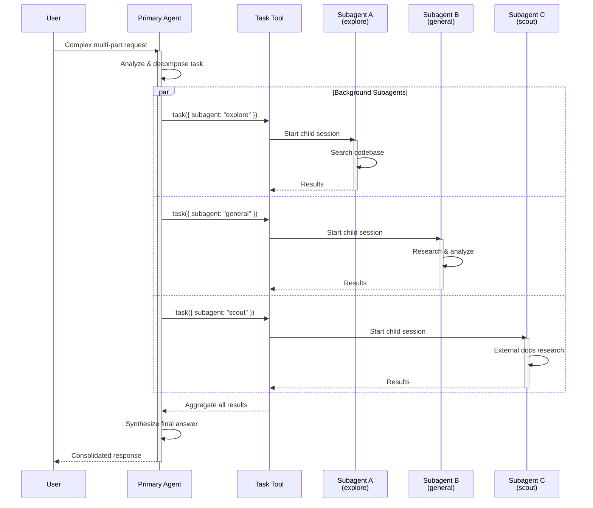

# Subagent Concurrency

## Task Tool Invocation

Primary agents invoke subagents via the **`task`** tool. The Task tool description lists available subagents with their names and descriptions. Invocation format:

```
task({ subagent: "explore", prompt: "Find all files containing 'auth'" })
```

Users can also manually invoke subagents with `@mention`:

```
@general help me search for this function
```

## Agent Types

| Agent | Mode | Type | Purpose | Key Restrictions |
|-------|------|------|---------|-----------------|
| **build** | `primary` | Default | Full development work, all tools enabled | None |
| **plan** | `primary` | Planning | Analysis and planning without code changes | `edit: ask`, `bash: ask` by default |
| **general** | `subagent` | Multi-step | Complex research, multi-step tasks, parallel work | Full tool access (except `todo`) |
| **explore** | `subagent` | Read-only | Fast codebase exploration | Cannot modify files |
| **scout** | `subagent` | Read-only | External docs and dependency research | Cannot modify workspace |
| **compaction** | `primary` | System (hidden) | Automatically compacts long context | Not selectable in UI |
| **title** | `primary` | System (hidden) | Generates short session titles | Not selectable in UI |
| **summary** | `primary` | System (hidden) | Creates session summaries | Not selectable in UI |

### Subagent Capability Matrix

| Type | Read | Write | Speed | Best For |
|------|------|-------|-------|----------|
| **general** | Yes | Yes (no todo) | Normal | Multi-step tasks, research, implementation |
| **explore** | Yes | No | Fast | File pattern matching, code search, Q&A |
| **scout** | Yes (external) | No | Normal | External docs, dependency source inspection |
| **Custom** | Configurable | Configurable | Configurable | Specialized workflows |

## Subagent Execution Model

- **Fresh context per invocation**: Each subagent invocation starts with a clean context
- **Child sessions**: Subagents create child sessions under the parent
- **`task_id` for resuming**: Subagent sessions can be resumed via the Task tool

### Session Navigation

| Keybinding | Action | Description |
|------------|--------|-------------|
| `session_child_first` | Leader+Down | Enter first child session |
| `session_child_cycle` | Right | Cycle forward through children |
| `session_child_cycle_reverse` | Left | Cycle backward through children |
| `session_parent` | Up | Return to parent session |

## Concurrent Subagent Execution



- Multiple subagents can run in **parallel** via background subagent tasks
- Controlled by `OPENCODE_EXPERIMENTAL_BACKGROUND_SUBAGENTS` environment variable
- The `general` subagent is designed for "running multiple units of work in parallel"
- Each subagent runs as an **independent session** with its own context

## Optimal Agent Prompt Structure

A well-formed agent prompt has **5 elements**:

1. **Clear purpose statement**: What the agent is and when to use it
2. **Tool access summary**: What the agent can and cannot do
3. **Specific domain instructions**: Bullet-pointed focus areas
4. **Output format expectations**: How results should be structured
5. **Context injection**: Via system prompt file (`{file:./prompts/...}`)

### Example: Code Reviewer Agent

```markdown
---
description: Reviews code for quality and best practices
mode: subagent
temperature: 0.1
permission:
  edit: deny
---
You are in code review mode. Focus on:
- Code quality and best practices
- Potential bugs and edge cases
- Performance implications
- Security considerations

Provide constructive feedback without making direct changes.
```

## Agent Configuration

Agents can be defined **inline in JSON** or as **Markdown files**:

### JSON (in opencode.json)

```json
{
  "agent": {
    "code-reviewer": {
      "description": "Reviews code for quality",
      "mode": "subagent",
      "model": "anthropic/claude-sonnet-4-20250514",
      "permission": { "edit": "deny" }
    }
  }
}
```

### Markdown (file-based)

Place `.md` files in `~/.config/opencode/agents/` (global) or `.opencode/agents/` (project). The filename becomes the agent name (e.g., `review.md` → `review` agent).

### Agent Permission Override

Agent-level permissions are **merged** with global permissions. **Agent rules take precedence** when they conflict:

```json
{
  "agent": {
    "build": {
      "permission": {
        "bash": {
          "*": "ask",
          "git *": "allow",
          "git push *": "deny"
        }
      }
    }
  }
}
```

Task permission controls which subagents an agent can invoke:

```json
{
  "agent": {
    "orchestrator": {
      "permission": {
        "task": {
          "*": "deny",
          "orchestrator-*": "allow",
          "code-reviewer": "ask"
        }
      }
    }
  }
}
```
