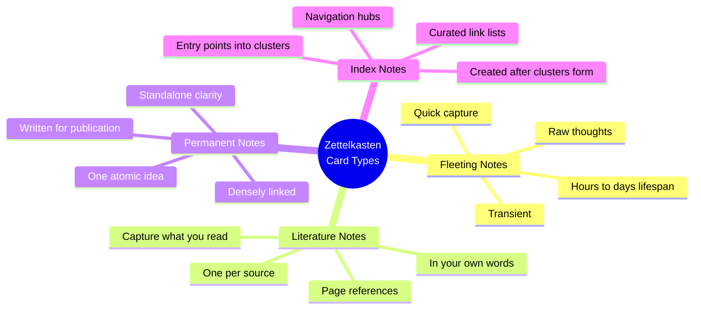
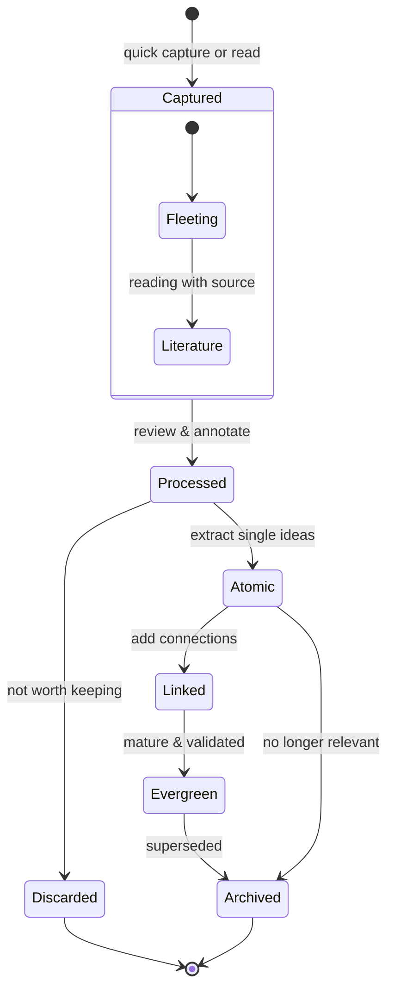

# Zettelkasten Methodology

## Core Principles

### Atomicity

> Each note captures **exactly one idea** in a self-contained unit.

- If a note contains two distinct ideas, split it into two
- An atomic note can be understood independently (with the aid of its links)
- Rule of thumb: if you can't summarize the note's single idea in 2–3 sentences, it's not atomic

Formally, for a note $N$ in a Zettelkasten $\mathcal{Z}$:

$$
\text{atomic}(N) \iff |\text{ideas}(N)| = 1
$$

### Connectivity

> Notes gain meaning through their **links to other notes**.

- Every note should link to at least 1–3 other notes
- Links encode the **context** and **relationships** between ideas
- A densely connected Zettelkasten enables **serendipitous discovery**
- Link types: sequence, elaboration, contradiction, application, question

For a Zettelkasten $\mathcal{Z}$ with notes $N$ and links $L$:

$$
\mathcal{Z} = (V, E) \quad \text{where} \quad V = \{N_1, N_2, \ldots, N_k\}, \quad E = \{(N_i, N_j) \mid N_i \text{ links to } N_j\}
$$

### Emergent Structure

> The organization of notes emerges **bottom-up** from links, not top-down from folders.

- Start writing notes about whatever interests you
- As the note count grows (500+), **clusters** naturally form around topics
- **Index notes** (Maps of Content) are created *after* clusters exist, not before
- This is the opposite of a folder hierarchy where structure is predetermined

## Card Types



### Note Lifecycle



### Fleeting Notes

- **Purpose**: Quick capture of ideas as they occur — transient and disposable
- **Content**: Raw thoughts, reminders, spontaneous ideas — usually not linked
- **Lifespan**: Hours to days — processed into permanent notes or discarded

### Literature Notes

- **Purpose**: Capture what you read, in your own words, with page references
- **Content**: Summary of a source's key arguments — selective, not comprehensive
- **Rule**: Always in **your own words** (forces processing)
- **Link to**: The source's bibliographic note

### Permanent Notes (Zettels)

- **Purpose**: Capture **one atomic idea**, fully developed, in your own words
- **Content**: A single, self-contained argument, concept, or insight
- **Key properties**: Written as if for publication, stands alone, connects to 1–3 existing notes

### Index Notes / Maps of Content (MOCs)

- **Purpose**: Provide entry points and navigation into topic clusters
- **Content**: Curated lists of links with brief annotations
- **Creation**: After a cluster of 10+ related permanent notes has formed

## Luhmann's Original Analog System

| Aspect         | Luhmann's Method (1952–1997)                                           |
| -------------- | ---------------------------------------------------------------------- |
| **Medium**     | Physical index cards in wooden cabinets                                |
| **Schema**     | Branching IDs (e.g., `21/3a1b5c`)                                      |
| **Branching**  | `21/3` → `21/3a` (continuation) or `21/4` (new topic)                  |
| **Links**      | Red reference numbers at card edges                                    |
| **Index**      | Keyword index (Schlagwortregister) mapping keywords to 1–4 entry cards |
| **Size**       | ~90,000 cards over 45 years (~6 cards/day)                             |
| **Constraint** | Linear — cards have fixed physical position                            |

The branching ID structure encodes sequence:

$$
\text{id} = n_1 / n_2 a_1 b_1 c_1 \ldots
$$

Where $n_1$ is the top-level category, $n_2$ a subtopic, and letters signal branching alternatives.

## Digital ZK vs. Analog ZK

| Aspect | Analog (Luhmann) | Digital (Obsidian, etc.) |
|--------|------------------|--------------------------|
| **Medium** | Physical cards | Markdown files |
| **Schema** | Branching IDs | Timestamps, UUIDs, slugs |
| **Links** | Unidirectional (by ID) | Bidirectional wiki links |
| **Backlinks** | Manual (red numbers on target card) | Automatic |
| **Graph** | Mental model only | Visual graph view |
| **Search** | Keyword index | Full-text search |
| **Position** | Fixed (linear) | Non-linear (can be in many "places") |

The key digital advantage — **backlinks** — make the knowledge graph explicit. In math notation:

$$
\text{Analog: } \quad \text{InLinks}(N) = \emptyset \quad \text{(unless manually tracked)}
$$
$$
\text{Digital: } \quad \text{InLinks}(N) = \{M \in V \mid N \in \text{OutLinks}(M)\} \quad \text{(automatic)}
$$

## Folgezettel (Sequence Notes)

A Folgezettel is a note that directly follows another in a logical sequence, with the implied relationship "this note follows from / builds upon that note."

### Links Create Structure Without Folders

Traditional folder organization:

```
Folder > Subfolder > File
```

ZK link-based organization:

```
Note A ← Note B ← Note C
    ↖ Note D ← Note E
        ↖ Note F
```

A note can be at the intersection of multiple sequences:

$$
N_k \in \text{Sequence}_A \cap \text{Sequence}_B \cap \text{Sequence}_C
$$

Whereas in folders: $F_k \in \text{Folder}_A$ (mutually exclusive).

### Implementation in Digital ZK

**Implicit**: Just link notes — the graph creates sequences.

**Explicit in frontmatter**:
```yaml
---
prev: "[[zettelkasten-methodology|ZK Core Principles]]"
next: "[[zettelkasten-methodology|Cognitive Load and Note Design]]"
sequence: zk-applications
---
```

**Trail links**: Create explicit narrative paths through the ZK:
```markdown
# Trail: ZK for Software Engineers
1. [[zettelkasten-methodology|ZK Core Principles]]
2. → [[zettelkasten-methodology|ZK for Code Documentation]]
3. → [[zettelkasten-methodology|Example: ZK in a Codebase]]
```

## ID Systems Comparison

| System | Example | Uniqueness | Readability | Sortability |
|--------|---------|------------|-------------|-------------|
| **Timestamp** | `20260622143000` | ✅ Excellent | ❌ Meaningless | ✅ Natural |
| **Luhmann Branching** | `21/3a1b5c` | ✅ Good | ⚠️ Encodes hierarchy | ✅ Topic-ordered |
| **Descriptive Slug** | `atomicity-in-zk` | ❌ Collisions possible | ✅ Excellent | ❌ Arbitrary |
| **Hybrid (Timestamp+Slug)** | `20260622-atomicity-in-zk` | ✅ Excellent | ✅ Good | ✅ Natural |
| **UUID** | `550e8400-e29b-...` | ✅ Perfect | ❌ Inscrutable | ❌ Arbitrary |

**Recommendation**: Use **hybrid** (`YYYYMMDDHHmmss-slug`) for shared vaults or **timestamp** for personal high-volume systems.

## Implementing ZK in Obsidian

### Directory Structure

```
vault/
├── inbox/                  # Fleeting notes, daily notes
├── literature/             # Literature notes (one per source)
├── permanent/              # Permanent atomic notes
├── index/                  # Maps of Content / Structure notes
├── sources/                # Bibliographic notes
├── templates/              # Note templates
├── attachments/            # Images, PDFs, etc.
└── .obsidian/              # Obsidian configuration
```

> The folder structure is for rough organization, not strict hierarchy. The real structure is in the links.

### Permanent Note Template

```markdown
---
id: "{{date:YYYYMMDD}}{{time:HHmmss}}"
type: Concept    # permanent note (Zettelkasten terminology)
status: seedling
created: {{date}}
modified: {{date}}
tags: []
aliases: []
related: []
sources: []
confidence: 0.7
---
# {{title}}

<!-- One atomic idea, fully developed. Write as if for publication. -->

---

## Links
- Related:
- Sources:
```

## ZK vs. Folder-Based Organization

| Dimension | Folder-Based | Zettelkasten |
|-----------|-------------|--------------|
| **Structure** | Top-down, pre-imposed | Bottom-up, emergent |
| **Classification** | Each item in exactly one folder | Each note accessed via multiple paths |
| **Discovery** | Browse by known categories | Follow links; serendipitous discovery |
| **Reorganization** | Manual, labor-intensive | Automatic — links update the graph |
| **Rigidity** | Categories become outdated | Network adapts as knowledge grows |
| **Multi-membership** | Impossible (without symlinks) | Natural — a note belongs to many contexts |
| **Meta-knowledge** | Category titles describe contents | Link context explains *why* things relate |
| **Scale handling** | Becomes unwieldy past ~100 items | Thrives at scale (Luhmann: 90,000 cards) |

The formal mathematical relationship between folder membership and ZK membership:

$$
\text{Folder: } \quad f(N) \in \mathcal{F} \quad \text{(surjective function, exactly one folder)}
$$
$$
\text{ZK: } \quad L(N) \subseteq V \quad \text{(subset of all notes, unlimited membership)}
$$
