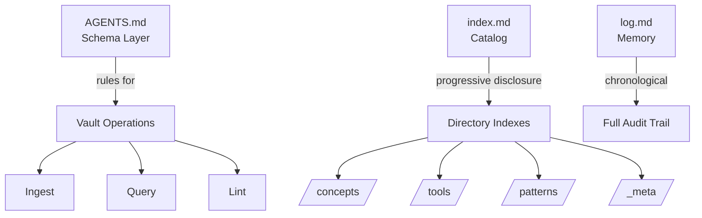

---
type: Index
title: Nova Knowledge Vault
description: Progressive-disclosure catalog of the entire Nova knowledge vault — an AI-maintained, Zettelkasten-inspired, OKF-conformant knowledge base.
tags: [index, catalog]
timestamp: 2026-06-22T05:30:00Z
okf_version: "0.1"
---

# Nova 知识库

欢迎来到 Nova 知识库 — 一个基于 Obsidian 的、自举式 AI 维护的知识体系。本知识库遵循 [[okf-format|Open Knowledge Format (OKF)]]、[[zettelkasten-methodology|Zettelkasten Methodology]] 和 [[karpathy-llm-curriculum|Karpathy LLM Curriculum]] 的设计原则。

> **导航提示**：从这里开始。下方每个栏目链接到一个主题集群。跟随链接深入探索。

---

## 知识库架构

---

## 📍 知识集群

### 🧠 [[_meta/index|元信息 — 关于知识库本身]]
知识库的自我参照层：运作机制、约定规范与自举策略。
- [[vault-architecture|Vault Architecture]] — 知识库的结构设计与原理
- [[conventions|Conventions]] — 命名、链接与 frontmatter 规范
- [[self-bootstrapping|Self-Bootstrapping]] — 知识库如何自我维护与成长

### 🤖 [[concepts/index|概念 — 核心思想]]
原子化、可持久化的笔记，涵盖 AI Agent、知识管理与系统设计等基础概念。
- [[opencode-architecture|OpenCode Architecture]] — OpenCode 的客户端-服务端架构与核心循环
- [[agent-skills-system|Agent Skills System]] — 技能机制如何扩展 Agent 能力
- [[subagent-concurrency|Subagent Concurrency]] — 多 Agent 并行执行模式
- [[cross-session-memory|Cross-Session Memory]] — 跨会话记忆持久化机制
- [[agent-orchestration|Agent Orchestration]] — LLM 驱动 vs 代码驱动的多 Agent 协调
- [[mcp-protocol|MCP Protocol]] — Model Context Protocol：LLM 与工具集成的标准协议
- [[a2a-protocol|A2A Protocol]] — Agent-to-Agent Protocol：Agent 间通信的标准协议
- [[zettelkasten-methodology|Zettelkasten Methodology]] — 卡片盒笔记法（ZK 方法）
- [[okf-format|OKF Format]] — Google 的 Open Knowledge Format 规范
- [[markdown-frontmatter|Markdown Frontmatter]] — 知识图谱元数据的 YAML frontmatter
- [[mermaid-diagrams|Mermaid Diagrams]] — 在 markdown 中嵌入图表
- [[latex-in-markdown|LaTeX in Markdown]] — 知识笔记中的数学符号
- [[karpathy-llm-curriculum|Karpathy LLM Curriculum]] — 理解 LLM 的渐进式课程体系

### 🛠️ [[tools/index|工具 — Agent 编程平台]]
主流 AI 编程/Agent 工具的深度分析。
- [[opencode|OpenCode]] — OpenCode 完整功能分析
- [[claude-code|Claude Code]] — Anthropic 的终端编程 Agent
- [[codex-cli|Codex CLI]] — OpenAI 的 Agent 编程工具
- [[openai-agents-sdk|OpenAI Agents SDK]] — OpenAI 多 Agent 工作流 Python 库
- [[aider|Aider]] — 基于 RepoMap 的 Map-Reduce 方法
- [[cursor|Cursor]] — IDE 原生 AI Agent
- [[copilot|GitHub Copilot]] — Microsoft 的 Agent 生态

### 📐 [[patterns/index|模式 — 架构与设计]]
Agent 系统与知识管理的跨领域设计模式。
- [[multi-agent-patterns|Multi-Agent Patterns]] — 编排器-工作者、点对点、层级式
- [[context-management|Context Management]] — LLM 上下文窗口管理策略
- [[permission-models|Permission Models]] — Agent 系统的安全与访问控制
- [[knowledge-graph-patterns|Knowledge Graph Patterns]] — 构建与维护知识图谱
- [[agent-extensibility|Agent Extensibility]] — 插件系统、钩子与 Agent 定制

### 🧬 [[_identity/index|身份 — Nova 是谁]]
AI 管家的自我认知、能力清单与扩展性。
- [[nova-identity|Nova Identity]] — Nova 的核心目标、指令与个性
- [[capability-manifest|Capability Manifest]] — Nova 的能力、可用工具与成长路径

---

## 🔗 快速导航

| 需求 | 前往 |
|------|-------|
| 了解 Agent 规则 | [AGENTS.md](AGENTS.md) |
| 查看近期活动 | [log.md](log.md) |
| 创建新概念笔记 | [[concept-template|概念模板]] |
| 浏览全部概念 | [[concepts/index]] |
| 理解 ZK 方法 | [[zettelkasten-methodology|Zettelkasten Methodology]] |
| 学习 OKF 格式 | [[okf-format|OKF Format]] |

---

## 📊 知识库统计

| 指标 | 数值 |
|--------|-------|
| 框架 | OKF v0.1 |
| 模式层 | AGENTS.md v1.0.0 |
| ID 系统 | Timestamp (YYYYMMDDThhmmss) |
| 知识域 | AI Agent、知识管理、系统架构 |
| 状态 | 活跃，持续复利增长 |
