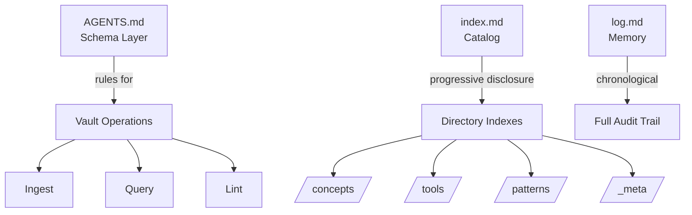

# Nova Knowledge Vault

Welcome to the Nova Knowledge Vault — a self-bootstrapping, AI-maintained knowledge base structured as an Obsidian vault. The vault follows [[Open Knowledge Format (OKF)]], [[Zettelkasten Methodology]], and [[Karpathy LLM Curriculum]] principles.

> **Navigator**: Start here. Each section below links to a topic cluster. Follow links to dive deeper.

---

## Vault Architecture

---

## 📍 Knowledge Clusters

### 🧠 [[_meta/index|Meta — Vault About the Vault]]
Self-referential knowledge about how this vault works, its conventions, and its self-bootstrapping mechanisms.
- [[Vault Architecture]] — How the vault is structured and why
- [[Conventions]] — Naming, linking, and frontmatter standards
- [[Self-Bootstrapping]] — How the vault maintains and grows itself

### 🤖 [[concepts/index|Concepts — Core Ideas]]
Atomic, permanent notes on fundamental concepts across AI agents, knowledge management, and system design.
- [[OpenCode Architecture]] — Opencode's client-server design and core loop
- [[Agent Skills System]] — How skills extend agent capabilities
- [[Subagent Concurrency]] — Multi-agent parallel execution patterns
- [[Cross-Session Memory]] — Memory persistence across agent sessions
- [[Agent Orchestration]] — LLM-driven vs code-driven multi-agent coordination
- [[MCP Protocol]] — Model Context Protocol: standard for LLM-tool integration
- [[A2A Protocol]] — Agent-to-Agent Protocol: standard for inter-agent communication
- [[Zettelkasten Methodology]] — The ZK method for knowledge management
- [[OKF Format]] — Google's Open Knowledge Format specification
- [[Markdown Frontmatter]] — YAML frontmatter for knowledge graph metadata
- [[Mermaid Diagrams]] — Embedded diagrams in markdown
- [[LaTeX in Markdown]] — Mathematical notation in knowledge articles
- [[Karpathy LLM Curriculum]] — Progressive curriculum for LLM understanding

### 🛠️ [[tools/index|Tools — Agent Coding Platforms]]
Deep-dive analyses of major AI coding/agent tools.
- [[OpenCode]] — Opencode's full feature analysis
- [[Claude Code]] — Anthropic's terminal-based coding agent
- [[Codex CLI]] — OpenAI's agentic coding tool
- [[OpenAI Agents SDK]] — OpenAI's Python library for multi-agent workflows
- [[Aider]] — Map-reduce approach with RepoMap
- [[Cursor]] — IDE-native AI agent
- [[GitHub Copilot]] — Microsoft's agent ecosystem

### 📐 [[patterns/index|Patterns — Architecture & Design]]
Cross-cutting design patterns for agent systems and knowledge management.
- [[Multi-Agent Patterns]] — Orchestrator-worker, peer-to-peer, hierarchical
- [[Context Management]] — Strategies for managing LLM context windows
- [[Permission Models]] — Security and access control in agent systems
- [[Knowledge Graph Patterns]] — Building and maintaining knowledge graphs
- [[Agent Extensibility]] — Plugin systems, hooks, and agent customization

### 🧬 [[_identity/index|Identity — Who Nova Is]]
The AI steward's self-conception, capabilities, and extensibility.
- [[Nova Identity]] — Nova's core purpose, directives, and personality
- [[Capability Manifest]] — What Nova can do, tools available, growth path

---

## 🔗 Quick Links

| Need | Go To |
|------|-------|
| Understand agent rules | [AGENTS.md](AGENTS.md) |
| See recent activity | [log.md](log.md) |
| Create new concept note | [[../templates/concept-template|Concept Template]] |
| Browse all concepts | [[concepts/index]] |
| Understand ZK method | [[Zettelkasten Methodology]] |
| Learn OKF format | [[OKF Format]] |

---

## 📊 Vault Statistics

| Metric | Value |
|--------|-------|
| Framework | OKF v0.1 |
| Schema Layer | AGENTS.md v1.0.0 |
| ID System | Timestamp (YYYYMMDDThhmmss) |
| Knowledge Domains | AI Agents, Knowledge Management, System Architecture |
| Status | Active, compounding |
