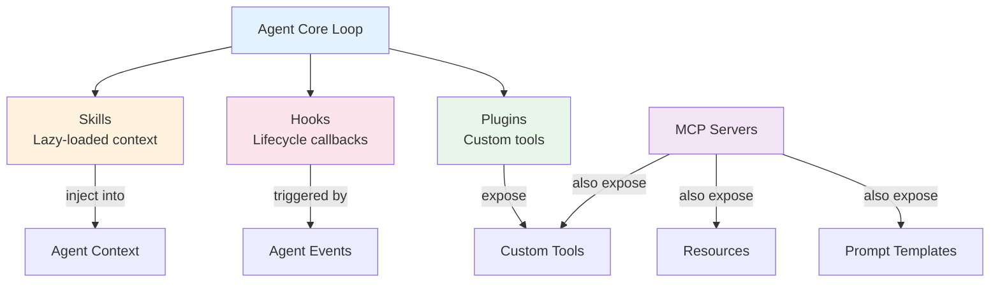
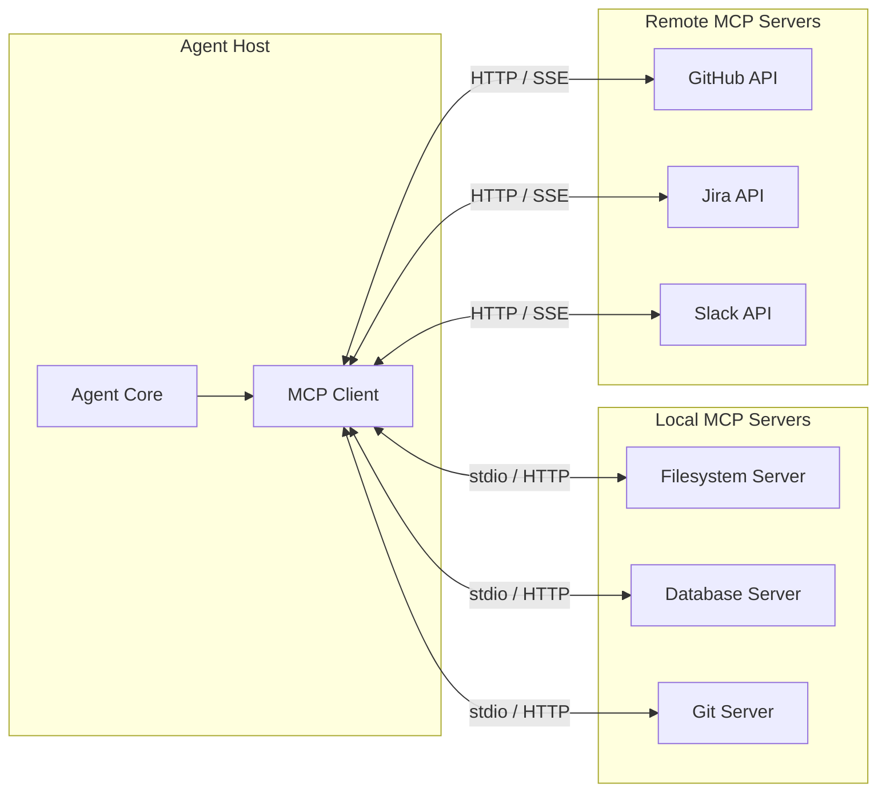
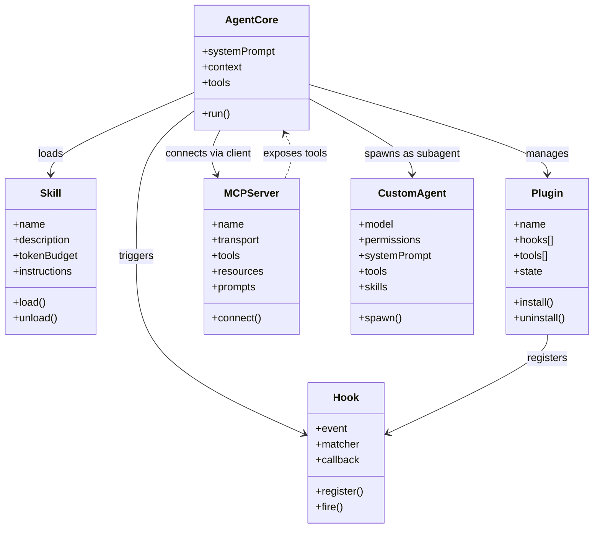

# Agent Extensibility Patterns

## The Extensibility Triad



### When to Use Each

| Extension Type | Use When | Lifetime | Example |
|----------------|----------|----------|---------|
| **Skill** | Repeated task with specialized instructions | Per-session, lazy-loaded | "code-review" skill |
| **Hook** | Event-driven side effects or overrides | Persistent, reacts to events | Pre-tool-use audit, post-message log |
| **Plugin** | Custom tool that needs persistent state | Persistent, always available | Custom filesystem tool, custom API client |
| **MCP Server** | External tool/resource provider across agents | External process, multi-agent | Database query server, knowledge base server |

## 1. Plugin Systems

### Claude Code Hooks

Claude Code hooks are event-driven callbacks defined in settings:

```json
{
  "hooks": {
    "PreToolUse": [
      {
        "matcher": "Bash",
        "hooks": [{
          "type": "command",
          "command": "python3 ~/hooks/audit_bash.py"
        }]
      }
    ],
    "PostToolUse": [
      {
        "matcher": "Edit",
        "hooks": [{
          "type": "command",
          "command": "npx prettier --write $FILE"
        }]
      }
    ],
    "Notification": [
      {
        "matcher": "*",
        "hooks": [{
          "type": "command",
          "command": "python3 ~/hooks/notify_desktop.py"
        }]
      }
    ]
  }
}
```

**Hook Lifecycle Events**:
- `PreToolUse` — before any tool execution (can deny)
- `PostToolUse` — after tool execution (audit, format)
- `Notification` — permission prompts, errors, completion
- `UserPromptSubmit` — when user submits a message
- `Stop` — agent session ending

### Opencode Plugins (25+ Hook Events)

Opencode's plugin system is more granular:

```jsonc
// Plugin registration in opencode.json
{
  "plugins": {
    "my-formatter": {
      "path": ".opencode/plugins/formatter.js",
      "hooks": [
        "file-write-after",
        "file-read-before"
      ]
    }
  }
}
```

**Hook Event Categories**:

| Category | Events | Examples |
|----------|--------|----------|
| **File Operations** | `file-read-before`, `file-read-after`, `file-write-before`, `file-write-after`, `file-delete-before`, `file-delete-after` | Auto-format, audit log, backup |
| **Command Execution** | `bash-execute-before`, `bash-execute-after`, `bash-execute-error` | Command allow-listing, output capture |
| **Web Operations** | `webfetch-before`, `webfetch-after` | URL filtering, response caching |
| **Agent Lifecycle** | `session-start`, `session-end`, `message-received`, `message-sent`, `compaction-start`, `compaction-end` | Session logging, metrics |
| **Permission** | `permission-check`, `permission-granted`, `permission-denied` | Custom permission logic |
| **Tool** | `tool-call-before`, `tool-call-after` | Tool telemetry, rate limiting |
| **Skills** | `skill-load`, `skill-unload` | Skill auditing |
| **Subagents** | `subagent-spawn`, `subagent-complete` | Subagent monitoring |

## 2. Skill / Command Systems

### The SKILL.md Standard

Skills are self-contained instruction sets in markdown:

```
.opencode/skills/<name>/SKILL.md
```

```yaml
---
name: code-review
description: "Automated code review with style checking and security analysis"
token_budget: 2000
---
```

**Lazy Loading**: Skills are loaded on-demand when the agent recognizes a matching task. The skill's instructions are injected into the agent's context for the duration of the task.

**Context Injection**: Skills declare what context they need and what they produce. The agent manages injection and cleanup.

### Comparison Across Tools

| Tool | Skill/Command System | Format | Auto-Discovery |
|------|---------------------|--------|----------------|
| OpenCode | Skills (SKILL.md) | Markdown with YAML frontmatter | Yes, directory scanning |
| Claude Code | Slash commands + subagents | Markdown in CLAUDE.md | Manual registration |
| Codex CLI | Workflows | YAML workflow definitions | Manual |
| Cline | `.clinerules` files | Markdown in project root | Single file, no hierarchy |
| Aider | None built-in | N/A | N/A |
| Copilot | Custom instructions | `.github/copilot-instructions.md` | Single file |

## 3. Custom Tool Creation

### Via MCP (Claude Code, Opencode, Codex CLI)

```json
// claude_desktop_config.json or opencode.json
{
  "mcpServers": {
    "filesystem": {
      "command": "npx",
      "args": ["-y", "@modelcontextprotocol/server-filesystem", "/path/to/data"]
    },
    "postgres": {
      "command": "npx",
      "args": ["-y", "@anthropic/mcp-server-postgres", "$DATABASE_URL"]
    }
  }
}
```

### Via Plugins (Opencode)

```javascript
// .opencode/plugins/custom-api.js
export default {
  name: 'custom-api',
  hooks: {
    'tool-register': (registry) => {
      registry.registerTool('api-call', {
        description: 'Make authenticated API calls',
        parameters: { url: 'string', method: 'string', body: 'string?' },
        execute: async (params) => {
          // Custom API logic
          return await fetch(params.url, { method: params.method, body: params.body });
        }
      });
    }
  }
};
```

### Tool Namespacing (MCP)

MCP tools are namespaced to prevent collisions:

```
mcp__filesystem__read_file
mcp__filesystem__write_file
mcp__postgres__query
mcp__github__create_issue
```

The agent sees these as native tools alongside built-in tools.

## 4. Agent Customization

### File-Based Agent Definitions

```markdown
<!-- .opencode/agents/code-reviewer.md -->
---
model: claude-sonnet-4-20250514
permissions:
  allow: ["Read"]
  deny: ["Edit", "Write", "Bash"]
system_prompt_append: |
  You are a code reviewer. You only read and analyze code.
  Never modify files. Provide thorough security and style analysis.
tools:
  - Read
  - Grep
  - Glob
---
```

**Customization Dimensions**:

| Dimension | What You Control | Purpose |
|-----------|-----------------|---------|
| `model` | Which LLM powers the agent | Use cheaper models for simple tasks |
| `permissions` | What the agent can do | Restrict subagents to read-only |
| `system_prompt_append` | Agent personality/role | Specialize for code review, testing, docs |
| `tools` | Available tool set | Remove dangerous tools from subagents |
| `skills` | Auto-loaded skills | Pre-load domain knowledge |
| `token_budget` | Context size limit | Limit costs for simple agents |

## 5. MCP Integration Pattern



### Transport Modes

| Transport | Use Case | Latency |
|-----------|----------|---------|
| **stdio** | Local processes, same machine | Lowest |
| **HTTP + SSE** | Remote servers, cloud services | Medium |
| **WebSocket** | Persistent bidirectional | Low |

## 6. Extensibility Comparison



## Tool-by-Tool Comparison

| Feature | Claude Code | Opencode | Codex CLI | Cline | Aider | Copilot |
|---------|------------|----------|-----------|-------|-------|---------|
| **Plugin system** | Hooks (5 events) | Plugins (25+ events) | None | None | None | None |
| **Skill/Commands** | Slash commands, subagents, CLAUDE.md | SKILL.md standard, lazy loading | Workflows | `.clinerules` | `/commands` | Custom instructions |
| **Custom tools** | MCP servers | MCP + Plugins | MCP | MCP (partial) | None | Extensions |
| **Agent customization** | `--model`, subagent type | File-based agents, model/permission/tools | Workflow agents | N/A | `--model` | N/A |
| **MCP integration** | Full (local + remote) | Full (local + remote) | Full | Partial | None | Extensions API |
| **Hook granularity** | Tool-level | File, bash, web, lifecycle, permission, tool, skill, subagent | N/A | N/A | N/A | N/A |
| **Lazy loading** | Subagents on-demand | Skills on-demand | N/A | N/A | N/A | N/A |

### Extensibility Maturity

```
Claude Code:     ████████░░  (hooks + MCP + subagents, growing)
OpenCode:        █████████░  (25+ hooks + plugins + skills + MCP + agents)
Codex CLI:       ████░░░░░░  (MCP + workflows, early stage)
Cline:           ███░░░░░░░  (MCP partial + .clinerules)
Aider:           ██░░░░░░░░  (model selection + commands)
Copilot:         ███░░░░░░░  (extensions API + custom instructions)
```

## The Extensibility Triad Decision Guide

| Need | Use |
|------|-----|
| "I want the agent to follow a specific workflow for this task" | **Skill** (SKILL.md) |
| "I want to run a script whenever a file is edited" | **Hook** (PreToolUse / file-write-after) |
| "I want the agent to have a permanently available custom tool" | **Plugin** or **MCP Server** |
| "I want to restrict a subagent to read-only" | **Agent Customization** (permissions override) |
| "I want the agent to query my database" | **MCP Server** (postgres/generic SQL) |
| "I want auto-formatting after every edit" | **Hook** (PostToolUse / file-write-after) |
| "I want to distribute my agent's capabilities" | **Skill** (self-contained SKILL.md + scripts) |
