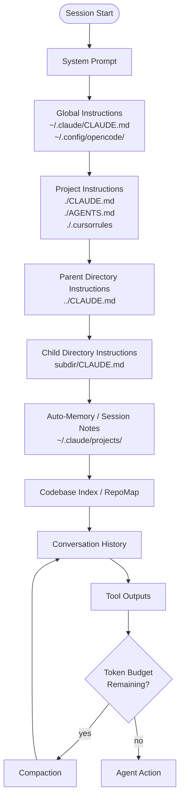
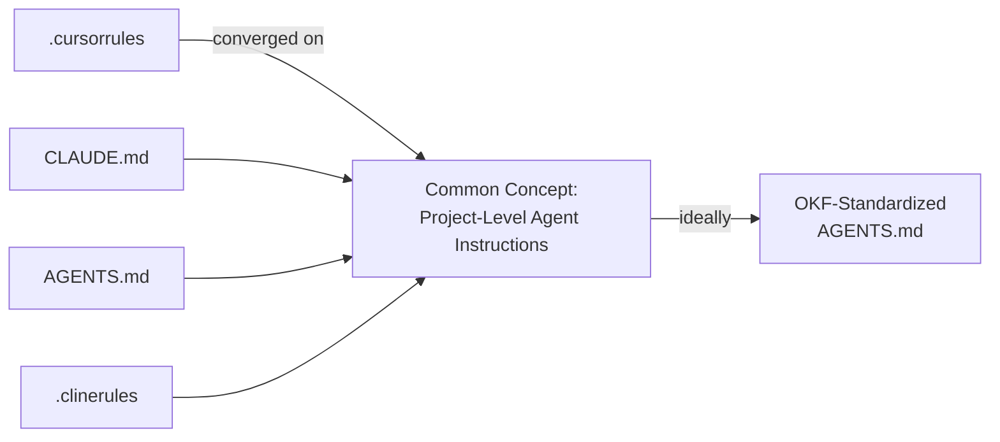
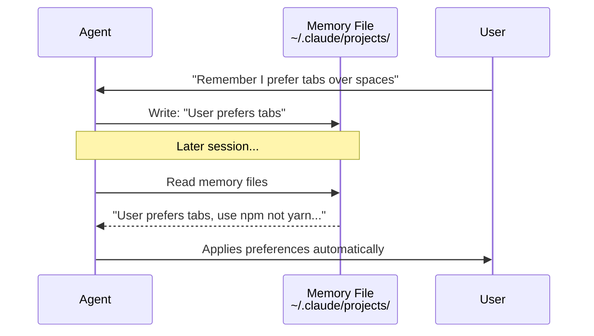
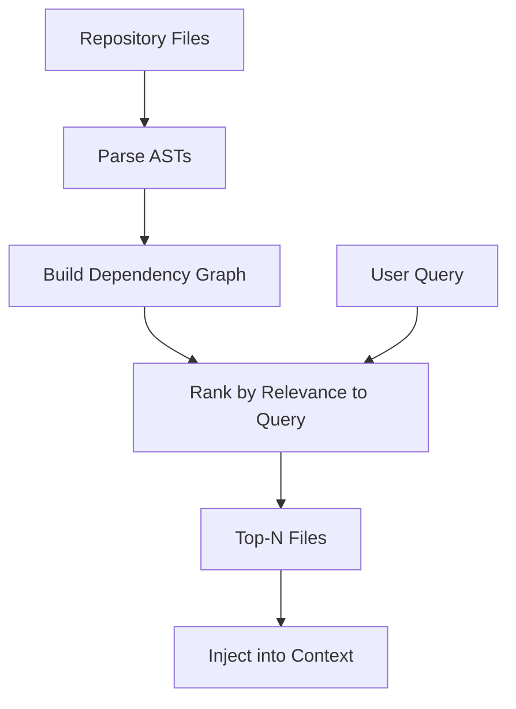
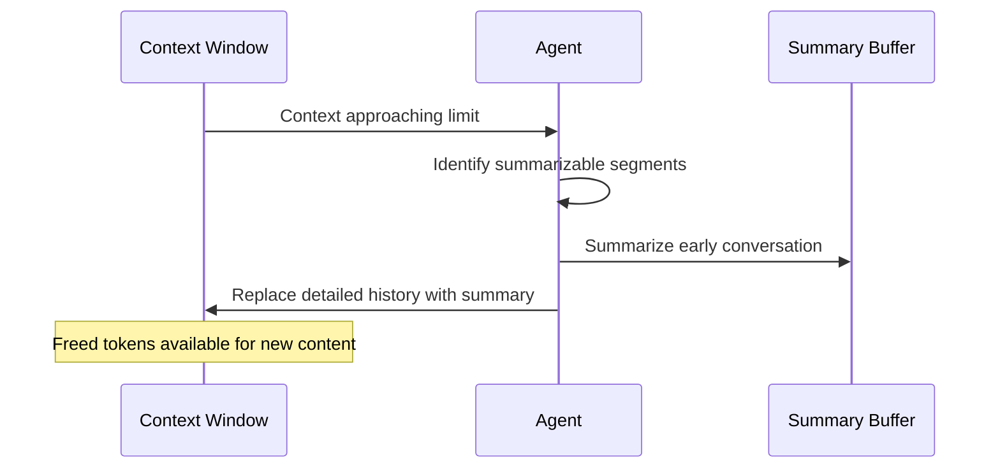

# Context Management Strategies

## Context Loading Order



## 1. Hierarchical Instruction Files

Instruction files apply at directory boundaries, forming a scope chain.

```
~/.claude/CLAUDE.md          ← Global (all projects)
  └── ~/projects/CLAUDE.md   ← Monorepo root
      └── frontend/CLAUDE.md ← Frontend-specific
          └── frontend/admin/CLAUDE.md  ← Admin panel rules
```

| Tool | File | Scope | Inheritance |
|------|------|-------|-------------|
| Claude Code | `CLAUDE.md` | Directory-scoped, cascading | Child inherits parent, merges |
| Opencode | `AGENTS.md` | Project root | Single file, links to sub-indexes |
| Cursor | `.cursorrules` | Project root | Single file, no hierarchy |
| Cline | `.clinerules` | Project root | Single file |
| Aider | `CONVENTIONS.md` | Project root (manual `--read`) | No auto-loading |
| Codex CLI | `AGENTS.md` | Project root | Single file, OKF-compatible |

### The Convergence Problem

Tools are converging on the same concept with different filenames:



**Best practice**: Maintain a single `AGENTS.md` as source of truth; symlink or copy to tool-specific filenames as needed.

## 2. Auto-Memory

Agents self-write notes for future sessions, persisting learned context.

| Tool | Mechanism | Storage | Content |
|------|-----------|---------|---------|
| Claude Code | Self-written memory files | `~/.claude/projects/<project-hash>/` | Project conventions, user preferences, learned patterns |
| Opencode | `log.md` + AGENTS.md session protocol | `./log.md` (per-project) | Chronological operations log, session summaries |
| Windsurf | "Memories" feature | Cloud-persisted | User preferences, coding style, project rules |
| Cursor | `.cursorrules` (manual) | Project file | Static, no auto-update |

**Claude Code auto-memory flow**:


## 3. Codebase Indexing

Pre-computed indexes for efficient codebase retrieval without scanning all files.

| Tool | Technique | Description | Tradeoff |
|------|-----------|-------------|----------|
| Cursor | Embedding-based index | Vector embeddings of code chunks | High accuracy, pre-compute cost, disk usage |
| Windsurf | Fast Context engine | Proprietary indexing with real-time updates | Fast retrieval, opaque implementation |
| Aider | RepoMap (graph-ranked) | Builds a dependency graph, ranks files by relevance | Lightweight, no embeddings, ranking quality depends on graph accuracy |
| Claude Code | On-demand file reads | No pre-index; reads files via tools as needed | Zero setup, higher latency for large codebases |
| Opencode | On-demand file reads | Filesystem tools + glob/grep discovery | Same as Claude Code pattern |
| Codex CLI | On-demand + tree view | Directory listing + targeted reads | Minimal overhead, no indexing |
| GitHub Copilot | GitHub semantic index | Cloud-hosted code understanding | Always available, internet-dependent, enterprise privacy concerns |

### Aider RepoMap in Detail



RepoMap uses a **PageRank-like algorithm** on the code dependency graph. Files that are referenced by many others rank higher. The query biases the ranking toward semantically relevant files.

## 4. Compaction Strategies

When the context window fills, the agent must reclaim space.

| Tool | Strategy | Mechanism | Data Loss Risk |
|------|----------|-----------|----------------|
| Claude Code | Auto-compact | Summarizes conversation, drops old tool outputs | Medium — summarized sections lose detail |
| Opencode | Compaction agent | Dedicated agent summarizes conversation; skills define compaction thresholds | Medium — configurable via skills |
| Aider | Cache + drop | Caches file contents, drops from context when unchanged | Low — reproducible from cache |
| Codex CLI | Sliding window | Keeps N most recent turns | High for long sessions |

**Claude Code compaction flow**:


## 5. Token Budget Management

### Skills Budget (Opencode)
Skills declare a `token_budget` in SKILL.md — maximum context the skill's instructions may consume. The agent enforces this, unloading skills that exceed budget.

### Memory Size Limits (Claude Code)
Auto-memory files have soft limits. When exceeded, older/less-relevant memories are pruned or summarized.

### Context Allocation by Priority

| Priority | Content | Typical Share |
|----------|---------|---------------|
| 1 (Must) | System prompt | 5-10% |
| 2 (Must) | Active conversation | 40-60% |
| 3 (High) | Instruction files (CLAUDE.md, etc.) | 5-15% |
| 4 (High) | Relevant code context | 10-25% |
| 5 (Medium) | Auto-memory / session notes | 5-10% |
| 6 (Low) | Tool output history (summarized) | Remaining |

## Comparison Table

| Feature | Claude Code | Opencode | Codex CLI | Cursor | Aider | Windsurf | Copilot |
|---------|------------|----------|-----------|--------|-------|----------|---------|
| Hierarchical instructions | Yes (CLAUDE.md chain) | Partial (AGENTS.md root) | Partial (AGENTS.md) | No (.cursorrules root) | No (manual) | No | No |
| Auto-memory | Yes (file-based) | Yes (log.md) | No | Memories (beta) | No | Memories | No |
| Codebase indexing | On-demand | On-demand | On-demand | Embeddings | RepoMap (graph) | Fast Context | Semantic index |
| Compaction | Auto-compact | Compaction agent | Sliding window | N/A (IDE) | Cache + drop | N/A (IDE) | N/A (IDE) |
| Token budget | Implicit | Explicit (skills) | Implicit | N/A | Configurable | N/A | N/A |
| Offline capable | Yes | Yes | Yes | Partial | Yes | No | No |
