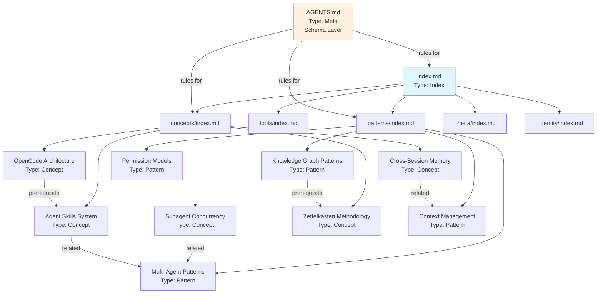
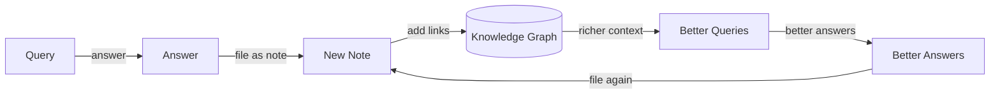
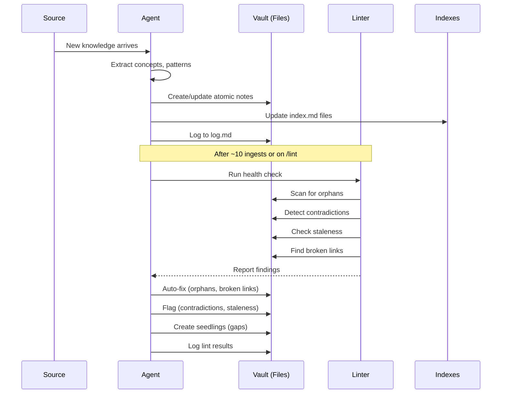
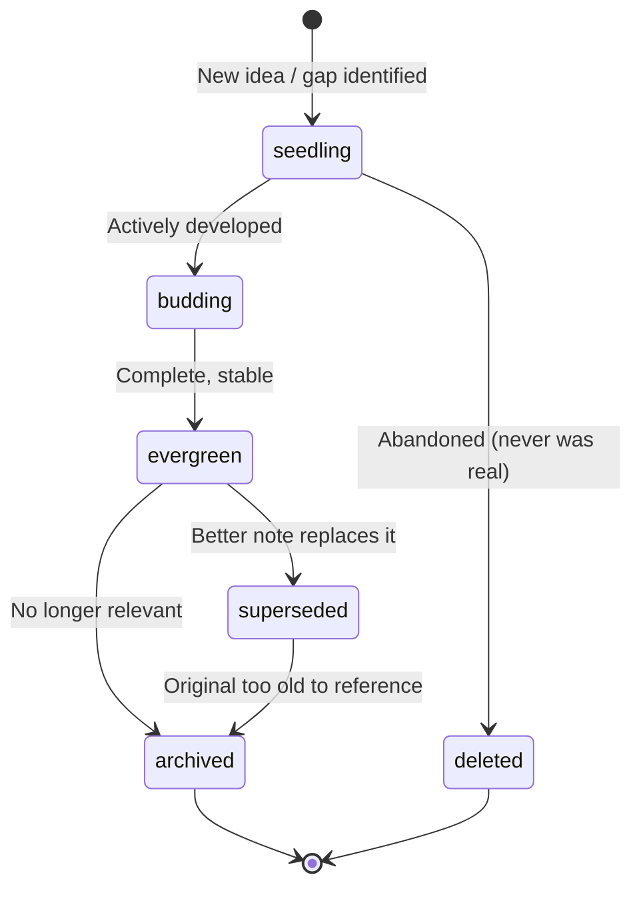

# Knowledge Graph Patterns

## Graph Topology Example



## 1. Atomic Notes Pattern

**Principle**: One concept per file. Files are nouns, links are verbs.

### Atomicity Rules

| Rule | Example |
|------|---------|
| One concept, one file | `attention-mechanism.md` — only the attention mechanism, not all of transformers |
| Self-contained | Can be understood without reading other notes (but links to deeper context) |
| Complete frontmatter | All OKF fields populated; the file is machine-readable |
| Minimum 1-3 links | Every note links to prerequisites, related concepts, and sources |

### What Makes an Atomic Note

```
✅ "Multi-Agent Coordination Patterns" — one pattern family
❌ "AI Agent Architecture" — too broad, should be multiple notes

✅ "Permission Models" — one security concern
❌ "Agent Security and Configuration" — conflates permissions with config management

✅ "Attention Mechanism" — one algorithm
❌ "Transformer Architecture" — spans attention, feedforward, normalization, embedding
```

### Frontmatter as Graph Schema

```yaml
---
type: Concept                    # Node type in the graph
id: "20260622T160000"            # Stable identifier
status: evergreen                # Node state
prerequisites:                   # Directed edges (inbound dependencies)
  - /concepts/attention.md
related:                         # Undirected edges (semantic connections)
  - "[[Transformer Architecture]]"
  - "[[Multi-Head Attention]]"
sources:                         # External edges (provenance)
  - title: "Attention Is All You Need"
    url: "https://arxiv.org/abs/1706.03762"
---
```

## 2. Progressive Disclosure via index.md

**Principle**: Each directory has an `index.md` that catalogs its contents. Entry point is the root `/index.md`.

### Three-Level Navigation

```
Level 1: /index.md              ← "What exists in the vault?"
    ↓ click link
Level 2: /concepts/index.md     ← "What concepts are available?"
    ↓ click link
Level 3: /concepts/attention.md ← "The actual knowledge"
```

### Index as API

The `index.md` serves as the stable API for both humans and AI agents:

```markdown
# Concepts
## AI Agent Architecture
- [[OpenCode Architecture]] — Client-server design, core loop
- [[Agent Skills System]] — How skills extend capabilities
```

**Properties**:
- **Human-readable**: Curated lists with one-line descriptions
- **Machine-readable**: Frontmatter with `tags`, `description`, `type: Index`
- **Discoverable**: No search infrastructure needed
- **Version-controlled**: Changes to indexes are tracked in git

## 3. Compound Knowledge Growth

**Principle**: Every interaction enriches the vault. Good answers become permanent notes.

### The Compound Loop



### Growth Flywheel

1. **More content** → richer `index.md` files → better query routing
2. **More links** → denser knowledge graph → better context assembly
3. **More sessions** → longer `log.md` → better memory
4. **More lint runs** → identified gaps → targeted ingest tasks

### Karpathy's Compound Effect

The Karpathy LLM wiki curriculum exemplifies this: each layer builds on previous layers. In a knowledge vault:
- Layer 1 (raw facts) → Layer 2 (wiki pages) → Layer 3 (schema/AGENTS.md)
- Each session adds to Layer 1-2, each lint run refines Layer 3

## 4. Self-Linting

**Principle**: The vault maintains itself through automated health checks.

### Lint Checks

| Check | Detection | Auto-Fix |
|-------|-----------|----------|
| **Orphans** | Notes with zero inbound links (not in any `index.md` or `related` field) | Add to appropriate `index.md`, link from related concepts |
| **Contradictions** | Conflicting claims across notes | Flag for human review, mark lower-confidence claim |
| **Staleness** | Notes with `status: superseded` or old `modified` dates | Mark superseded, propose replacement |
| **Broken links** | Wiki links pointing to non-existent files | Find correct target or remove |
| **Missing cross-references** | Notes that semantically relate but don't link | Add `related` links |
| **Gaps** | Topics mentioned but lacking dedicated notes | Create `status: seedling` stubs |

### Lint Cadence

```
After ~10 ingest operations  →  Lint run
On `/lint` command           →  Full health check
Session start (optional)     →  Quick orphan scan
```

### Knowledge Flow Sequence



## 5. Status Lifecycle

**Principle**: Notes evolve through explicit states. Nothing is ever deleted — only superseded or archived.



| Status | Meaning | Frontmatter | Action |
|--------|---------|-------------|--------|
| `seedling` | Rough idea, stub, or identified gap | `status: seedling` | Develop into budding |
| `budding` | Actively being written, incomplete | `status: budding` | Complete and promote |
| `evergreen` | Complete, stable, accurate | `status: evergreen` | Maintain, update if needed |
| `superseded` | Replaced by a better note | `status: superseded` | Link to replacement |
| `archived` | No longer relevant, historical | `status: archived` | Remove from indexes |
| `deleted` | Only for seedlings that never developed | Remove file | Only valid for seedlings |

## 6. Cross-Referencing Conventions

**Principle**: Links encode the type of relationship. The prose around a link explains *why*.

### Link Types

| Field | Link Type | Direction | Example |
|-------|-----------|-----------|---------|
| `prerequisites` | Dependency (must-read-before) | Inbound to this note | `- /concepts/attention.md` |
| `related` | Semantic association | Bidirectional | `- "[[Transformer Architecture]]"` |
| `sources` | Provenance (external) | Outbound to source | `- title: "Paper" / url: "..."` |
| `tags` | Categorical | Many-to-many | `tags: [transformers, attention]` |

### Link Density

- **Minimum**: 1-3 links per note
- **Ideal**: 3-7 links (rich connectivity without noise)
- **Maximum**: No hard limit, but every link should have a reason

### Orphan Prevention

Every new note must be:
1. Added to at least one `index.md`
2. Linked from at least one existing note's `related` field
3. If it has prerequisites, those notes should get `related` links back

## 7. Knowledge Layering (Karpathy Pattern)

**Principle**: Knowledge is organized in layers of increasing structure.

```
Layer 0: Raw sources (papers, docs, transcripts) — immutable
    ↓ ingest / extract
Layer 1: Wiki pages (atomic notes) — human-shaped, linked
    ↓ schema extraction
Layer 2: Schema (AGENTS.md, frontmatter conventions) — machine-executable
    ↓ meta-cognition
Layer 3: Operations (log.md, lint rules, session protocols) — self-maintaining
```

| Layer | What | Examples in this vault | Immutable? |
|-------|------|----------------------|------------|
| 0 Raw | Source materials | `_attachments/`, external URLs in `sources` | Yes |
| 1 Wiki | Atomic notes | `/concepts/`, `/tools/`, `/patterns/` | No (evergreen updates) |
| 2 Schema | Rules & conventions | `AGENTS.md`, frontmatter standards | Version-controlled |
| 3 Operations | Process & memory | `log.md`, lint protocol | Append-only for log |

## 8. Graph Navigation Without Infrastructure

**Principle**: The knowledge graph is navigable using only markdown files and file system primitives. No database, no search engine.

### Navigation Primitives

| Primitive | Implementation | Tool |
|-----------|---------------|------|
| Entry point | `/index.md` | Any text editor or agent |
| Directory listing | `/concepts/index.md` | Markdown link following |
| Semantic search | Wiki links + `grep` | `grep "\[\[Note Name\]\]" *.md` |
| Backlinks | `grep` on wiki link targets | `grep -r "\[\[Target Note\]\]" .` |
| Chronology | `log.md` with date headers | `grep "^## \[" log.md \| tail -20` |
| Full-text search | File contents via grep/ripgrep | `rg "search term" concepts/` |

### Why No Infrastructure

- **Portability**: Works in any filesystem, any editor, any agent
- **Durability**: No database to corrupt, no service to maintain
- **Version control**: Git tracks all changes natively
- **AI-native**: LLMs already understand markdown files
- **Zero setup**: Clone the repo, start reading `index.md`
