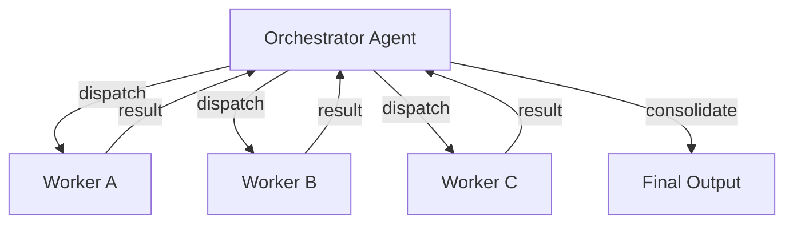
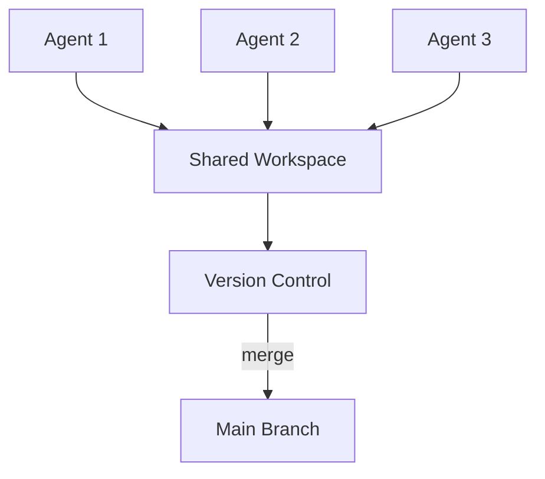
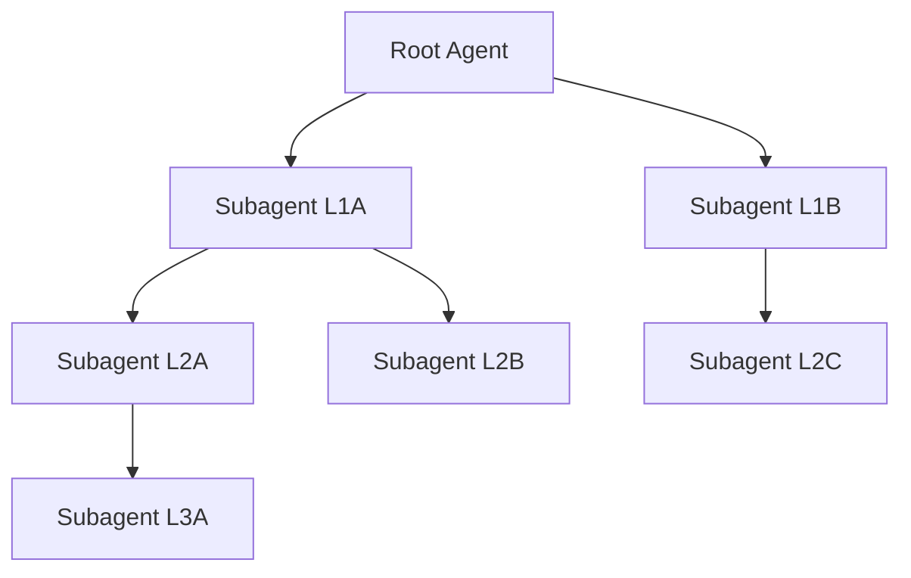
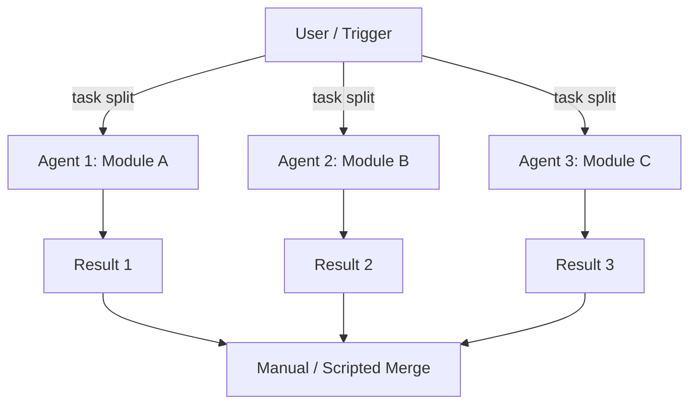
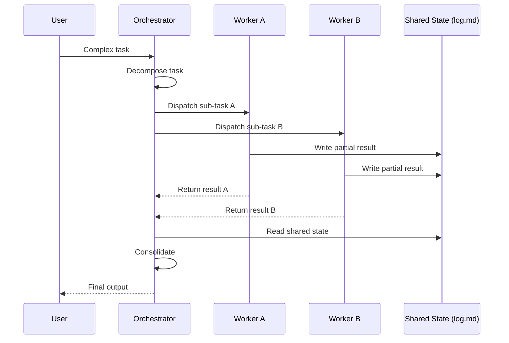

# Multi-Agent Coordination Patterns

## 1. Orchestrator-Worker

A single orchestrator agent dispatches subtasks to specialized worker agents and consolidates results.

**Used by**: Claude Code (agent teams), OpenCode (`task` tool), Cline (coordinator mode)

| Tool | Mechanism | Strengths | Weaknesses |
|------|-----------|-----------|------------|
| Claude Code | `task` tool with `subagent_type` | Fine-grained agent types, reconnection | Single point of failure at orchestrator |
| OpenCode | `task` tool, desc-based routing | Parallel subagent spawning, write isolation | No persistent agent identity |
| Cline | Coordinator spawns worker subagents | Human-in-loop oversight per dispatch | Higher latency from approvals |

**Key properties**:
- Centralized control, single merge point
- Orchestrator can become context bottleneck
- Best for tasks with clear decomposition boundaries

## 2. Peer-to-Peer / Shared Workspace

Multiple peer agents operate on a shared workspace with no central coordinator.

**Used by**: Windsurf Spaces, shared git worktrees, Copilot parallel sessions

| Tool | Mechanism | Strengths | Weaknesses |
|------|-----------|-----------|------------|
| Windsurf | Shared Spaces with real-time sync | Real-time collaboration, same IDE view | Merge conflicts, no task partitioning |
| Git Worktrees | Multiple branches, agent per worktree | Strong VCS isolation, familiar tooling | Manual conflict resolution, no agent-to-agent comms |
| Copilot | Agent mode multi-session | Simple, IDE-native | Sessions are isolated, no cross-talk |

**Key properties**:
- Decentralized, no single coordinator
- Conflict resolution is externalized to VCS or user
- Best for embarrassingly parallel, non-overlapping file scopes

## 3. Hierarchical / Nested

Agents spawn subagents that themselves spawn subagents, forming a tree.

**Used by**: Claude Code (deeply nested subagents), Codex CLI (nested subagents)

| Tool | Mechanism | Strengths | Weaknesses |
|------|-----------|-----------|------------|
| Claude Code | Unlimited nesting via `task` within subagents | Decompose arbitrarily deep, natural for tree problems | Context amplification, hard to debug |
| Codex CLI | Nested subagent chains | Codex's execution model supports delegation | Latency compounds with depth |

**Key properties**:
- Tree-structured delegation
- Each level adds context overhead
- Best for recursive problem decomposition (e.g., monorepo refactor by directory tree)

## 4. Parallel Independent

Multiple agents execute simultaneously on isolated, non-overlapping tasks.

**Used by**: Claude Code (background agents), OpenCode (parallel `task` calls), Cline (Kanban mode), Copilot (parallel sessions)

| Tool | Mechanism | Strengths | Weaknesses |
|------|-----------|-----------|------------|
| Claude Code | Background agents with `--background` flag | True parallelism, non-blocking | No built-in merge, must coordinate manually |
| OpenCode | Multiple `task` calls in parallel | One-message parallel spawn, write isolation | Primary agent must consolidate |
| Cline | Kanban board of parallel tasks | Visual task tracking, human-in-loop | Serialized by human review |
| Copilot | Multiple agent sessions | IDE-native, no setup | Sessions unaware of each other |

**Key properties**:
- True parallelism (not just concurrent)
- Requires strict write isolation — no shared files
- Best for independent features, parallel research, multi-file refactors on disjoint files

## 5. Task Decomposition Strategies

How tasks are split among agents.

### Model-Driven Decomposition
The LLM itself analyzes the task and produces a decomposition plan.
- **Claude Code**: Orchestrator reasons about sub-tasks and dispatches
- **OpenCode**: Agent introspects and spawns subagents with `task`
- **Best for**: Complex, novel tasks where structure is emergent

### User-Driven Decomposition
The human explicitly defines sub-tasks and agent assignments.
- **Cline**: User approves each action, effectively decomposing
- **Aider**: User runs separate aider sessions for separate concerns
- **Best for**: Tasks where the human has domain expertise

### Template/Workflow Decomposition
Predefined workflow templates define the decomposition structure.
- **Claude Code**: Custom slash commands, CLAUDE.md workflows
- **OpenCode**: Skills define reusable multi-step workflows
- **Codex CLI**: Workflow files define agent pipelines
- **Best for**: Repeated task patterns (PR review, release, migration)

### Serial Architect/Editor
A two-phase pattern: architect agent designs, editor agent implements.
- **Claude Code**: `/architect` and `/editor` modes
- **Aider**: Architect mode + Editor mode
- **Best for**: Design-heavy tasks where planning benefits from separation

### Scheduled / Cron
Agents triggered on a schedule or event rather than by user request.
- **Claude Code**: Scheduled runs via cron + CLAUDE.md instructions
- **OpenCode**: Plugin-based scheduled hooks
- **Best for**: Continuous maintenance, nightly lint, automated PRs

## 6. Inter-Agent Communication Patterns

| Pattern | Description | Tools | Use Case |
|---------|-------------|-------|----------|
| **Direct** | Agents message each other | Claude Code subagent results | Tight coupling, fast feedback |
| **Shared State** | Agents read/write a shared data structure | Opencode log.md, shared files | Loose coupling, eventual consistency |
| **No Direct** | Agents are fully isolated, results merged externally | Copilot parallel sessions, git worktrees | Maximum isolation, simplest model |
| **Event Bus** | Agents publish/subscribe to events | Opencode hooks, Claude Code hooks | Reactive, extensible |

## 7. Protocol Standardization

| Protocol | Scope | Description |
|----------|-------|-------------|
| **MCP** (Model Context Protocol) | Tool/Resource integration | Standard for LLM-to-tool communication; servers expose tools, resources, prompts |
| **ACP** (Agent Communication Protocol) | Agent-to-agent | Emerging standard for inter-agent message passing and coordination |
| **Agent Skills Standard** | Skill packaging | SKILL.md format for distributable, self-contained agent capabilities |
| **OKF** (Open Knowledge Format) | Knowledge representation | Standard for AI-consumable knowledge files with typed frontmatter |

## Decision Matrix

| When to use... | Criteria |
|----------------|----------|
| Orchestrator-Worker | Clear task decomposition, single output required |
| Peer-to-Peer | Multiple independent contributors, shared workspace |
| Hierarchical | Recursive problem structure, tree-shaped codebase |
| Parallel Independent | Non-overlapping file scopes, latency-critical |
| Serial Architect/Editor | High design complexity requiring separation of concerns |
| Scheduled | Repetitive maintenance, unattended operation |
