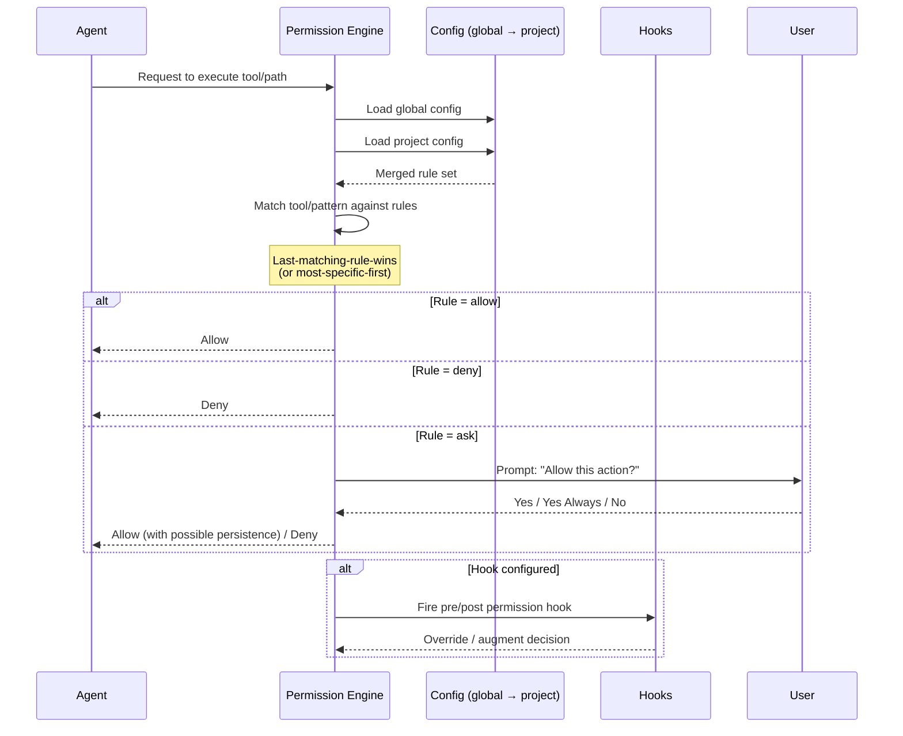
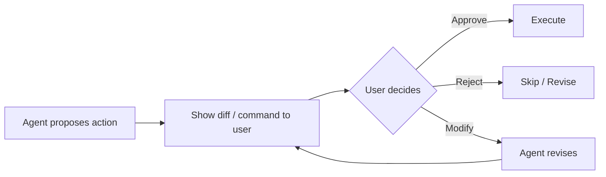

# Permission & Security Models

## Permission Evaluation Sequence



## 1. Claude Code — Granular Pattern Rules

Claude Code uses a YAML-based permission system with pattern matching.

### Permission Modes

| Mode | Behavior |
|------|----------|
| `default` | Standard interactive prompting |
| `acceptEdits` | Auto-accept file edits |
| `bypassPermissions` | Full trust, no prompts (⚠️ use with caution) |
| `plan` | Read-only, no writes allowed |

### Rule Structure

```yaml
# ~/.claude/settings.json or .claude/settings.local.json
{
  "permissions": {
    "allow": [
      "Bash(git:*)",           # Allow all git commands
      "Bash(npm:run test:*)",  # Allow specific npm scripts
      "Read(./src/**)",        # Allow reading src directory
      "Edit(./*.md)"           # Allow editing markdown files
    ],
    "deny": [
      "Bash(rm:*)",            # Deny all rm commands
      "Bash(curl:*)",          # Deny network requests
      "Edit(./.env*)"          # Deny editing env files
    ],
    "ask": [
      "Bash(docker:*)"         # Ask before docker commands
    ]
  }
}
```

### Hook-Based Overrides

Hooks can override permission decisions:
- **PreToolUse hooks**: Intercept before execution, can deny or modify
- **PostToolUse hooks**: Audit after execution, cannot undo but can flag

### Managed Settings (Enterprise)

Organizations can enforce permissions via managed settings that users cannot override:
```yaml
# Managed at org level, immutable by user
managed_permissions:
  deny:
    - "Bash(curl:*)"
    - "Bash(wget:*)"
    - "Edit(**/.env)"
```

### CLI Flags

```bash
claude --permission-mode acceptEdits    # Auto-accept edits
claude --permission-mode plan            # Read-only planning mode
claude --dangerously-bypass-permissions  # Full trust (⚠️)
```

## 2. Opencode — allow/ask/deny with Cascading Merge

Opencode uses a three-tier permission model with cascading configuration.

### Permission Levels

```jsonc
// opencode.json
{
  "permissions": {
    "allow": [
      "Bash(git:*)",              // Glob patterns
      "Read",                     // Allow all reads
      "WebFetch(https://docs.*)" // Allow specific domains
    ],
    "ask": [
      "Bash(npm:publish *)",     // Confirm before publish
      "Edit"                      // Ask before any edit
    ],
    "deny": [
      "Bash(rm:-rf:*)"           // Block destructive operations
    ]
  }
}
```

### Cascading Merge

```
Global config  (~/.config/opencode/opencode.json)
       ↓  merged with (later overrides earlier)
Project config (./opencode.json)
       ↓  merged with (later overrides earlier)
Agent-level    (.opencode/agents/<name>.md)
```

**Rule**: Last-matching-rule-wins. More specific agent-level rules override project-level.

### Agent-Level Overrides

Each agent can have its own permission boundary:
```markdown
<!-- .opencode/agents/deployer.md -->
---
permissions:
  allow: ["Bash(docker:*)", "Bash(kubectl:*)"]
  deny: ["Read", "Edit", "WebFetch"]
---
```

### The `ask` → `remember` Flow

When a user responds "yes, always" to an `ask` prompt, Opencode persists the rule:
1. Tool generates a permission pattern
2. Rule is appended to `opencode.json` under `allow`
3. Future matching calls are auto-allowed

## 3. Codex CLI — Configurable Permissions with Sandbox

### Permission Architecture

| Component | Description |
|-----------|-------------|
| `allow` list | Explicitly permitted operations |
| `ask` list | Operations requiring user confirmation |
| `deny` list | Blocked operations |
| Sandbox | Optional execution sandbox for untrusted code |
| Agent approvals | Per-agent permission profiles |

### Sandbox Modes

```bash
codex --sandbox            # Run in isolated sandbox
codex --no-sandbox         # Run with host access
```

## 4. Cline — Human-in-the-Loop

Cline implements the simplest and most conservative model: **every action requires human approval**.



**Characteristics**:
- Maximum safety, maximum friction
- No pattern-based auto-approval (by design)
- Suitable for security-critical environments
- Lowest throughput of any model

## 5. Aider — Minimal Model

Aider takes the opposite approach — minimal permission friction.

| Feature | Aider |
|---------|-------|
| Auto-commits | Yes (before each change) |
| Pattern rules | No |
| User prompts | Only for major decisions |
| Sandbox | No |
| Fine-grained permissions | No |
| Safety net | git history + `--no-auto-commits` flag |

**Philosophy**: Git is the safety net. Every change is auto-committed, so recovery is always possible. Trust the developer to run aider in appropriate contexts.

## 6. Common Permission Patterns

### Wildcard Matching

All tools use glob-style pattern matching:

| Pattern | Matches |
|---------|---------|
| `Bash(git:*)` | Any git subcommand |
| `Read(./src/**)` | All files under src/ recursively |
| `Edit(**/*.ts)` | All TypeScript files anywhere |
| `WebFetch(https://*.github.com/*)` | GitHub URLs only |
| `Bash(npm:run test:*)` | Any npm test script |

### Pattern Override Priority

```
Explicit deny > Explicit allow > Ask default
```

More specific patterns override less specific ones:
- `deny: Bash(rm:-rf:*)` overrides `allow: Bash(rm:*)`
- Agent-level rules override project-level
- Managed/enterprise rules override user rules

### Enterprise Enforcement

| Tool | Enterprise Controls |
|------|--------------------|
| Claude Code | Managed settings (immutable), org-level deny lists |
| Opencode | Cascading config merge, agent-level boundaries |
| Codex CLI | Sandbox enforcement, org-level permissions |
| Cline | Inherently safe (all actions require human approval) |
| Aider | No enterprise controls (rely on git history) |

## Decision Matrix

| When to use... | Criteria |
|----------------|----------|
| Claude Code | Need granular control + hook extensibility + enterprise enforcement |
| Opencode | Need cascading rules + agent-level permission boundaries |
| Codex CLI | Need sandbox execution + per-agent profiles |
| Cline | Security-critical environment, every action must be reviewed |
| Aider | Trusted environment, fast iteration, git as safety net |
