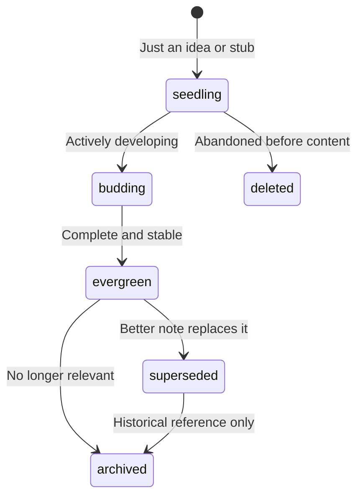

# Concept Note Template

Copy this template when creating a new concept note. Replace all `{{PLACEHOLDER}}` values.

---

## Frontmatter Template

```yaml
---
type: Concept
title: "{{Display Title}}"
description: "{{One-line summary of what this note explains}}"
tags: [{{tag1}}, {{tag2}}, {{tag3}}]
timestamp: {{YYYY-MM-DD}}T00:00:00Z
id: "{{YYYYMMDDThhmmss}}"
status: {{seedling | budding | evergreen}}
difficulty: {{beginner | intermediate | advanced}}
domain: {{knowledge-domain}}
prerequisites:
  - /path/to/prerequisite-note.md
related:
  - "[[Related Note A]]"
  - "[[Related Note B]]"
sources:
  - title: "{{Source Title}}"
    url: "{{https://...}}"
confidence: {{0.0-1.0}}
summary: >
  {{One-sentence executive summary of the core idea.}}
---
```

---

## Section Structure

### Required Sections

#### 1. Title (H1)
```markdown
# {{Display Title}}
```
The H1 should match the `title` in frontmatter. Use title case.

#### 2. Overview (optional H2)
```markdown
## Overview

{{2-4 sentences establishing what this concept is, why it matters, and what the reader will understand after reading.}}
```

#### 3. Core Content (H2 sections)
Organize the body into logical H2 sections. The number and names depend on the concept, but common patterns include:

```markdown
## {{Key Idea 1}}

{{Explanation, examples, diagrams.}}

## {{Key Idea 2}}

{{Explanation, examples, diagrams.}}

## {{Comparison / Tradeoffs}}

{{When applicable, compare alternatives or tradeoffs.}}

## {{Related Concepts}}

{{Brief pointers to connected ideas, with wiki links.}}
```

#### 4. See Also (H2, optional)
```markdown
## See Also

- [[Related Note A]] — {{Why it's related}}
- [[Related Note B]] — {{Why it's related}}
```

#### 5. Citations (H2, if external sources used)
```markdown
## Citations

1. [{{Source Name}}]({{URL}})
2. [{{Source Name}}]({{URL}})
```

---

## Frontmatter Field Reference

| Field | Required | Type | Description | Example |
|-------|----------|------|-------------|---------|
| `type` | **Yes (OKF)** | string | Must be `Concept` | `type: Concept` |
| `title` | Recommended | string | Display title (title case) | `title: "Attention Mechanism"` |
| `description` | Recommended | string | One-line summary for indexes | `description: "How attention works..."` |
| `tags` | Recommended | list | Lowercase, hyphenated | `tags: [transformers, attention]` |
| `timestamp` | Recommended | ISO 8601 | Last modified time | `timestamp: 2026-06-22T00:00:00Z` |
| `id` | Nova extension | string | Stable unique ID | `id: "20260622T160000"` |
| `status` | Nova extension | enum | `seedling` / `budding` / `evergreen` / `superseded` / `archived` | `status: seedling` |
| `difficulty` | Nova extension | enum | `beginner` / `intermediate` / `advanced` | `difficulty: intermediate` |
| `domain` | Nova extension | string | Knowledge domain | `domain: ai-architecture` |
| `prerequisites` | Nova extension | list | Notes to read first | See template above |
| `related` | Nova extension | list | Wiki links to related notes | See template above |
| `sources` | Nova extension | list | Provenance tracking | See template above |
| `confidence` | Nova extension | float 0-1 | Subjective confidence | `confidence: 0.85` |
| `summary` | Nova extension | string | One-sentence executive summary | See template above |

---

## Status Lifecycle Guide

Choose the correct `status` for the note's current state:



- **seedling**: Use when creating a stub for an identified gap. Content is sparse.
- **budding**: Use while actively writing the note. Content is growing.
- **evergreen**: Use when the note is complete, reviewed, and stable.
- **superseded**: Use when a newer/better note covers the same concept. Link to the replacement.
- **archived**: Use for historical reference. Remove from active `index.md` entries.

---

## Usage Instructions

1. **Copy** this template to the target path (e.g., `/concepts/new-concept.md`)
2. **Replace** all `{{PLACEHOLDER}}` values with real content
3. **Set status** to `seedling` initially, promote as content matures
4. **Generate id**: Use current timestamp in `YYYYMMDDThhmmss` format
5. **Add links**: Minimum 1-3 links in `related` and/or `prerequisites`
6. **Update indexes**: Add the new note to the appropriate `index.md`
7. **Cross-link**: Add this note to the `related` field of linked notes
8. **Log**: Append to `log.md`: `## [YYYY-MM-DD] ingest | Created: {{title}}`

---

## Quick Checklist

Before considering a concept note complete:

- [ ] `type: Concept` is set
- [ ] Complete frontmatter (all fields populated)
- [ ] At least 1-3 wiki links in `related` or `prerequisites`
- [ ] `index.md` updated with new note entry
- [ ] Linked notes have reciprocal `related` links
- [ ] `log.md` has an ingest entry
- [ ] No broken wiki links
- [ ] One concept, one file (not overloaded with multiple topics)
- [ ] H1 matches frontmatter `title`
