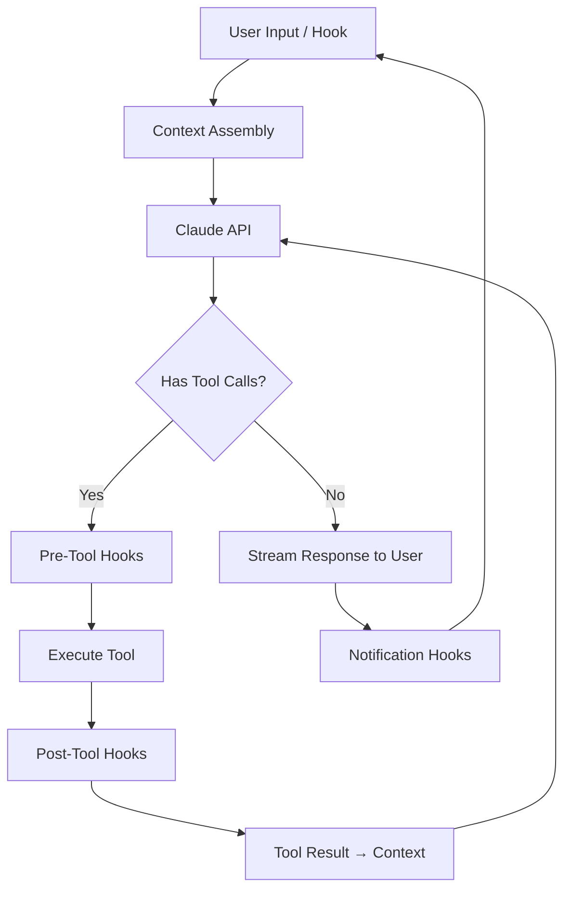

# Claude Code — Comprehensive Tool Analysis

## 1. Surface Architecture

Claude Code operates across **four surfaces** — a unified agent experience across environments:

| Surface | Description | Launch |
|---------|-------------|--------|
| **Terminal** | Native CLI application | `claude` |
| **IDE** | VS Code / JetBrains extension | IDE extension marketplace |
| **Desktop** | Standalone desktop application | macOS/Windows/Linux app |
| **Web** | Browser-based interface | Claude.ai web app |

### Surface-Specific Capabilities
- **Terminal**: Full filesystem access, pipe support, scripting
- **IDE**: In-editor diffs, inline completions, file tree integration
- **Desktop**: File drag-and-drop, system notifications, native menus
- **Web**: Cloud-hosted, no local installation, restricted filesystem access

---

## 2. Agent Loop (ReAct-Style)

Claude Code implements a standard **ReAct (Reasoning + Acting)** loop:



### Iteration Control
- **maxTurns** config limits the number of ReAct iterations per user message
- Default is typically 25 turns
- Each turn = one API call + potential tool execution
- The loop terminates when Claude emits a final response (no tool calls) or maxTurns is reached

---

## 3. Core Tools

Claude Code provides **9 core tools** for the agent:

| Tool | Function | Key Features |
|------|----------|-------------|
| `Read` | Read files and directories | Line-numbered output, image/PDF support, directory listing |
| `Write` | Create or overwrite files | Atomic writes, requires prior read for overwrites |
| `Edit` | String replacement in files | Exact match replacement, `replace_all` option |
| `Bash` | Execute shell commands | Timeout support, background execution, output capture |
| `Grep` | Regex content search | Uses ripgrep, respects `.gitignore` |
| `Glob` | File pattern matching | Fast filesystem traversal, respects `.gitignore` |
| `Agent` | Spawn subagents | Typed subagents (Explore, Plan, General-purpose) |
| `Skill` | Load skill instructions | Injects `SKILL.md` content into context |
| `WebSearch` | Search the web | For current information and external knowledge |
| `WebFetch` | Fetch URL content | Retrieves and converts web pages to markdown |
| `Task` | Multi-step subagent | Complete complex tasks autonomously |

### Tool-Use Format
Claude Code uses Anthropic's native **tool-use API** — tool calls are structured JSON blocks within the message stream, not parsed from text output.

---

## 4. CLAUDE.md Memory Hierarchy

The CLAUDE.md system implements [[Cross-Session Memory]] through a **hierarchical configuration-merging** approach. Files cascade from broad to specific:

### Hierarchy (Managed → User → Project → Local)
```
Managed CLAUDE.md    ← Enterprise IT-managed, deployed via MDM/GPO
    ↓ (merged)
User CLAUDE.md       ← ~/.claude/CLAUDE.md (global user preferences)
    ↓ (merged)
Project CLAUDE.md    ← <project>/CLAUDE.md (team conventions)
    ↓ (merged)
Local CLAUDE.md      ← <project>/CLAUDE.local.md (personal, gitignored)
```

### Merge Behavior
- Files are **concatenated**, not deep-merged
- Later files **append** to earlier ones
- Conflicts are resolved by ordering (local overrides project overrides user overrides managed)
- Each file can reference additional files via `@path/to/file.md` syntax

### Standard CLAUDE.md Sections
```markdown
# Project Overview
# Build & Test Commands
# Code Style & Conventions
# Architecture Notes
# Dependencies
# Environment Variables
# Security Guidelines
```

### AGENTS.md / CLAUDE.md Dual Support
Claude Code also reads `AGENTS.md` files (OpenCode convention), providing cross-tool compatibility:
- `AGENTS.md` at project root is treated like `CLAUDE.md`
- Same merge behavior applies
- Enables projects to have a single agent-instruction file for multiple tools

---

## 5. Auto Memory System

Claude Code's **auto memory** provides automatic context persistence beyond CLAUDE.md files.

### How It Works
1. During a session, Claude can call the `update_memory` tool
2. This triggers a background process that **extracts key information** from the conversation
3. Extracted information is written to `~/.claude/memories/` or project-specific memory locations
4. On next session start, relevant memories are **automatically loaded** into context

### Memory Files
| File | Purpose |
|------|---------|
| `~/.claude/memories/user.md` | Global user preferences and knowledge |
| `<project>/CLAUDE.md` | Project conventions (already covered above) |

### Periodic Snapshot Saves
- At configurable intervals (default: after significant decisions), Claude saves a summary snapshot
- Snapshots are stored alongside memories
- Enables recovery from truncated or lost sessions

### Memory vs CLAUDE.md
| Aspect | CLAUDE.md | Auto Memory |
|--------|-----------|-------------|
| Author | Human-written | AI-extracted |
| Edit method | Manual edit | Tool-triggered |
| Structure | Free-form markdown | Structured key-value |
| Persistence | Always loaded | Loaded when relevant |
| Scope | Per-project + global | Per-user + per-project |

---

## 6. Skills System

Claude Code's skills system aligns with [[Agent Skills System]] patterns but adds unique features.

### SKILL.md Format
```markdown
---
name: my-skill
description: What this skill does
---

# Skill Instructions

Detailed workflows and domain knowledge...
```

### Context Forking (`context: fork`)
A distinguishing feature: skills can specify **context forking**:
```yaml
context: fork
```
When `context: fork` is set, the skill runs in a **forked (clean) context** — it receives only the skill instructions + the specific task, not the full conversation history. This:
- Reduces token usage
- Prevents context pollution
- Ensures focused execution

Without `context: fork`, skills merge into the existing conversation context.

### Background Subagents
Skills can spawn **background subagents** for parallel processing:
- Subagents run independently, not blocking the main agent
- Results are reported back asynchronously
- Useful for parallel research, multi-file analysis, or batch operations

### Skill Storage Locations
| Scope | Path |
|-------|------|
| Global skills | `~/.claude/skills/` |
| Project skills | `<project>/.claude/skills/` |
| Managed skills | Enterprise-deployed |

---

## 7. Hooks System

Claude Code has an extensive hooks system — **11 hook events** across **5 hook types**:

### Hook Types
| Type | Events | Description |
|------|--------|-------------|
| **User Prompt Submit** | `UserPromptSubmit` | Fires when user submits a message |
| **Pre-Tool Use** | `PreToolUse` | Fires before any tool executes |
| **Post-Tool Use** | `PostToolUse` | Fires after tool execution completes |
| **Session Start** | `SessionStart` | Fires on session initialization |
| **Notification** | `Notification` | Fires on various system events |

### Full Hook Events List

| # | Event | Type | Trigger |
|---|-------|------|---------|
| 1 | `UserPromptSubmit` | User Prompt | User sends a message |
| 2 | `PreToolUse` | Pre-Tool | Before any tool execution |
| 3 | `PostToolUse` | Post-Tool | After any tool execution |
| 4 | `SessionStart` | Session | Session initialization |
| 5 | `SessionEnd` | Session | Session termination |
| 6 | `Stop` | Notification | Agent stops responding |
| 7 | `SubagentStop` | Notification | Subagent finishes |
| 8 | `PreCompact` | Notification | Before context compaction |
| 9 | `PermissionRequest` | Notification | Permission prompt displayed |
| 10 | `PreMessageSend` | Pre-Tool | Before API call sent to model |
| 11 | `PostMessageReceive` | Post-Tool | After API response received |

### Hook Configuration
```json
{
  "hooks": {
    "PreToolUse": [
      {
        "matcher": "Bash",
        "command": "validate-command.sh",
        "timeout": 5000
      }
    ],
    "PostToolUse": [
      {
        "matcher": "Write|Edit",
        "command": "auto-format.sh",
        "timeout": 10000
      }
    ]
  }
}
```

### Hook Execution Model
- Hooks run as **shell commands** (any language)
- Receive event data via **stdin** as JSON
- Can **modify** or **reject** tool inputs (PreToolUse)
- Can **transform** tool outputs (PostToolUse)
- Timeout per hook (default 60s)
- Hooks for the same event run **sequentially** in order

### Hook Comparison: Claude Code vs OpenCode
| Aspect | Claude Code | OpenCode |
|--------|-------------|----------|
| Hook count | 11 events | 8 events |
| Hook types | 5 (User/Pre/Post/Session/Notify) | 8 lifecycle events |
| Implementation | Shell commands | JavaScript/TypeScript plugins |
| Input format | stdin JSON | Function parameters |
| Modify tool calls | Yes | Yes |
| Compaction hooks | Yes (PreCompact) | Yes (onCompaction) |

---

## 8. Subagents System

Claude Code implements [[Subagent Concurrency]] with three built-in agent types plus custom agents.

### Built-in Agent Types
| Agent Type | Description | Tool Access | Use Case |
|------------|-------------|-------------|----------|
| **Explore** | Fast codebase search | Read, Grep, Glob | Finding patterns, file discovery |
| **Plan** | Strategic analysis | Read, Grep, Glob, WebSearch | Architecture review, planning |
| **General-purpose** | Full implementation | Read, Write, Edit, Bash, Grep, Glob | Multi-step code changes |

### Spawning Subagents
```bash
> Find all places where authentication logic is implemented
# Claude spawns Explore subagent(s) for parallel search
```

Subagents are spawned via the `Agent` tool — the primary agent decides when to delegate.

### Subagent Configuration
```json
{
  "subagents": {
    "explore": {
      "model": "claude-haiku-4-5",
      "maxTurns": 5
    },
    "plan": {
      "model": "claude-sonnet-4-5",
      "maxTurns": 10
    },
    "general": {
      "model": "claude-sonnet-4-5",
      "maxTurns": 25
    }
  }
}
```

### Nested Subagents
- Subagents can spawn **nested subagents** (subagent → sub-subagent)
- Configured via `maxNestedDepth` (default: 1)
- Each nesting level adds overhead — use sparingly

### Agent Teams
Claude Code supports **agent teams** — multiple agents running concurrently on related tasks:
- Teams are defined in configuration
- Each team member has a specific role and instructions
- The primary agent orchestrates the team
- Results are consolidated and presented to the user

```json
{
  "teams": {
    "code-review": {
      "agents": [
        { "name": "security-reviewer", "instructions": "Review for security issues..." },
        { "name": "style-reviewer", "instructions": "Review for code style..." },
        { "name": "perf-reviewer", "instructions": "Review for performance..." }
      ]
    }
  }
}
```

### Concurrency Model
- Explore subagents run in **parallel** (independent search tasks)
- General-purpose subagents run **sequentially** by default (to avoid edit conflicts)
- Teams can be configured for parallel execution
- See [[Subagent Concurrency]] for the theoretical model

---

## 9. Permission System

Claude Code uses a **mode-based** permission system aligned with [[Permission Models]].

### Permission Modes
| Mode | Description | CLI Flag |
|------|-------------|----------|
| `default` | Prompt for destructive operations | `--permission-mode default` |
| `acceptEdits` | Auto-accept file edits, prompt for bash | `--permission-mode acceptEdits` |
| `bypassPermissions` | Skip all permission prompts | `--permission-mode bypassPermissions` |
| `plan` | Read-only, no file modifications | `--permission-mode plan` |

### Permission Rules
```json
{
  "permissions": {
    "allow": [
      "Bash(npm test:*)",
      "Bash(git diff:*)",
      "Bash(git status:*)"
    ],
    "deny": [
      "Bash(curl:*)",
      "Bash(rm -rf:*)",
      "Bash(git push --force:*)",
      "Bash(git push origin master:*)"
    ],
    "ask": []
  }
}
```

### Permission Rule Syntax
- Tool name followed by parenthesized command/pattern
- `*` wildcard matches any arguments
- Rules are evaluated top-to-bottom, first match wins
- `deny` takes precedence over `allow` for security

---

## 10. Compaction System

Compaction in Claude Code manages context window limits.

### Trigger Mechanism
- **Automatic**: When context approaches model's context window limit
- **Manual**: Via compaction-related hooks
- **Before subagent spawn**: Fresh context for subagents

### Compaction Strategy
1. Conversation history is summarized by the model
2. Key decisions, file changes, and state are preserved
3. The summary becomes the new conversation prefix
4. Subsequent messages append to the summary
5. PreCompact/PostCompact hooks can influence what's preserved

### Compaction vs OpenCode
| Aspect | Claude Code | OpenCode |
|--------|-------------|----------|
| Trigger | Automatic at limit | Configurable threshold |
| Threshold | Window-based | Percentage (default 85%) |
| Hooks | PreCompact event | onCompaction event |
| Manual trigger | Not exposed | `/compact` command |

---

## 11. Cost Tracking

Claude Code provides **token usage and cost tracking**:
- Per-session token counts (input/output)
- Estimated cost based on model pricing
- Displayed in TUI status bar
- Logged to session history

---

## 12. Integration Ecosystem

| Integration | Description |
|-------------|-------------|
| VS Code | Extension with inline diffs, file tree |
| JetBrains | Plugin for IntelliJ, PyCharm, etc. |
| GitHub | PR review, issue resolution |
| GitLab | MR review, pipeline integration |
| MCP | Model Context Protocol for external tools |
| Shell pipes | `echo "prompt" | claude -p` |

---

## 13. Comparison Matrix

| Feature | Claude Code | OpenCode | Codex CLI |
|---------|-------------|----------|-----------|
| Provider | Anthropic only | 75+ via AI SDK | OpenAI only |
| Memory | CLAUDE.md hierarchy + auto memory | AGENTS.md + log.md | AGENTS.md + Chronicle |
| Skills | SKILL.md + context fork | SKILL.md | Skills system |
| Hooks | 11 events, shell-based | 8 events, JS/TS plugins | Hook system |
| Subagents | Explore/Plan/General + teams | Explore/General/Custom | — |
| Permissions | 4 modes + allow/deny rules | 5 modes + cascading rules | Sandbox-based |
| Compaction | Automatic at window limit | Threshold-based (85%) | Session management |
| Open Source | Proprietary | MIT | Apache 2.0 |
| Multi-surface | Terminal/IDE/Desktop/Web | TUI/CLI/Server/Web/IDE | Terminal/Desktop/Web |

See also: [[OpenCode]], [[Codex CLI]], [[Aider]].
