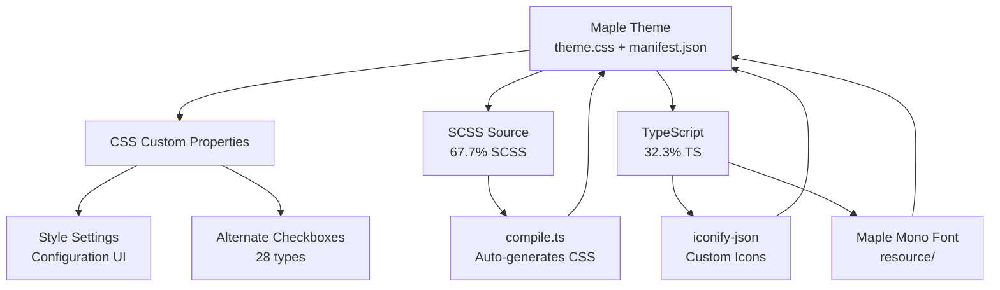

# Obsidian Maple Theme

## 概述

Maple 是由 [subframe7536](https://github.com/subframe7536) 开发的现代化 Obsidian 主题，v1.5.1（截至 2026-06）。是 Obsidian 社区中设计最精致、可定制性最强的主题之一。

**核心亮点**：
- 流畅的现代设计语言，优雅的动画过渡
- 内嵌自研等宽字体 **[Maple Mono](https://github.com/subframe7536/maple-font)**
- **28 种替代复选框**（6 种 Maple 专属）
- 通过 [Style Settings](https://github.com/mgmeyers/obsidian-style-settings) 插件实现高度自定义
- 桌面 + 移动端一流体验
- 丰富的自定义图标

## 安装

### 方式 1：社区主题商店

1. 打开 Obsidian → **Settings → Appearance**
2. 点击 **Manage** → 搜索 **"Maple"**
3. 点击 **Install and Enable**

### 方式 2：手动安装

1. 下载 [源码 zip](https://github.com/subframe7536/obsidian-theme-maple/archive/refs/heads/1.0.zip)
2. 解压到 `<vault>/.obsidian/themes/maple/`
3. 确保 `theme.css` 和 `manifest.json` 在 `maple/` 文件夹内
4. 重启 Obsidian

### 推荐：安装 Style Settings

Maple 的大多数自定义选项依赖 Style Settings 插件：

1. Settings → Community plugins → Browse
2. 搜索 **"Style Settings"** → Install → Enable
3. 在 Style Settings 面板中会出现 Maple 的所有自定义选项

## 自定义选项 (Style Settings)

### 布局

```
Settings → Style Settings → Maple Basic → Layout
```

可选项包括：
- **Tab 布局**：经典 / 现代 / 隐藏
- **侧边栏位置**：左 / 右
- **Ribbon 样式**：默认 / 浮动 / 隐藏
- **文件浏览器**：标准 / 紧凑

### 配色 (Colors)

```
Settings → Style Settings → Maple Basic → Colors
```

支持：
- **Color Scheme**：Light / Dark / Custom
- **背景色自定义**：主背景 / 次级背景 / 块背景 / 顶栏背景
- **高亮色自定义**：活跃色 / 非活跃色
- **仅改高亮色**：实验性功能，背景保持默认

### 排版 (Typography)

- 字体族自定义
- 标题大小/粗细
- 正文行高/字距
- 代码块字体大小

### 动画

- 标签切换动画
- 悬停效果
- 模态框过渡
- 可选：关闭所有动画（性能优化）

## 替代复选框 (Alternate Checkbox)

Maple 对 Obsidian 标准复选框做了视觉增强，28 种类型各有独特图标：

### 标准 Obsidian（Maple 渲染增强）

| 语法 | 含义 | Maple 图标 |
|------|------|-----------|
| `- [ ]` | To-do | 空心圆 |
| `- [/]` | Incomplete | 半圆 |
| `- [x]` | Done | 绿色勾 |
| `- [-]` | Canceled | 红色叉 |
| `- [>]` | Forwarded | 右箭头 |
| `- [<]` | Scheduling | 时钟 |
| `- [?]` | Question | 问号 |
| `- [!]` | Important | 感叹号 |
| `- [*]` | Star | 星标 |
| `- ["]` | Quote | 引号 |
| `- [l]` | Location | 定位针 |
| `- [b]` | Bookmark | 书签 |
| `- [i]` | Information | 信息 |
| `- [S]` | Dollar | 美元符号 |
| `- [I]` | Idea | 灯泡 |
| `- [p]` | Pros | 加号 |
| `- [c]` | Cons | 减号 |
| `- [w]` | Win | 奖杯 |
| `- [u]` | Up | 上箭头 |
| `- [d]` | Down | 下箭头 |

### Maple 专属（其他主题不显示）

| 语法 | 含义 | 用途 |
|------|------|------|
| `- [+]` | Add | 新增任务/特性 |
| `- [B]` | Bug | Bug 追踪 |
| `- [a]` | Alarm | 提醒/截止 |
| `- [n]` | Note | 附注 |
| `- [R]` | Review | 审查 |
| `- [L]` | Love | 收藏/点赞 |

## 技术架构



### 开发

```bash
bun i           # 安装依赖
bun run dev     # 开发 + 热重载
bun run build   # 构建产物
bun run release # 发布
```

- 图标来源 `iconify-json` 包，编译时自动加载
- Style Settings 配置通过脚本自动生成
- 字体和 SVG 存放于 `resource/`

## 版本兼容性

> ⚠️ 作者声明：由于时间限制，不保证向后兼容性。

- 当前稳定版：`v1.5.1`（2026-06-14）
- 旧版（0.x）在 `main` 分支
- 共 102 个发布版本，1,173 个提交

## 设计灵感

Maple 融合了多个经典 Obsidian 主题的设计语言：

| 主题 | 借鉴方向 |
|------|---------|
| [Minimal](https://github.com/kepano/obsidian-minimal) | 极简主义、信息密度 |
| [Blue Topaz](https://github.com/whyt-byte/Blue-Topaz_Obsidian-css) | 配色丰富度 |
| [Border](https://github.com/Akifyss/obsidian-border) | 边框与分隔线 |
| [Cupertino](https://github.com/aaaaalexis/obsidian-cupertino/) | 现代 UI 质感 |
| [Baseline](https://github.com/aaaaalexis/obsidian-baseline) | 排版基线 |
| [Velocity](https://github.com/Gonzalo-D-Sales/obsidian-velocity) | 交互速度感 |

## 实际应用建议

### 在 Nova Vault 中使用 Maple

1. 安装 Maple 主题和 Style Settings 插件
2. 设置 Style Settings → Maple Basic → Layout → 选择偏好布局
3. 在 `theme.css` 中补充 Nova 专属自定义 CSS（如需要）
4. 利用 Maple 的 28 种复选框做精细的任务管理

### 推荐的复选框工作流

```markdown
## 开发任务
- [+] 新功能：实现知识图谱可视化
- [B] Bug：log.md 日期格式不一致
- [>] 转交 @nova-architect：vault 目录重构
- [R] 待审核：AGENTS.md 语言分层规则

## 状态跟踪
- [!] 重要：session start 序列需要更新
- [a] 提醒：每周 lint 检查
- [L] 喜欢：Karpathy LLM Wiki 设计模式
```

---

# Citations

[1] subframe7536. (2024-2026). obsidian-theme-maple. https://github.com/subframe7536/obsidian-theme-maple
[2] mgmeyers. obsidian-style-settings. https://github.com/mgmeyers/obsidian-style-settings
